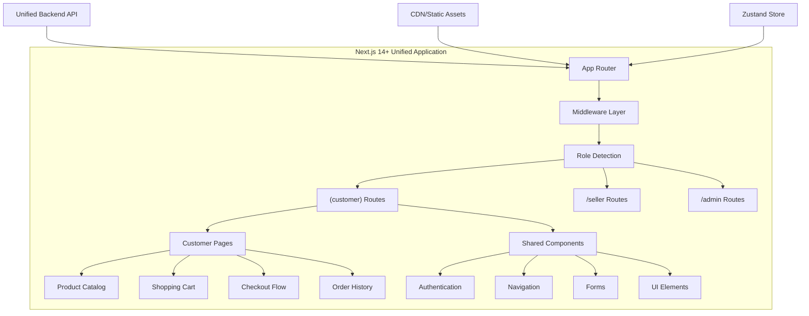
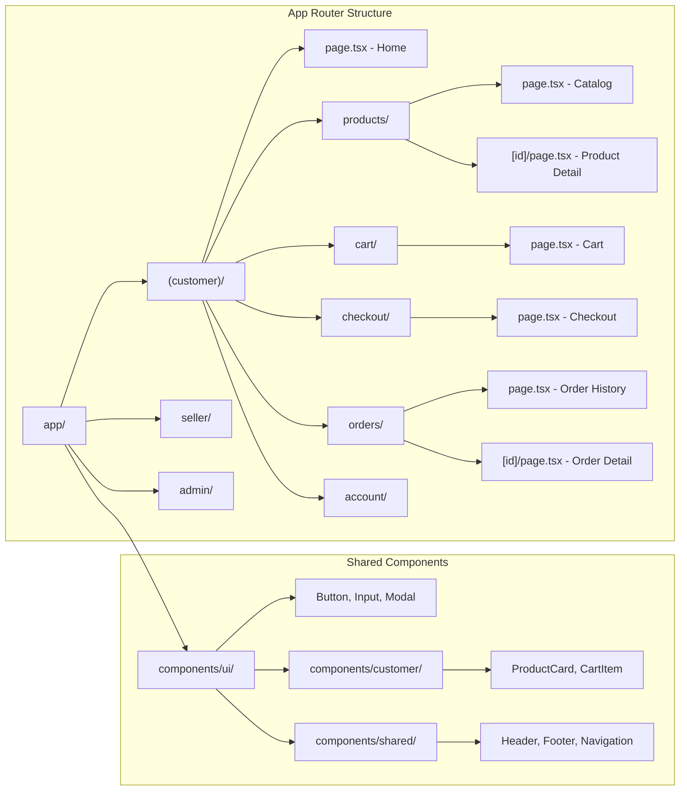
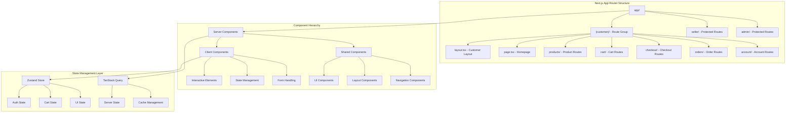

# Design Document: Customer Frontend Interface

## Overview

The Customer Frontend Interface represents the customer-facing portion of a unified Next.js 14+ e-commerce application. This interface is implemented as role-based routes and components within a single Next.js application that serves customers, sellers, and super administrators through dynamic role-based rendering. Built with TypeScript, Tailwind CSS, and Zustand for state management, this design ensures optimal performance, SEO optimization, and seamless user experience.

The customer interface leverages Next.js App Router for server-side rendering, implements role-based middleware for authentication, and provides customers with product browsing, cart management, secure checkout with cash-on-delivery, order tracking, and account management. It integrates with the unified backend API through JWT-based authentication and shared state management across all user roles.

## Architecture

### Unified Next.js 14+ Architecture

The customer interface is implemented within a unified Next.js 14+ application using the App Router architecture. The application dynamically renders different interfaces based on authenticated user roles through middleware and role-based routing:



### Next.js App Router Structure

The customer interface follows Next.js 14+ App Router conventions with role-based route organization:



### Component Architecture

The customer interface follows Next.js 14+ App Router architecture with role-based component organization and server-client component separation:



### Technology Stack

#### Core Framework & Runtime
- **Next.js 14+**: Full-stack React framework with App Router, Server Components, and Server Actions
- **React 18+**: Component-based UI with concurrent features and streaming SSR
- **TypeScript**: Type-safe development with enhanced IDE support and compile-time validation
- **Node.js**: Server-side runtime for API routes and middleware

#### State Management & Data Fetching
- **Zustand**: Lightweight global state management for user session, cart, and UI state
- **TanStack Query (React Query)**: Server state management, caching, and synchronization
- **React Hook Form**: Form state management with validation and performance optimization
- **SWR**: Alternative data fetching with built-in caching (where TanStack Query isn't used)

#### Styling & UI Components
- **Tailwind CSS**: Utility-first CSS framework for rapid development and consistent design
- **shadcn/ui**: High-quality, accessible React components built on Radix UI primitives
- **Headless UI**: Unstyled, accessible UI components for custom implementations
- **Framer Motion**: Animation library for smooth interactions and page transitions
- **Lucide React**: Modern icon library with consistent design

#### Authentication & Security
- **NextAuth.js**: Complete authentication solution with JWT and session management
- **Custom JWT Handling**: Alternative JWT implementation with role-based claims
- **Next.js Middleware**: Route protection and role-based access control
- **bcrypt**: Password hashing for secure authentication

#### SEO & Performance
- **Next.js SEO**: Built-in meta tag management, Open Graph, and structured data
- **Next.js Image**: Automatic image optimization with WebP/AVIF support
- **Code Splitting**: Automatic route-based and dynamic component splitting
- **Server Components**: Reduced client-side JavaScript and improved performance

## Components and Interfaces

### Next.js App Router Pages

#### 1. Customer Route Group - `app/(customer)/`
```typescript
// app/(customer)/layout.tsx
interface CustomerLayoutProps {
  children: React.ReactNode
}

export default function CustomerLayout({ children }: CustomerLayoutProps) {
  return (
    <div className="min-h-screen bg-gray-50">
      <CustomerHeader />
      <main className="container mx-auto px-4 py-8">
        {children}
      </main>
      <CustomerFooter />
    </div>
  )
}

// app/(customer)/page.tsx - Homepage
export default function HomePage() {
  return (
    <>
      <HeroSection />
      <FeaturedProducts />
      <CategoryGrid />
      <PromotionalBanner />
    </>
  )
}

// app/(customer)/products/page.tsx - Product Catalog
interface ProductCatalogPageProps {
  searchParams: {
    category?: string
    search?: string
    sort?: string
    page?: string
  }
}

export default function ProductCatalogPage({ searchParams }: ProductCatalogPageProps) {
  return (
    <div className="grid grid-cols-1 lg:grid-cols-4 gap-8">
      <ProductFilters />
      <div className="lg:col-span-3">
        <ProductGrid searchParams={searchParams} />
        <Pagination />
      </div>
    </div>
  )
}
```

#### 2. Authentication Components with NextAuth.js
```typescript
// components/customer/auth/LoginForm.tsx
interface LoginFormProps {
  callbackUrl?: string
  onSuccess?: (user: Customer) => void
}

interface LoginFormData {
  email: string
  password: string
  rememberMe: boolean
}

export function LoginForm({ callbackUrl, onSuccess }: LoginFormProps) {
  const { register, handleSubmit, formState: { errors } } = useForm<LoginFormData>()
  const { data: session, status } = useSession()
  
  const onSubmit = async (data: LoginFormData) => {
    const result = await signIn('credentials', {
      email: data.email,
      password: data.password,
      redirect: false,
    })
    
    if (result?.ok) {
      onSuccess?.(session?.user as Customer)
      router.push(callbackUrl || '/')
    }
  }
  
  return (
    <form onSubmit={handleSubmit(onSubmit)} className="space-y-6">
      <Input
        {...register('email', { required: 'Email is required' })}
        type="email"
        placeholder="Email address"
        error={errors.email?.message}
      />
      <Input
        {...register('password', { required: 'Password is required' })}
        type="password"
        placeholder="Password"
        error={errors.password?.message}
      />
      <Button type="submit" className="w-full">
        Sign In
      </Button>
    </form>
  )
}
```

#### 3. Product Components with Server Components
```typescript
// components/customer/products/ProductCard.tsx
interface ProductCardProps {
  product: Product
  priority?: boolean // For LCP optimization
}

export function ProductCard({ product, priority = false }: ProductCardProps) {
  const { addToCart } = useCartStore()
  
  return (
    <div className="group relative bg-white rounded-lg shadow-sm hover:shadow-md transition-shadow">
      <div className="aspect-square overflow-hidden rounded-t-lg">
        <Image
          src={product.images[0]?.url}
          alt={product.images[0]?.altText || product.name}
          width={300}
          height={300}
          priority={priority}
          className="object-cover group-hover:scale-105 transition-transform"
        />
      </div>
      <div className="p-4">
        <h3 className="text-lg font-semibold text-gray-900">{product.name}</h3>
        <p className="text-sm text-gray-600 mt-1">{product.shortDescription}</p>
        <div className="flex items-center justify-between mt-4">
          <div className="flex items-center space-x-2">
            <span className="text-xl font-bold text-gray-900">
              ${product.price}
            </span>
            {product.compareAtPrice && (
              <span className="text-sm text-gray-500 line-through">
                ${product.compareAtPrice}
              </span>
            )}
          </div>
          <Button
            onClick={() => addToCart(product.id, 1)}
            disabled={product.stock === 0}
            size="sm"
          >
            {product.stock === 0 ? 'Out of Stock' : 'Add to Cart'}
          </Button>
        </div>
      </div>
    </div>
  )
}

// app/(customer)/products/[id]/page.tsx - Server Component
export default async function ProductDetailPage({ params }: { params: { id: string } }) {
  const product = await getProduct(params.id) // Server-side data fetching
  
  if (!product) {
    notFound()
  }
  
  return (
    <div className="grid grid-cols-1 lg:grid-cols-2 gap-12">
      <ProductImageGallery images={product.images} />
      <ProductDetails product={product} />
    </div>
  )
}
```

#### 4. Shopping Cart with Zustand State Management
```typescript
// store/cartStore.ts
interface CartState {
  items: CartItem[]
  isOpen: boolean
  isLoading: boolean
  error: string | null
}

interface CartActions {
  addToCart: (productId: string, quantity: number) => Promise<void>
  updateQuantity: (itemId: string, quantity: number) => Promise<void>
  removeItem: (itemId: string) => Promise<void>
  clearCart: () => void
  toggleCart: () => void
  syncWithServer: () => Promise<void>
}

export const useCartStore = create<CartState & CartActions>((set, get) => ({
  items: [],
  isOpen: false,
  isLoading: false,
  error: null,
  
  addToCart: async (productId: string, quantity: number) => {
    set({ isLoading: true, error: null })
    try {
      const response = await customerAPI.addToCart(productId, quantity)
      set({ items: response.items, isLoading: false })
      toast.success('Product added to cart')
    } catch (error) {
      set({ error: error.message, isLoading: false })
      toast.error('Failed to add product to cart')
    }
  },
  
  updateQuantity: async (itemId: string, quantity: number) => {
    if (quantity === 0) {
      return get().removeItem(itemId)
    }
    
    set({ isLoading: true })
    try {
      const response = await customerAPI.updateCartItem(itemId, quantity)
      set({ items: response.items, isLoading: false })
    } catch (error) {
      set({ error: error.message, isLoading: false })
    }
  },
  
  toggleCart: () => set((state) => ({ isOpen: !state.isOpen })),
}))

// components/customer/cart/CartDrawer.tsx
export function CartDrawer() {
  const { items, isOpen, toggleCart, updateQuantity, removeItem } = useCartStore()
  
  return (
    <Sheet open={isOpen} onOpenChange={toggleCart}>
      <SheetContent className="w-full sm:max-w-lg">
        <SheetHeader>
          <SheetTitle>Shopping Cart ({items.length})</SheetTitle>
        </SheetHeader>
        <div className="flex flex-col h-full">
          <div className="flex-1 overflow-y-auto py-6">
            {items.map((item) => (
              <CartItem
                key={item.id}
                item={item}
                onUpdateQuantity={updateQuantity}
                onRemove={removeItem}
              />
            ))}
          </div>
          <div className="border-t pt-6">
            <CartSummary items={items} />
            <Button asChild className="w-full mt-4">
              <Link href="/checkout">Proceed to Checkout</Link>
            </Button>
          </div>
        </div>
      </SheetContent>
    </Sheet>
  )
}
```

#### 5. Checkout Flow with Server Actions
```typescript
// app/(customer)/checkout/page.tsx
export default function CheckoutPage() {
  return (
    <div className="grid grid-cols-1 lg:grid-cols-2 gap-12">
      <CheckoutForm />
      <OrderSummary />
    </div>
  )
}

// components/customer/checkout/CheckoutForm.tsx
interface CheckoutFormData {
  shippingAddress: Address
  billingAddress?: Address
  paymentMethod: 'cod' | 'online'
  specialInstructions?: string
  sameAsBilling: boolean
}

export function CheckoutForm() {
  const { items } = useCartStore()
  const router = useRouter()
  const { register, handleSubmit, watch, formState: { errors } } = useForm<CheckoutFormData>()
  
  const onSubmit = async (data: CheckoutFormData) => {
    try {
      const order = await createOrder({
        items: items.map(item => ({
          productId: item.productId,
          quantity: item.quantity,
          selectedVariant: item.selectedVariant
        })),
        shippingAddress: data.shippingAddress,
        billingAddress: data.sameAsBilling ? data.shippingAddress : data.billingAddress,
        paymentMethod: data.paymentMethod,
        specialInstructions: data.specialInstructions
      })
      
      router.push(`/orders/${order.id}/confirmation`)
    } catch (error) {
      toast.error('Failed to create order. Please try again.')
    }
  }
  
  return (
    <form onSubmit={handleSubmit(onSubmit)} className="space-y-8">
      <AddressSection
        title="Shipping Address"
        register={register}
        errors={errors}
        prefix="shippingAddress"
      />
      
      <PaymentMethodSection
        register={register}
        errors={errors}
      />
      
      <Button type="submit" className="w-full">
        Place Order
      </Button>
    </form>
  )
}

// Server Action for order creation
// app/actions/orders.ts
'use server'

export async function createOrder(orderData: CreateOrderRequest): Promise<Order> {
  const session = await getServerSession(authOptions)
  
  if (!session?.user) {
    throw new Error('Authentication required')
  }
  
  const response = await fetch(`${process.env.API_URL}/api/orders`, {
    method: 'POST',
    headers: {
      'Content-Type': 'application/json',
      'Authorization': `Bearer ${session.accessToken}`
    },
    body: JSON.stringify(orderData)
  })
  
  if (!response.ok) {
    throw new Error('Failed to create order')
  }
  
  return response.json()
}
```

### Shared Interface Components

#### Next.js Middleware for Role-Based Access
```typescript
// middleware.ts
import { withAuth } from 'next-auth/middleware'
import { NextResponse } from 'next/server'

export default withAuth(
  function middleware(req) {
    const { pathname } = req.nextUrl
    const token = req.nextauth.token
    
    // Customer routes are public (no authentication required)
    if (pathname.startsWith('/(customer)') || pathname === '/') {
      return NextResponse.next()
    }
    
    // Seller routes require seller role
    if (pathname.startsWith('/seller')) {
      if (!token || token.role !== 'seller') {
        return NextResponse.redirect(new URL('/auth/signin', req.url))
      }
    }
    
    // Admin routes require super_admin role
    if (pathname.startsWith('/admin')) {
      if (!token || token.role !== 'super_admin') {
        return NextResponse.redirect(new URL('/auth/signin', req.url))
      }
    }
    
    return NextResponse.next()
  },
  {
    callbacks: {
      authorized: ({ token, req }) => {
        // Allow access to customer routes without authentication
        if (req.nextUrl.pathname.startsWith('/(customer)') || req.nextUrl.pathname === '/') {
          return true
        }
        
        // Require authentication for protected routes
        return !!token
      },
    },
  }
)

export const config = {
  matcher: [
    '/((?!api|_next/static|_next/image|favicon.ico).*)',
  ]
}
```

#### Unified Navigation Component
```typescript
// components/shared/Navigation.tsx
interface NavigationProps {
  userRole?: 'customer' | 'seller' | 'super_admin' | null
  user?: User
}

export function Navigation({ userRole, user }: NavigationProps) {
  const { items: cartItems } = useCartStore()
  const { data: session } = useSession()
  
  return (
    <header className="bg-white shadow-sm border-b">
      <div className="container mx-auto px-4">
        <div className="flex items-center justify-between h-16">
          <div className="flex items-center space-x-8">
            <Link href="/" className="text-2xl font-bold text-gray-900">
              Store
            </Link>
            
            {/* Customer Navigation */}
            <nav className="hidden md:flex space-x-6">
              <Link href="/products" className="text-gray-700 hover:text-gray-900">
                Products
              </Link>
              <CategoryDropdown />
            </nav>
          </div>
          
          <div className="flex items-center space-x-4">
            <SearchBar />
            
            {/* Role-based navigation items */}
            {session?.user ? (
              <UserMenu user={session.user} role={userRole} />
            ) : (
              <div className="flex items-center space-x-2">
                <Button variant="ghost" asChild>
                  <Link href="/auth/signin">Sign In</Link>
                </Button>
                <Button asChild>
                  <Link href="/auth/signup">Sign Up</Link>
                </Button>
              </div>
            )}
            
            {/* Cart icon (customer only) */}
            {(!userRole || userRole === 'customer') && (
              <CartButton itemCount={cartItems.length} />
            )}
          </div>
        </div>
      </div>
    </header>
  )
}
```

### API Integration with Next.js

#### Customer API Service with TypeScript
```typescript
// lib/api/customer.ts
class CustomerAPIService {
  private baseURL: string
  private getAuthHeaders: () => Promise<HeadersInit>
  
  constructor() {
    this.baseURL = process.env.NEXT_PUBLIC_API_URL || 'http://localhost:3001'
    this.getAuthHeaders = async () => {
      const session = await getSession()
      return {
        'Content-Type': 'application/json',
        ...(session?.accessToken && {
          'Authorization': `Bearer ${session.accessToken}`
        })
      }
    }
  }
  
  // Authentication
  async login(credentials: LoginCredentials): Promise<AuthResponse> {
    const response = await fetch(`${this.baseURL}/api/auth/login`, {
      method: 'POST',
      headers: { 'Content-Type': 'application/json' },
      body: JSON.stringify(credentials)
    })
    
    if (!response.ok) {
      throw new APIError('Login failed', response.status)
    }
    
    return response.json()
  }
  
  async register(userData: RegisterData): Promise<AuthResponse> {
    const response = await fetch(`${this.baseURL}/api/auth/register`, {
      method: 'POST',
      headers: { 'Content-Type': 'application/json' },
      body: JSON.stringify(userData)
    })
    
    if (!response.ok) {
      throw new APIError('Registration failed', response.status)
    }
    
    return response.json()
  }
  
  // Products with Server-Side Rendering support
  async getProducts(params: ProductQueryParams): Promise<ProductResponse> {
    const searchParams = new URLSearchParams(params as Record<string, string>)
    const response = await fetch(`${this.baseURL}/api/products?${searchParams}`, {
      headers: await this.getAuthHeaders(),
      next: { revalidate: 300 } // ISR with 5-minute revalidation
    })
    
    if (!response.ok) {
      throw new APIError('Failed to fetch products', response.status)
    }
    
    return response.json()
  }
  
  async getProduct(id: string): Promise<Product> {
    const response = await fetch(`${this.baseURL}/api/products/${id}`, {
      headers: await this.getAuthHeaders(),
      next: { revalidate: 600 } // ISR with 10-minute revalidation
    })
    
    if (!response.ok) {
      throw new APIError('Product not found', response.status)
    }
    
    return response.json()
  }
  
  // Cart operations
  async getCart(): Promise<Cart> {
    const response = await fetch(`${this.baseURL}/api/cart`, {
      headers: await this.getAuthHeaders()
    })
    
    if (!response.ok) {
      throw new APIError('Failed to fetch cart', response.status)
    }
    
    return response.json()
  }
  
  async addToCart(productId: string, quantity: number): Promise<Cart> {
    const response = await fetch(`${this.baseURL}/api/cart/items`, {
      method: 'POST',
      headers: await this.getAuthHeaders(),
      body: JSON.stringify({ productId, quantity })
    })
    
    if (!response.ok) {
      throw new APIError('Failed to add to cart', response.status)
    }
    
    return response.json()
  }
  
  // Orders
  async createOrder(orderData: CreateOrderRequest): Promise<Order> {
    const response = await fetch(`${this.baseURL}/api/orders`, {
      method: 'POST',
      headers: await this.getAuthHeaders(),
      body: JSON.stringify(orderData)
    })
    
    if (!response.ok) {
      throw new APIError('Failed to create order', response.status)
    }
    
    return response.json()
  }
  
  async getOrders(): Promise<Order[]> {
    const response = await fetch(`${this.baseURL}/api/orders`, {
      headers: await this.getAuthHeaders()
    })
    
    if (!response.ok) {
      throw new APIError('Failed to fetch orders', response.status)
    }
    
    return response.json()
  }
}

export const customerAPI = new CustomerAPIService()

// Custom API Error class
export class APIError extends Error {
  constructor(message: string, public status: number) {
    super(message)
    this.name = 'APIError'
  }
}
```

#### TanStack Query Integration
```typescript
// hooks/useProducts.ts
export function useProducts(params: ProductQueryParams) {
  return useQuery({
    queryKey: ['products', params],
    queryFn: () => customerAPI.getProducts(params),
    staleTime: 5 * 60 * 1000, // 5 minutes
    cacheTime: 10 * 60 * 1000, // 10 minutes
  })
}

export function useProduct(id: string) {
  return useQuery({
    queryKey: ['product', id],
    queryFn: () => customerAPI.getProduct(id),
    staleTime: 10 * 60 * 1000, // 10 minutes
    enabled: !!id,
  })
}

// hooks/useCart.ts
export function useCart() {
  const queryClient = useQueryClient()
  
  const cartQuery = useQuery({
    queryKey: ['cart'],
    queryFn: customerAPI.getCart,
    staleTime: 0, // Always fresh for cart data
  })
  
  const addToCartMutation = useMutation({
    mutationFn: ({ productId, quantity }: { productId: string; quantity: number }) =>
      customerAPI.addToCart(productId, quantity),
    onSuccess: (data) => {
      queryClient.setQueryData(['cart'], data)
      toast.success('Product added to cart')
    },
    onError: (error) => {
      toast.error('Failed to add product to cart')
    },
  })
  
  return {
    cart: cartQuery.data,
    isLoading: cartQuery.isLoading,
    error: cartQuery.error,
    addToCart: addToCartMutation.mutate,
    isAddingToCart: addToCartMutation.isLoading,
  }
}
```

## Data Models

### Core Customer Data Models

#### User and Authentication Models
```typescript
interface Customer {
  id: string
  email: string
  firstName: string
  lastName: string
  role: 'customer'
  isEmailVerified: boolean
  createdAt: Date
  updatedAt: Date
  preferences?: CustomerPreferences
}

interface CustomerPreferences {
  language: string
  currency: string
  notifications: NotificationSettings
  privacy: PrivacySettings
}

interface AuthResponse {
  user: Customer
  accessToken: string
  refreshToken: string
  expiresIn: number
}
```

#### Product Models
```typescript
interface Product {
  id: string
  name: string
  description: string
  shortDescription?: string
  price: number
  compareAtPrice?: number
  currency: string
  images: ProductImage[]
  category: Category
  brand?: string
  sku: string
  stock: number
  isActive: boolean
  seoTitle?: string
  seoDescription?: string
  variants?: ProductVariant[]
  attributes?: ProductAttribute[]
  createdAt: Date
  updatedAt: Date
}

interface ProductImage {
  id: string
  url: string
  altText: string
  isMain: boolean
  sortOrder: number
}

interface Category {
  id: string
  name: string
  slug: string
  description?: string
  parentId?: string
  children?: Category[]
  image?: string
}
```

#### Shopping Cart Models
```typescript
interface Cart {
  id: string
  customerId?: string
  items: CartItem[]
  subtotal: number
  tax: number
  shipping: number
  total: number
  currency: string
  createdAt: Date
  updatedAt: Date
  expiresAt?: Date
}

interface CartItem {
  id: string
  productId: string
  product: Product
  quantity: number
  unitPrice: number
  totalPrice: number
  selectedVariant?: ProductVariant
  addedAt: Date
}
```

#### Order Models
```typescript
interface Order {
  id: string
  orderNumber: string
  customerId: string
  customer: Customer
  items: OrderItem[]
  shippingAddress: Address
  billingAddress?: Address
  paymentMethod: PaymentMethod
  paymentStatus: PaymentStatus
  orderStatus: OrderStatus
  subtotal: number
  tax: number
  shipping: number
  discount: number
  total: number
  currency: string
  specialInstructions?: string
  trackingNumber?: string
  createdAt: Date
  updatedAt: Date
  deliveredAt?: Date
}

interface OrderItem {
  id: string
  productId: string
  product: Product
  quantity: number
  unitPrice: number
  totalPrice: number
  selectedVariant?: ProductVariant
}

type PaymentMethod = 'cod' | 'stripe' | 'paypal'
type PaymentStatus = 'pending' | 'paid' | 'failed' | 'refunded'
type OrderStatus = 'pending' | 'confirmed' | 'processing' | 'shipped' | 'delivered' | 'cancelled'
```

#### Optional Feature Models
```typescript
// Wishlist (Priority 2)
interface Wishlist {
  id: string
  customerId: string
  items: WishlistItem[]
  createdAt: Date
  updatedAt: Date
}

interface WishlistItem {
  id: string
  productId: string
  product: Product
  addedAt: Date
}

// Reviews (Priority 2)
interface ProductReview {
  id: string
  productId: string
  customerId: string
  customer: Pick<Customer, 'firstName' | 'lastName'>
  rating: number
  title?: string
  comment?: string
  isVerifiedPurchase: boolean
  createdAt: Date
  updatedAt: Date
}

// Coupons (Priority 3)
interface Coupon {
  id: string
  code: string
  type: 'percentage' | 'fixed'
  value: number
  minimumOrderValue?: number
  maxDiscount?: number
  expiresAt?: Date
  isActive: boolean
  usageLimit?: number
  usageCount: number
}
```

### Unified State Management with Zustand

#### Global Application State
```typescript
// store/index.ts
interface AppState {
  auth: AuthState
  cart: CartState
  ui: UIState
  preferences: PreferencesState
}

interface AuthState {
  user: Customer | Seller | SuperAdmin | null
  role: 'customer' | 'seller' | 'super_admin' | null
  isAuthenticated: boolean
  isLoading: boolean
  error: string | null
}

interface CartState {
  items: CartItem[]
  isOpen: boolean
  isLoading: boolean
  error: string | null
  lastUpdated: Date | null
}

interface UIState {
  isMobileMenuOpen: boolean
  isCartOpen: boolean
  currentModal: string | null
  notifications: Notification[]
  theme: 'light' | 'dark'
}

interface PreferencesState {
  language: string
  currency: string
  notifications: NotificationSettings
}

// Unified store with role-based sections
export const useAppStore = create<AppState & AppActions>((set, get) => ({
  // Auth state (shared across all roles)
  auth: {
    user: null,
    role: null,
    isAuthenticated: false,
    isLoading: false,
    error: null,
  },
  
  // Cart state (customer-specific)
  cart: {
    items: [],
    isOpen: false,
    isLoading: false,
    error: null,
    lastUpdated: null,
  },
  
  // UI state (shared with role-specific variations)
  ui: {
    isMobileMenuOpen: false,
    isCartOpen: false,
    currentModal: null,
    notifications: [],
    theme: 'light',
  },
  
  // Preferences (role-specific)
  preferences: {
    language: 'en',
    currency: 'USD',
    notifications: {
      email: true,
      push: false,
      sms: false,
    },
  },
  
  // Actions
  setUser: (user, role) => set((state) => ({
    auth: { ...state.auth, user, role, isAuthenticated: !!user }
  })),
  
  logout: () => set((state) => ({
    auth: { ...state.auth, user: null, role: null, isAuthenticated: false },
    cart: { ...state.cart, items: [] }, // Clear cart on logout
  })),
  
  toggleCart: () => set((state) => ({
    cart: { ...state.cart, isOpen: !state.cart.isOpen }
  })),
  
  addNotification: (notification) => set((state) => ({
    ui: { ...state.ui, notifications: [...state.ui.notifications, notification] }
  })),
}))

// Role-specific store slices
export const useCustomerStore = () => {
  const store = useAppStore()
  return {
    // Customer-specific state and actions
    cart: store.cart,
    toggleCart: store.toggleCart,
    // Filter out non-customer functionality
  }
}

export const useSellerStore = () => {
  const store = useAppStore()
  return {
    // Seller-specific state and actions
    // No cart functionality for sellers
    auth: store.auth,
    ui: store.ui,
  }
}
```

#### Persistent State with Next.js
```typescript
// store/middleware/persist.ts
import { StateCreator } from 'zustand'
import { persist, createJSONStorage } from 'zustand/middleware'

export const createPersistentStore = <T>(
  stateCreator: StateCreator<T>,
  name: string,
  partialize?: (state: T) => Partial<T>
) => {
  return persist(stateCreator, {
    name,
    storage: createJSONStorage(() => localStorage),
    partialize,
    // Only persist certain parts of the state
    partialize: (state) => ({
      cart: state.cart,
      preferences: state.preferences,
      // Don't persist auth state (handled by NextAuth)
    }),
  })
}
```

### API Response Models
```typescript
interface APIResponse<T> {
  data: T
  success: boolean
  message?: string
  errors?: ValidationError[]
}

interface PaginatedResponse<T> {
  data: T[]
  pagination: {
    page: number
    limit: number
    total: number
    totalPages: number
  }
  success: boolean
}

interface ValidationError {
  field: string
  message: string
  code: string
}
```

## Correctness Properties

*A property is a characteristic or behavior that should hold true across all valid executions of a system-essentially, a formal statement about what the system should do. Properties serve as the bridge between human-readable specifications and machine-verifiable correctness guarantees.*

### Property 1: User Registration Validation

*For any* registration attempt, the Authentication_System should create an account if and only if all required fields (email, password, name) are provided, the email is not already registered, and the password meets minimum length requirements of 8 characters.

**Validates: Requirements 1.1, 1.2, 1.3, 1.4**

### Property 2: Registration Confirmation

*For any* successful user registration, the Authentication_System should send a confirmation email to the provided email address.

**Validates: Requirements 1.5**

### Property 3: Authentication Session Management

*For any* login attempt, the Authentication_System should create a valid session for correct credentials and reject invalid credentials, maintaining sessions for 24 hours of inactivity and terminating sessions immediately on logout.

**Validates: Requirements 2.1, 2.2, 2.3, 2.4, 2.5**

### Property 4: Product Catalog Display

*For any* product in the catalog, the Product_Catalog should display name, price, image, and description, with out-of-stock indicators when stock is zero, and proper category filtering when category navigation occurs.

**Validates: Requirements 3.1, 3.2, 3.3, 3.5**

### Property 5: Product Pagination

*For any* product listing, the Product_Catalog should paginate results with exactly 20 products per page.

**Validates: Requirements 3.4**

### Property 6: Search Functionality

*For any* search query, the Search_Engine should return products matching the query in name or description, and display all available products when the query is empty.

**Validates: Requirements 4.1, 4.4**

### Property 7: Shopping Cart Operations

*For any* cart operation (add, update, remove), the Shopping_Cart should correctly store products with selected quantities, update quantities and recalculate totals, remove products completely, and maintain accurate total price calculations.

**Validates: Requirements 5.1, 5.2, 5.3, 5.4**

### Property 8: Cart Persistence

*For any* customer state (authenticated or unauthenticated), the Shopping_Cart should persist cart contents in browser storage for unauthenticated users and in the customer account for authenticated users.

**Validates: Requirements 5.5, 5.6**

### Property 9: Checkout Validation and Processing

*For any* checkout attempt, the Checkout_System should require delivery address and contact information, create orders with correct payment method settings, generate unique order numbers, and clear the cart upon successful completion.

**Validates: Requirements 6.1, 6.2, 6.3, 6.5**

### Property 10: Order Confirmation

*For any* successful order placement, the Checkout_System should send an order confirmation email to the customer.

**Validates: Requirements 6.4**

### Property 11: Order History Management

*For any* authenticated customer, the Order_Management should display all customer orders with required information (number, date, total, status), provide detailed views on selection, and sort orders chronologically with most recent first.

**Validates: Requirements 7.1, 7.2, 7.3, 7.4**

### Property 12: Password Security

*For any* password provided during registration or login, the Authentication_System should hash it using bcrypt with a cost factor of 12.

**Validates: Requirements 9.1**

### Property 13: Rate Limiting Protection

*For any* email address, the Authentication_System should implement rate limiting of 5 failed login attempts within 15 minutes and block further attempts for 30 minutes when the limit is exceeded.

**Validates: Requirements 9.3, 9.4**

### Property 14: Session Cookie Security

*For any* session cookie set by the Customer_Frontend, it should have HTTP-only and secure flags enabled.

**Validates: Requirements 9.5**

### Property 15: SEO Meta Tag Generation

*For any* product page, the Customer_Frontend should generate unique meta titles and descriptions.

**Validates: Requirements 10.1**

### Property 16: Sitemap Generation

*For any* product and category page in the system, the Customer_Frontend should include it in the generated XML sitemap.

**Validates: Requirements 10.3**

### Property 17: Structured Data Implementation

*For any* product page, the Customer_Frontend should implement Schema.org structured data markup for the product information.

**Validates: Requirements 10.4**

### Property 18: Product Filtering System

*For any* filter selection when filtering is enabled, the Filter_System should display only products matching all selected criteria, show available filter options based on product attributes, display all products when filters are cleared, and show accurate counts of matching products.

**Validates: Requirements 11.1, 11.2, 11.3, 11.4**

### Property 19: Product Sorting System

*For any* sort option selection when sorting is enabled, the Product_Catalog should reorder products according to the selected criteria (price ascending/descending, name, newest first) and maintain the sort order across pagination.

**Validates: Requirements 12.1, 12.2, 12.3**

### Property 20: Wishlist Management

*For any* wishlist operation when wishlist is enabled, the Wishlist should store product associations for authenticated customers, display all saved products, remove products on deletion, and maintain wishlist items when adding products to cart.

**Validates: Requirements 13.1, 13.2, 13.3, 13.4**

### Property 21: Order Tracking Display

*For any* order when tracking is enabled, the Tracking_System should display current shipment status, show all status types (placed, processing, shipped, out for delivery, delivered), and send notification emails on status changes.

**Validates: Requirements 14.1, 14.2, 14.3**

### Property 22: Product Review System

*For any* product when reviews are enabled, the Review_System should display all product reviews, store submitted reviews with ratings (1-5 stars) and text, calculate accurate average ratings, and only allow reviews from customers who have purchased the product.

**Validates: Requirements 15.1, 15.2, 15.3, 15.4, 15.5**

### Property 23: Online Payment Processing

*For any* online payment attempt when online payment is enabled, the Payment_Gateway should redirect customers to payment providers, complete orders on successful payment, handle failed payments with error messages, and store transaction IDs with orders.

**Validates: Requirements 16.1, 16.2, 16.3, 16.4**

### Property 24: Coupon System Validation

*For any* coupon code entry when coupons are enabled, the Coupon_System should apply discounts for valid codes, display error messages for invalid or expired codes, support both percentage and fixed-amount discounts, and enforce minimum order value requirements.

**Validates: Requirements 17.1, 17.2, 17.3, 17.4, 17.5**

### Property 25: Promotion Display System

*For any* promotional product when promotions are enabled, the Product_Catalog should display promotional badges, show both original and discounted prices, apply promotional prices in the cart, and display active promotions on the homepage.

**Validates: Requirements 18.1, 18.2, 18.3, 18.4**

## Error Handling

### Next.js Error Handling Strategy

The customer interface implements comprehensive error handling using Next.js 14+ error boundaries, server-side error handling, and client-side error management that ensures graceful degradation and clear user feedback.

#### Next.js Error Boundaries and Pages

**1. Global Error Boundary**
```typescript
// app/global-error.tsx
'use client'

export default function GlobalError({
  error,
  reset,
}: {
  error: Error & { digest?: string }
  reset: () => void
}) {
  useEffect(() => {
    // Log error to monitoring service
    console.error('Global error:', error)
  }, [error])

  return (
    <html>
      <body>
        <div className="min-h-screen flex items-center justify-center bg-gray-50">
          <div className="max-w-md w-full bg-white rounded-lg shadow-lg p-6">
            <h2 className="text-xl font-semibold text-gray-900 mb-4">
              Something went wrong!
            </h2>
            <p className="text-gray-600 mb-6">
              We apologize for the inconvenience. Please try again.
            </p>
            <Button onClick={reset} className="w-full">
              Try again
            </Button>
          </div>
        </div>
      </body>
    </html>
  )
}

// app/(customer)/error.tsx
'use client'

export default function CustomerError({
  error,
  reset,
}: {
  error: Error & { digest?: string }
  reset: () => void
}) {
  return (
    <div className="min-h-[400px] flex items-center justify-center">
      <div className="text-center">
        <h2 className="text-2xl font-semibold text-gray-900 mb-4">
          Oops! Something went wrong
        </h2>
        <p className="text-gray-600 mb-6">
          We're having trouble loading this page. Please try again.
        </p>
        <Button onClick={reset}>Try again</Button>
      </div>
    </div>
  )
}

// app/(customer)/not-found.tsx
export default function NotFound() {
  return (
    <div className="min-h-[400px] flex items-center justify-center">
      <div className="text-center">
        <h2 className="text-2xl font-semibold text-gray-900 mb-4">
          Page Not Found
        </h2>
        <p className="text-gray-600 mb-6">
          The page you're looking for doesn't exist.
        </p>
        <Button asChild>
          <Link href="/">Go Home</Link>
        </Button>
      </div>
    </div>
  )
}
```

**2. API Error Handling with Server Actions**
```typescript
// lib/errors.ts
export class APIError extends Error {
  constructor(
    message: string,
    public status: number,
    public code?: string
  ) {
    super(message)
    this.name = 'APIError'
  }
}

export function handleAPIError(error: unknown): APIError {
  if (error instanceof APIError) {
    return error
  }
  
  if (error instanceof Error) {
    return new APIError(error.message, 500)
  }
  
  return new APIError('An unexpected error occurred', 500)
}

// app/actions/error-handler.ts
'use server'

import { redirect } from 'next/navigation'
import { getServerSession } from 'next-auth'

export async function withErrorHandling<T>(
  action: () => Promise<T>
): Promise<{ data?: T; error?: string }> {
  try {
    const data = await action()
    return { data }
  } catch (error) {
    const apiError = handleAPIError(error)
    
    // Handle authentication errors
    if (apiError.status === 401) {
      redirect('/auth/signin')
    }
    
    // Handle authorization errors
    if (apiError.status === 403) {
      redirect('/unauthorized')
    }
    
    return { error: apiError.message }
  }
}
```

**3. Client-Side Error Handling**
```typescript
// hooks/useErrorHandler.ts
export function useErrorHandler() {
  const { addNotification } = useAppStore()
  
  const handleError = useCallback((error: unknown, context?: string) => {
    const apiError = handleAPIError(error)
    
    // Log error for debugging
    console.error(`Error in ${context}:`, apiError)
    
    // Show user-friendly notification
    addNotification({
      id: Date.now().toString(),
      type: 'error',
      title: 'Error',
      message: apiError.message,
      duration: 5000,
    })
    
    // Handle specific error types
    switch (apiError.status) {
      case 401:
        signOut({ callbackUrl: '/auth/signin' })
        break
      case 403:
        addNotification({
          id: Date.now().toString(),
          type: 'warning',
          title: 'Access Denied',
          message: 'You don\'t have permission to perform this action.',
          duration: 5000,
        })
        break
      case 429:
        addNotification({
          id: Date.now().toString(),
          type: 'warning',
          title: 'Rate Limited',
          message: 'Too many requests. Please try again later.',
          duration: 5000,
        })
        break
    }
  }, [addNotification])
  
  return { handleError }
}

// components/ui/ErrorBoundary.tsx
interface ErrorBoundaryProps {
  children: React.ReactNode
  fallback?: React.ComponentType<{ error: Error; reset: () => void }>
}

export function ErrorBoundary({ children, fallback: Fallback }: ErrorBoundaryProps) {
  return (
    <ReactErrorBoundary
      FallbackComponent={Fallback || DefaultErrorFallback}
      onError={(error, errorInfo) => {
        console.error('Error boundary caught an error:', error, errorInfo)
      }}
    >
      {children}
    </ReactErrorBoundary>
  )
}
```

#### Form Validation and Error Display

**React Hook Form Integration**
```typescript
// components/ui/FormField.tsx
interface FormFieldProps {
  label: string
  error?: string
  required?: boolean
  children: React.ReactNode
}

export function FormField({ label, error, required, children }: FormFieldProps) {
  return (
    <div className="space-y-2">
      <label className="text-sm font-medium text-gray-700">
        {label}
        {required && <span className="text-red-500 ml-1">*</span>}
      </label>
      {children}
      {error && (
        <p className="text-sm text-red-600" role="alert">
          {error}
        </p>
      )}
    </div>
  )
}

// Validation schemas with Zod
import { z } from 'zod'

export const checkoutFormSchema = z.object({
  shippingAddress: z.object({
    firstName: z.string().min(1, 'First name is required'),
    lastName: z.string().min(1, 'Last name is required'),
    street: z.string().min(1, 'Street address is required'),
    city: z.string().min(1, 'City is required'),
    postalCode: z.string().min(1, 'Postal code is required'),
    phone: z.string().min(1, 'Phone number is required'),
  }),
  paymentMethod: z.enum(['cod', 'online']),
  specialInstructions: z.string().optional(),
})
```

#### Network and Offline Error Handling

**Network Status Detection**
```typescript
// hooks/useNetworkStatus.ts
export function useNetworkStatus() {
  const [isOnline, setIsOnline] = useState(navigator.onLine)
  const { addNotification } = useAppStore()
  
  useEffect(() => {
    const handleOnline = () => {
      setIsOnline(true)
      addNotification({
        id: 'network-online',
        type: 'success',
        title: 'Connection Restored',
        message: 'You\'re back online!',
        duration: 3000,
      })
    }
    
    const handleOffline = () => {
      setIsOnline(false)
      addNotification({
        id: 'network-offline',
        type: 'warning',
        title: 'Connection Lost',
        message: 'You\'re currently offline. Some features may not work.',
        duration: 0, // Persistent until online
      })
    }
    
    window.addEventListener('online', handleOnline)
    window.addEventListener('offline', handleOffline)
    
    return () => {
      window.removeEventListener('online', handleOnline)
      window.removeEventListener('offline', handleOffline)
    }
  }, [addNotification])
  
  return isOnline
}
```

#### Error Recovery Mechanisms

**Automatic Retry with Exponential Backoff**
```typescript
// utils/retry.ts
export async function retryWithBackoff<T>(
  fn: () => Promise<T>,
  maxRetries: number = 3,
  baseDelay: number = 1000
): Promise<T> {
  let lastError: Error
  
  for (let attempt = 0; attempt <= maxRetries; attempt++) {
    try {
      return await fn()
    } catch (error) {
      lastError = error as Error
      
      if (attempt === maxRetries) {
        throw lastError
      }
      
      const delay = baseDelay * Math.pow(2, attempt)
      await new Promise(resolve => setTimeout(resolve, delay))
    }
  }
  
  throw lastError!
}

// Usage in API calls
export async function addToCartWithRetry(productId: string, quantity: number) {
  return retryWithBackoff(
    () => customerAPI.addToCart(productId, quantity),
    3,
    1000
  )
}
```

## Testing Strategy

### Comprehensive Testing Approach for Next.js 14+ Unified Architecture

The customer frontend interface employs a comprehensive testing strategy that leverages Next.js 14+ testing capabilities, combining unit tests, integration tests, and property-based tests for complete correctness validation within the unified architecture.

#### Property-Based Testing Configuration

**Testing Framework**: Fast-check (JavaScript/TypeScript property-based testing library)
**Test Configuration**: Minimum 100 iterations per property test
**Coverage Target**: All 25 correctness properties must be implemented as property-based tests
**Integration**: Jest + Next.js testing environment

**Property Test Structure for Next.js**:
```typescript
// __tests__/properties/customer-frontend.test.ts
import fc from 'fast-check'
import { render, screen } from '@testing-library/react'
import { NextIntlClientProvider } from 'next-intl'
import { SessionProvider } from 'next-auth/react'
import { QueryClient, QueryClientProvider } from '@tanstack/react-query'

// Test wrapper for Next.js components
function TestWrapper({ children }: { children: React.ReactNode }) {
  const queryClient = new QueryClient({
    defaultOptions: {
      queries: { retry: false },
      mutations: { retry: false },
    },
  })
  
  return (
    <SessionProvider session={null}>
      <QueryClientProvider client={queryClient}>
        <NextIntlClientProvider locale="en" messages={{}}>
          {children}
        </NextIntlClientProvider>
      </QueryClientProvider>
    </SessionProvider>
  )
}

describe('Customer Frontend Properties', () => {
  test('Property 1: User Registration Validation', () => {
    fc.assert(fc.property(
      fc.record({
        email: fc.emailAddress(),
        password: fc.string({ minLength: 8 }),
        firstName: fc.string({ minLength: 1, maxLength: 50 }),
        lastName: fc.string({ minLength: 1, maxLength: 50 })
      }),
      async (validRegistrationData) => {
        const mockRegister = jest.fn().mockResolvedValue({
          success: true,
          user: { ...validRegistrationData, id: 'test-id', role: 'customer' }
        })
        
        render(
          <TestWrapper>
            <RegisterForm onRegister={mockRegister} />
          </TestWrapper>
        )
        
        // Fill form with generated data
        await userEvent.type(screen.getByLabelText(/email/i), validRegistrationData.email)
        await userEvent.type(screen.getByLabelText(/password/i), validRegistrationData.password)
        await userEvent.type(screen.getByLabelText(/first name/i), validRegistrationData.firstName)
        await userEvent.type(screen.getByLabelText(/last name/i), validRegistrationData.lastName)
        
        await userEvent.click(screen.getByRole('button', { name: /register/i }))
        
        await waitFor(() => {
          expect(mockRegister).toHaveBeenCalledWith(
            expect.objectContaining(validRegistrationData)
          )
        })
      }
    ), { numRuns: 100 })
  })
  
  test('Property 7: Shopping Cart Operations', () => {
    fc.assert(fc.property(
      fc.array(fc.record({
        productId: fc.uuid(),
        quantity: fc.integer({ min: 1, max: 10 }),
        price: fc.float({ min: 0.01, max: 1000 })
      }), { minLength: 1, maxLength: 5 }),
      (cartItems) => {
        const { result } = renderHook(() => useCartStore(), {
          wrapper: ({ children }) => <TestWrapper>{children}</TestWrapper>
        })
        
        // Add items to cart
        act(() => {
          cartItems.forEach(item => {
            result.current.addToCart(item.productId, item.quantity)
          })
        })
        
        // Verify cart state
        const expectedTotal = cartItems.reduce((sum, item) => 
          sum + (item.quantity * item.price), 0
        )
        
        expect(result.current.items).toHaveLength(cartItems.length)
        expect(result.current.total).toBeCloseTo(expectedTotal, 2)
      }
    ), { numRuns: 100 })
  })
  
  // Tag: Feature: customer-frontend-interface, Property 1: User Registration Validation
  // Tag: Feature: customer-frontend-interface, Property 7: Shopping Cart Operations
})
```

#### Next.js Specific Testing Strategy

**1. App Router Testing**
```typescript
// __tests__/app/(customer)/products/page.test.tsx
import { render, screen } from '@testing-library/react'
import { notFound } from 'next/navigation'
import ProductCatalogPage from '@/app/(customer)/products/page'

// Mock Next.js navigation
jest.mock('next/navigation', () => ({
  notFound: jest.fn(),
  useRouter: () => ({
    push: jest.fn(),
    replace: jest.fn(),
    prefetch: jest.fn(),
  }),
  useSearchParams: () => new URLSearchParams(),
}))

describe('Product Catalog Page', () => {
  test('renders product catalog with search params', async () => {
    const searchParams = {
      category: 'electronics',
      search: 'laptop',
      sort: 'price-asc',
      page: '1'
    }
    
    render(
      <TestWrapper>
        <ProductCatalogPage searchParams={searchParams} />
      </TestWrapper>
    )
    
    expect(screen.getByRole('main')).toBeInTheDocument()
    expect(screen.getByText(/electronics/i)).toBeInTheDocument()
  })
  
  test('handles empty search results gracefully', async () => {
    const searchParams = { search: 'nonexistent-product' }
    
    render(
      <TestWrapper>
        <ProductCatalogPage searchParams={searchParams} />
      </TestWrapper>
    )
    
    await waitFor(() => {
      expect(screen.getByText(/no products found/i)).toBeInTheDocument()
    })
  })
})
```

**2. Server Component Testing**
```typescript
// __tests__/app/(customer)/products/[id]/page.test.tsx
import { render, screen } from '@testing-library/react'
import ProductDetailPage from '@/app/(customer)/products/[id]/page'
import { getProduct } from '@/lib/api/products'

// Mock server-side data fetching
jest.mock('@/lib/api/products', () => ({
  getProduct: jest.fn(),
}))

describe('Product Detail Page', () => {
  test('renders product details for valid product', async () => {
    const mockProduct = {
      id: 'product-1',
      name: 'Test Product',
      price: 99.99,
      description: 'Test description',
      images: [{ url: '/test.jpg', altText: 'Test image' }],
      stock: 10,
    }
    
    ;(getProduct as jest.Mock).mockResolvedValue(mockProduct)
    
    render(await ProductDetailPage({ params: { id: 'product-1' } }))
    
    expect(screen.getByText('Test Product')).toBeInTheDocument()
    expect(screen.getByText('$99.99')).toBeInTheDocument()
    expect(screen.getByText('Test description')).toBeInTheDocument()
  })
  
  test('calls notFound for invalid product', async () => {
    ;(getProduct as jest.Mock).mockResolvedValue(null)
    
    await ProductDetailPage({ params: { id: 'invalid-id' } })
    
    expect(notFound).toHaveBeenCalled()
  })
})
```

**3. Middleware Testing**
```typescript
// __tests__/middleware.test.ts
import { NextRequest } from 'next/server'
import middleware from '@/middleware'

describe('Middleware', () => {
  test('allows access to customer routes without authentication', async () => {
    const request = new NextRequest('http://localhost:3000/')
    const response = await middleware(request)
    
    expect(response.status).toBe(200)
  })
  
  test('redirects unauthenticated users from seller routes', async () => {
    const request = new NextRequest('http://localhost:3000/seller/dashboard')
    const response = await middleware(request)
    
    expect(response.status).toBe(307) // Redirect
    expect(response.headers.get('location')).toContain('/auth/signin')
  })
  
  test('allows authenticated sellers to access seller routes', async () => {
    const request = new NextRequest('http://localhost:3000/seller/dashboard')
    request.cookies.set('next-auth.session-token', 'valid-seller-token')
    
    const response = await middleware(request)
    
    expect(response.status).toBe(200)
  })
})
```

#### Component Testing with Role-Based Rendering

**1. Customer-Specific Components**
```typescript
// __tests__/components/customer/ProductCard.test.tsx
import { render, screen, fireEvent } from '@testing-library/react'
import { ProductCard } from '@/components/customer/ProductCard'
import { useCartStore } from '@/store/cartStore'

jest.mock('@/store/cartStore')

describe('ProductCard', () => {
  const mockProduct = {
    id: 'product-1',
    name: 'Test Product',
    price: 99.99,
    images: [{ url: '/test.jpg', altText: 'Test image' }],
    stock: 5,
  }
  
  test('renders product information correctly', () => {
    render(
      <TestWrapper>
        <ProductCard product={mockProduct} />
      </TestWrapper>
    )
    
    expect(screen.getByText('Test Product')).toBeInTheDocument()
    expect(screen.getByText('$99.99')).toBeInTheDocument()
    expect(screen.getByRole('button', { name: /add to cart/i })).toBeInTheDocument()
  })
  
  test('calls addToCart when button is clicked', () => {
    const mockAddToCart = jest.fn()
    ;(useCartStore as jest.Mock).mockReturnValue({
      addToCart: mockAddToCart,
    })
    
    render(
      <TestWrapper>
        <ProductCard product={mockProduct} />
      </TestWrapper>
    )
    
    fireEvent.click(screen.getByRole('button', { name: /add to cart/i }))
    
    expect(mockAddToCart).toHaveBeenCalledWith('product-1', 1)
  })
  
  test('disables add to cart button when out of stock', () => {
    const outOfStockProduct = { ...mockProduct, stock: 0 }
    
    render(
      <TestWrapper>
        <ProductCard product={outOfStockProduct} />
      </TestWrapper>
    )
    
    const button = screen.getByRole('button', { name: /out of stock/i })
    expect(button).toBeDisabled()
  })
})
```

**2. Shared Component Testing with Role Context**
```typescript
// __tests__/components/shared/Navigation.test.tsx
import { render, screen } from '@testing-library/react'
import { Navigation } from '@/components/shared/Navigation'
import { useSession } from 'next-auth/react'

jest.mock('next-auth/react')

describe('Navigation', () => {
  test('shows customer navigation for unauthenticated users', () => {
    ;(useSession as jest.Mock).mockReturnValue({
      data: null,
      status: 'unauthenticated',
    })
    
    render(
      <TestWrapper>
        <Navigation />
      </TestWrapper>
    )
    
    expect(screen.getByText('Products')).toBeInTheDocument()
    expect(screen.getByRole('button', { name: /sign in/i })).toBeInTheDocument()
    expect(screen.getByRole('button', { name: /cart/i })).toBeInTheDocument()
  })
  
  test('shows role-specific navigation for authenticated customer', () => {
    ;(useSession as jest.Mock).mockReturnValue({
      data: {
        user: { id: '1', email: 'customer@test.com', role: 'customer' },
      },
      status: 'authenticated',
    })
    
    render(
      <TestWrapper>
        <Navigation userRole="customer" />
      </TestWrapper>
    )
    
    expect(screen.getByText('Products')).toBeInTheDocument()
    expect(screen.getByRole('button', { name: /account/i })).toBeInTheDocument()
    expect(screen.getByRole('button', { name: /cart/i })).toBeInTheDocument()
  })
  
  test('hides cart for non-customer roles', () => {
    ;(useSession as jest.Mock).mockReturnValue({
      data: {
        user: { id: '1', email: 'seller@test.com', role: 'seller' },
      },
      status: 'authenticated',
    })
    
    render(
      <TestWrapper>
        <Navigation userRole="seller" />
      </TestWrapper>
    )
    
    expect(screen.queryByRole('button', { name: /cart/i })).not.toBeInTheDocument()
  })
})
```

#### Integration Testing with Next.js

**1. API Route Testing**
```typescript
// __tests__/api/auth/register.test.ts
import { createMocks } from 'node-mocks-http'
import handler from '@/app/api/auth/register/route'

describe('/api/auth/register', () => {
  test('creates new customer account with valid data', async () => {
    const { req, res } = createMocks({
      method: 'POST',
      body: {
        email: 'test@example.com',
        password: 'password123',
        firstName: 'John',
        lastName: 'Doe',
      },
    })
    
    await handler(req, res)
    
    expect(res._getStatusCode()).toBe(201)
    const data = JSON.parse(res._getData())
    expect(data.user.email).toBe('test@example.com')
    expect(data.user.role).toBe('customer')
  })
  
  test('returns validation error for invalid email', async () => {
    const { req, res } = createMocks({
      method: 'POST',
      body: {
        email: 'invalid-email',
        password: 'password123',
        firstName: 'John',
        lastName: 'Doe',
      },
    })
    
    await handler(req, res)
    
    expect(res._getStatusCode()).toBe(400)
    const data = JSON.parse(res._getData())
    expect(data.errors).toContain('Invalid email format')
  })
})
```

**2. End-to-End Testing with Playwright**
```typescript
// e2e/customer-journey.spec.ts
import { test, expect } from '@playwright/test'

test.describe('Customer Journey', () => {
  test('complete customer registration and purchase flow', async ({ page }) => {
    // Navigate to homepage
    await page.goto('/')
    
    // Register new account
    await page.click('text=Sign Up')
    await page.fill('[data-testid=email]', 'customer@test.com')
    await page.fill('[data-testid=password]', 'password123')
    await page.fill('[data-testid=firstName]', 'John')
    await page.fill('[data-testid=lastName]', 'Doe')
    await page.click('button[type=submit]')
    
    // Verify successful registration
    await expect(page).toHaveURL('/')
    await expect(page.locator('text=Welcome, John')).toBeVisible()
    
    // Browse products
    await page.click('text=Products')
    await expect(page).toHaveURL('/products')
    
    // Add product to cart
    await page.click('[data-testid=product-card]:first-child button:has-text("Add to Cart")')
    await expect(page.locator('[data-testid=cart-count]')).toHaveText('1')
    
    // Proceed to checkout
    await page.click('[data-testid=cart-button]')
    await page.click('text=Proceed to Checkout')
    
    // Fill checkout form
    await page.fill('[data-testid=shipping-street]', '123 Main St')
    await page.fill('[data-testid=shipping-city]', 'Anytown')
    await page.fill('[data-testid=shipping-postalCode]', '12345')
    await page.fill('[data-testid=shipping-phone]', '555-0123')
    await page.check('[data-testid=payment-cod]')
    
    // Place order
    await page.click('button:has-text("Place Order")')
    
    // Verify order confirmation
    await expect(page.locator('text=Order Confirmed')).toBeVisible()
    await expect(page.locator('[data-testid=order-number]')).toBeVisible()
  })
  
  test('handles role-based navigation correctly', async ({ page }) => {
    // Test customer access
    await page.goto('/')
    await expect(page.locator('text=Products')).toBeVisible()
    
    // Test seller route protection
    await page.goto('/seller/dashboard')
    await expect(page).toHaveURL('/auth/signin')
    
    // Test admin route protection
    await page.goto('/admin/dashboard')
    await expect(page).toHaveURL('/auth/signin')
  })
})
```

#### Performance Testing

**1. Core Web Vitals Testing**
```typescript
// __tests__/performance/web-vitals.test.ts
import { getCLS, getFID, getFCP, getLCP, getTTFB } from 'web-vitals'

describe('Web Vitals', () => {
  test('measures Core Web Vitals for customer pages', async () => {
    const vitals = {
      CLS: 0,
      FID: 0,
      FCP: 0,
      LCP: 0,
      TTFB: 0,
    }
    
    getCLS((metric) => { vitals.CLS = metric.value })
    getFID((metric) => { vitals.FID = metric.value })
    getFCP((metric) => { vitals.FCP = metric.value })
    getLCP((metric) => { vitals.LCP = metric.value })
    getTTFB((metric) => { vitals.TTFB = metric.value })
    
    // Navigate to key customer pages
    await page.goto('/')
    await page.goto('/products')
    await page.goto('/products/sample-product')
    
    // Assert performance thresholds
    expect(vitals.CLS).toBeLessThan(0.1) // Good CLS
    expect(vitals.FID).toBeLessThan(100) // Good FID
    expect(vitals.FCP).toBeLessThan(1800) // Good FCP
    expect(vitals.LCP).toBeLessThan(2500) // Good LCP
    expect(vitals.TTFB).toBeLessThan(800) // Good TTFB
  })
})
```

#### Accessibility Testing

**1. Automated Accessibility Testing**
```typescript
// __tests__/accessibility/a11y.test.tsx
import { render } from '@testing-library/react'
import { axe, toHaveNoViolations } from 'jest-axe'
import HomePage from '@/app/(customer)/page'

expect.extend(toHaveNoViolations)

describe('Accessibility', () => {
  test('homepage has no accessibility violations', async () => {
    const { container } = render(
      <TestWrapper>
        <HomePage />
      </TestWrapper>
    )
    
    const results = await axe(container)
    expect(results).toHaveNoViolations()
  })
  
  test('product catalog has proper ARIA labels', async () => {
    const { container } = render(
      <TestWrapper>
        <ProductCatalogPage searchParams={{}} />
      </TestWrapper>
    )
    
    const results = await axe(container)
    expect(results).toHaveNoViolations()
    
    // Check specific ARIA requirements
    expect(container.querySelector('[role="main"]')).toBeInTheDocument()
    expect(container.querySelector('[aria-label="Product catalog"]')).toBeInTheDocument()
  })
})
```

This comprehensive testing strategy ensures the customer frontend interface meets all functional requirements while maintaining high quality, security, and performance standards within the unified Next.js 14+ architecture.