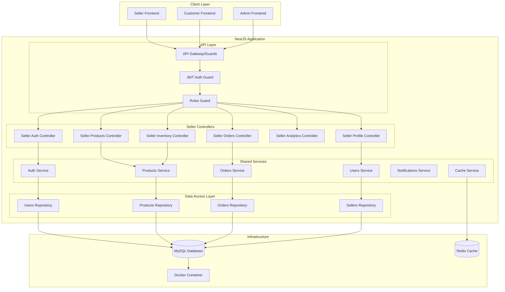
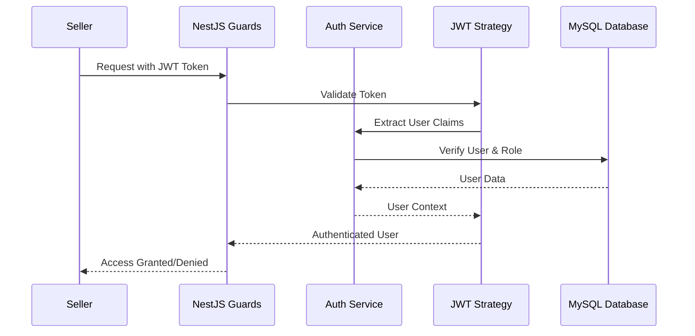
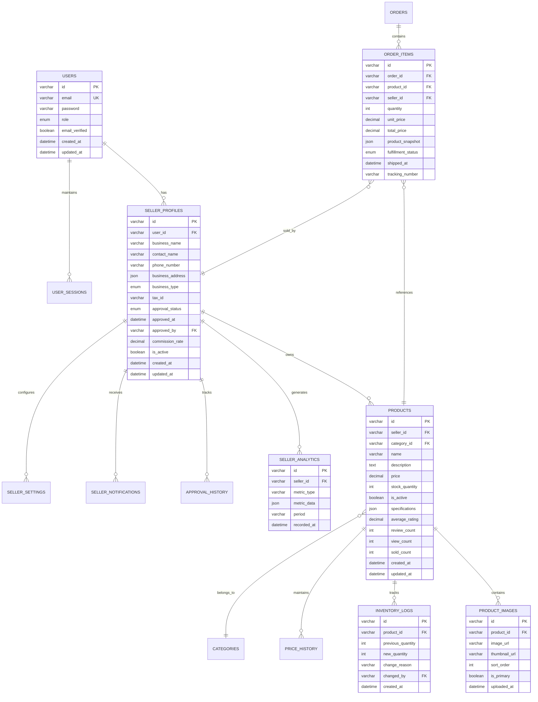

# Design Document: Seller Backend API

## Overview

The Seller Backend API represents the seller-focused components of the unified multi-vendor e-commerce platform backend built with NestJS and TypeScript. Rather than a separate API system, this design outlines the seller-specific controllers, services, and functionality within the unified NestJS application that serves customers, sellers, and super admins through role-based access control.

This system provides comprehensive seller operations including authentication, product management, inventory tracking, order processing, and sales analytics while maintaining seamless integration with customer-facing operations and administrative oversight through shared services and unified data models stored in MySQL with TypeORM.

### Key Design Principles

- **Unified NestJS Architecture**: Single NestJS application with seller-specific controllers and role-based guards
- **Role-Based Security**: JWT tokens with Passport.js authentication and seller role claims
- **MySQL with TypeORM**: Unified database schema with TypeORM entities and role-specific access patterns
- **Docker Development**: MySQL container for local development with TypeORM migrations
- **Performance Optimized**: Sub-200ms response times through caching and query optimization
- **Scalable Design**: Horizontal scaling support through stateless NestJS service architecture

## Architecture

### Unified NestJS Backend Architecture Overview

The seller functionality integrates into the unified NestJS backend architecture with role-based controller access:



### NestJS Role-Based Access Control Architecture

The seller controllers implement comprehensive role-based access control within the unified NestJS application:

#### JWT Authentication Flow with Passport.js


#### NestJS Guards and Decorators Implementation
```typescript
// JWT Authentication Guard
@Injectable()
export class JwtAuthGuard extends AuthGuard('jwt') {
  canActivate(context: ExecutionContext) {
    return super.canActivate(context);
  }
}

// Role-based Authorization Guard
@Injectable()
export class RolesGuard implements CanActivate {
  constructor(private reflector: Reflector) {}

  canActivate(context: ExecutionContext): boolean {
    const requiredRoles = this.reflector.getAllAndOverride<UserRole[]>(ROLES_KEY, [
      context.getHandler(),
      context.getClass(),
    ]);
    
    if (!requiredRoles) {
      return true;
    }
    
    const { user } = context.switchToHttp().getRequest();
    return requiredRoles.some((role) => user.role === role);
  }
}

// Seller-specific decorator
export const SellerOnly = () => SetMetadata(ROLES_KEY, [UserRole.SELLER]);

// Usage in controller
@Controller('api/seller')
@UseGuards(JwtAuthGuard, RolesGuard)
@SellerOnly()
export class SellerProductsController {
  // Controller methods
}
```

### Docker Development Environment

#### Docker Compose Configuration
```yaml
# docker-compose.yml
version: '3.8'
services:
  mysql:
    image: mysql:8.0
    container_name: ecommerce_mysql
    environment:
      MYSQL_ROOT_PASSWORD: root
      MYSQL_DATABASE: ecommerce
      MYSQL_USER: app_user
      MYSQL_PASSWORD: app_password
    ports:
      - "3306:3306"
    volumes:
      - mysql_data:/var/lib/mysql
      - ./docker/mysql/init:/docker-entrypoint-initdb.d
    command: --default-authentication-plugin=mysql_native_password

  redis:
    image: redis:7-alpine
    container_name: ecommerce_redis
    ports:
      - "6379:6379"
    volumes:
      - redis_data:/data

volumes:
  mysql_data:
  redis_data:
```

#### TypeORM Configuration for MySQL
```typescript
// database.config.ts
import { TypeOrmModuleOptions } from '@nestjs/typeorm';

export const databaseConfig: TypeOrmModuleOptions = {
  type: 'mysql',
  host: process.env.DB_HOST || 'localhost',
  port: parseInt(process.env.DB_PORT) || 3306,
  username: process.env.DB_USERNAME || 'app_user',
  password: process.env.DB_PASSWORD || 'app_password',
  database: process.env.DB_NAME || 'ecommerce',
  entities: [__dirname + '/../**/*.entity{.ts,.js}'],
  synchronize: process.env.NODE_ENV === 'development',
  migrations: [__dirname + '/migrations/*{.ts,.js}'],
  migrationsRun: true,
  logging: process.env.NODE_ENV === 'development',
  timezone: 'Z',
  charset: 'utf8mb4',
  collation: 'utf8mb4_unicode_ci',
};
```

## Components and Interfaces

### NestJS Controller Architecture

#### Seller Authentication Controller

```typescript
@Controller('api/auth/seller')
export class SellerAuthController {
  constructor(
    private readonly authService: AuthService,
    private readonly usersService: UsersService,
  ) {}

  @Post('register')
  @UsePipes(new ValidationPipe())
  async register(@Body() registerDto: SellerRegisterDto): Promise<SellerRegistrationResponse> {
    return this.authService.registerSeller(registerDto);
  }

  @Post('login')
  @UseGuards(LocalAuthGuard)
  async login(@Request() req): Promise<SellerAuthResponse> {
    return this.authService.loginSeller(req.user);
  }

  @Post('refresh')
  @UseGuards(JwtRefreshGuard)
  async refresh(@Request() req): Promise<SellerAuthResponse> {
    return this.authService.refreshSellerToken(req.user);
  }

  @Post('verify-email')
  async verifyEmail(@Body() verifyDto: EmailVerificationDto): Promise<EmailVerificationResult> {
    return this.authService.verifySellerEmail(verifyDto.token);
  }

  @Post('forgot-password')
  async forgotPassword(@Body() forgotDto: ForgotPasswordDto): Promise<void> {
    return this.authService.requestSellerPasswordReset(forgotDto.email);
  }

  @Post('reset-password')
  async resetPassword(@Body() resetDto: ResetPasswordDto): Promise<void> {
    return this.authService.resetSellerPassword(resetDto.token, resetDto.newPassword);
  }
}

// DTOs for validation
export class SellerRegisterDto {
  @IsString()
  @IsNotEmpty()
  businessName: string;

  @IsString()
  @IsNotEmpty()
  contactName: string;

  @IsEmail()
  email: string;

  @IsString()
  @MinLength(8)
  password: string;

  @IsString()
  @IsPhoneNumber()
  phoneNumber: string;

  @ValidateNested()
  @Type(() => BusinessAddressDto)
  businessAddress: BusinessAddressDto;

  @IsEnum(BusinessType)
  businessType: BusinessType;

  @IsOptional()
  @IsString()
  taxId?: string;
}
```

#### Seller Products Controller

```typescript
@Controller('api/seller/products')
@UseGuards(JwtAuthGuard, RolesGuard)
@SellerOnly()
export class SellerProductsController {
  constructor(
    private readonly productsService: ProductsService,
    private readonly inventoryService: InventoryService,
  ) {}

  @Post()
  @UsePipes(new ValidationPipe())
  async createProduct(
    @Request() req,
    @Body() createProductDto: CreateProductDto,
  ): Promise<Product> {
    return this.productsService.createSellerProduct(req.user.id, createProductDto);
  }

  @Get()
  async getSellerProducts(
    @Request() req,
    @Query() query: ProductQueryDto,
  ): Promise<ProductPage> {
    return this.productsService.findSellerProducts(req.user.id, query);
  }

  @Get(':id')
  async getProduct(
    @Request() req,
    @Param('id', ParseUUIDPipe) productId: string,
  ): Promise<Product> {
    return this.productsService.findSellerProduct(req.user.id, productId);
  }

  @Put(':id')
  @UsePipes(new ValidationPipe())
  async updateProduct(
    @Request() req,
    @Param('id', ParseUUIDPipe) productId: string,
    @Body() updateProductDto: UpdateProductDto,
  ): Promise<Product> {
    return this.productsService.updateSellerProduct(req.user.id, productId, updateProductDto);
  }

  @Delete(':id')
  async deleteProduct(
    @Request() req,
    @Param('id', ParseUUIDPipe) productId: string,
  ): Promise<DeletionResult> {
    return this.productsService.deleteSellerProduct(req.user.id, productId);
  }

  @Post(':id/images')
  @UseInterceptors(FileInterceptor('image'))
  async uploadProductImage(
    @Request() req,
    @Param('id', ParseUUIDPipe) productId: string,
    @UploadedFile() file: Express.Multer.File,
  ): Promise<ImageUploadResult> {
    return this.productsService.uploadProductImage(req.user.id, productId, file);
  }

  @Put('bulk')
  @UsePipes(new ValidationPipe())
  async bulkUpdateProducts(
    @Request() req,
    @Body() bulkUpdateDto: BulkProductUpdateDto,
  ): Promise<BulkOperationResult> {
    return this.productsService.bulkUpdateSellerProducts(req.user.id, bulkUpdateDto.operations);
  }
}
```

#### Seller Orders Controller

```typescript
@Controller('api/seller/orders')
@UseGuards(JwtAuthGuard, RolesGuard)
@SellerOnly()
export class SellerOrdersController {
  constructor(private readonly ordersService: OrdersService) {}

  @Get()
  async getSellerOrders(
    @Request() req,
    @Query() query: OrderQueryDto,
  ): Promise<OrderPage> {
    return this.ordersService.findSellerOrders(req.user.id, query);
  }

  @Get(':id')
  async getOrderDetails(
    @Request() req,
    @Param('id', ParseUUIDPipe) orderId: string,
  ): Promise<SellerOrderDetail> {
    return this.ordersService.findSellerOrderDetail(req.user.id, orderId);
  }

  @Put(':id/status')
  @UsePipes(new ValidationPipe())
  async updateOrderStatus(
    @Request() req,
    @Param('id', ParseUUIDPipe) orderId: string,
    @Body() statusUpdateDto: OrderStatusUpdateDto,
  ): Promise<OrderStatusUpdate> {
    return this.ordersService.updateSellerOrderStatus(
      req.user.id,
      orderId,
      statusUpdateDto.status,
      statusUpdateDto.notes,
    );
  }

  @Put(':id/tracking')
  @UsePipes(new ValidationPipe())
  async addTrackingInfo(
    @Request() req,
    @Param('id', ParseUUIDPipe) orderId: string,
    @Body() trackingDto: TrackingInfoDto,
  ): Promise<void> {
    return this.ordersService.addSellerOrderTracking(req.user.id, orderId, trackingDto);
  }

  @Put('bulk-status')
  @UsePipes(new ValidationPipe())
  async bulkUpdateOrderStatus(
    @Request() req,
    @Body() bulkUpdateDto: BulkOrderStatusUpdateDto,
  ): Promise<BulkOrderResult> {
    return this.ordersService.bulkUpdateSellerOrderStatus(req.user.id, bulkUpdateDto.updates);
  }
}
```

### TypeORM Entity Definitions

#### User Entity (Base for all user types)

```typescript
@Entity('users')
export class User {
  @PrimaryGeneratedColumn('uuid')
  id: string;

  @Column({ unique: true })
  email: string;

  @Column()
  password: string;

  @Column({
    type: 'enum',
    enum: UserRole,
    default: UserRole.CUSTOMER,
  })
  role: UserRole;

  @Column({ default: false })
  emailVerified: boolean;

  @Column({ nullable: true })
  emailVerificationToken: string;

  @Column({ nullable: true })
  passwordResetToken: string;

  @Column({ nullable: true })
  passwordResetExpires: Date;

  @CreateDateColumn()
  createdAt: Date;

  @UpdateDateColumn()
  updatedAt: Date;

  @OneToOne(() => SellerProfile, profile => profile.user)
  sellerProfile: SellerProfile;

  @OneToMany(() => UserSession, session => session.user)
  sessions: UserSession[];
}

export enum UserRole {
  CUSTOMER = 'customer',
  SELLER = 'seller',
  SUPER_ADMIN = 'super_admin',
}
```

#### Seller Profile Entity

```typescript
@Entity('seller_profiles')
export class SellerProfile {
  @PrimaryGeneratedColumn('uuid')
  id: string;

  @Column()
  @Index()
  userId: string;

  @OneToOne(() => User, user => user.sellerProfile)
  @JoinColumn({ name: 'userId' })
  user: User;

  @Column()
  businessName: string;

  @Column()
  contactName: string;

  @Column()
  phoneNumber: string;

  @Column('json')
  businessAddress: BusinessAddress;

  @Column({
    type: 'enum',
    enum: BusinessType,
  })
  businessType: BusinessType;

  @Column({ nullable: true })
  taxId: string;

  @Column({
    type: 'enum',
    enum: ApprovalStatus,
    default: ApprovalStatus.PENDING,
  })
  approvalStatus: ApprovalStatus;

  @Column({ nullable: true })
  approvedAt: Date;

  @Column({ nullable: true })
  approvedBy: string;

  @Column('decimal', { precision: 5, scale: 4, default: 0.05 })
  commissionRate: number;

  @Column({ default: true })
  isActive: boolean;

  @CreateDateColumn()
  createdAt: Date;

  @UpdateDateColumn()
  updatedAt: Date;

  @OneToMany(() => Product, product => product.seller)
  products: Product[];

  @OneToMany(() => OrderItem, orderItem => orderItem.seller)
  orderItems: OrderItem[];
}

export enum ApprovalStatus {
  PENDING = 'pending',
  APPROVED = 'approved',
  REJECTED = 'rejected',
  SUSPENDED = 'suspended',
}

export enum BusinessType {
  RETAIL = 'retail',
  WHOLESALE = 'wholesale',
  MANUFACTURER = 'manufacturer',
  SERVICE = 'service',
}
```

#### Product Entity

```typescript
@Entity('products')
export class Product {
  @PrimaryGeneratedColumn('uuid')
  id: string;

  @Column()
  @Index()
  sellerId: string;

  @ManyToOne(() => SellerProfile, seller => seller.products)
  @JoinColumn({ name: 'sellerId' })
  seller: SellerProfile;

  @Column()
  @Index()
  categoryId: string;

  @ManyToOne(() => Category, category => category.products)
  @JoinColumn({ name: 'categoryId' })
  category: Category;

  @Column()
  name: string;

  @Column('text')
  description: string;

  @Column('decimal', { precision: 10, scale: 2 })
  price: number;

  @Column('int', { default: 0 })
  stockQuantity: number;

  @Column({ default: true })
  @Index()
  isActive: boolean;

  @Column('json', { nullable: true })
  specifications: Record<string, any>;

  @Column('decimal', { precision: 3, scale: 2, default: 0 })
  averageRating: number;

  @Column('int', { default: 0 })
  reviewCount: number;

  @Column('int', { default: 0 })
  viewCount: number;

  @Column('int', { default: 0 })
  soldCount: number;

  @CreateDateColumn()
  createdAt: Date;

  @UpdateDateColumn()
  updatedAt: Date;

  @OneToMany(() => ProductImage, image => image.product)
  images: ProductImage[];

  @OneToMany(() => InventoryLog, log => log.product)
  inventoryLogs: InventoryLog[];

  @OneToMany(() => OrderItem, orderItem => orderItem.product)
  orderItems: OrderItem[];

  @Index(['sellerId', 'isActive'])
  sellerActiveIndex: any;
}
```

### Service Layer Architecture

#### Products Service with Seller-Specific Methods

```typescript
@Injectable()
export class ProductsService {
  constructor(
    @InjectRepository(Product)
    private productsRepository: Repository<Product>,
    @InjectRepository(SellerProfile)
    private sellersRepository: Repository<SellerProfile>,
    private cacheService: CacheService,
    private eventEmitter: EventEmitter2,
  ) {}

  async createSellerProduct(sellerId: string, createProductDto: CreateProductDto): Promise<Product> {
    // Verify seller ownership and approval status
    const seller = await this.sellersRepository.findOne({
      where: { userId: sellerId, approvalStatus: ApprovalStatus.APPROVED },
    });

    if (!seller) {
      throw new ForbiddenException('Seller not approved or not found');
    }

    const product = this.productsRepository.create({
      ...createProductDto,
      sellerId: seller.id,
    });

    const savedProduct = await this.productsRepository.save(product);

    // Emit event for cross-system synchronization
    this.eventEmitter.emit('product.created', {
      productId: savedProduct.id,
      sellerId: seller.id,
      product: savedProduct,
    });

    // Invalidate cache
    await this.cacheService.del(`seller:${seller.id}:products:*`);

    return savedProduct;
  }

  async findSellerProducts(sellerId: string, query: ProductQueryDto): Promise<ProductPage> {
    const seller = await this.sellersRepository.findOne({
      where: { userId: sellerId },
    });

    if (!seller) {
      throw new NotFoundException('Seller not found');
    }

    // Check cache first
    const cacheKey = `seller:${seller.id}:products:${JSON.stringify(query)}`;
    const cached = await this.cacheService.get(cacheKey);
    if (cached) {
      return cached;
    }

    const queryBuilder = this.productsRepository
      .createQueryBuilder('product')
      .leftJoinAndSelect('product.images', 'images')
      .where('product.sellerId = :sellerId', { sellerId: seller.id });

    // Apply filters
    if (query.isActive !== undefined) {
      queryBuilder.andWhere('product.isActive = :isActive', { isActive: query.isActive });
    }

    if (query.categoryId) {
      queryBuilder.andWhere('product.categoryId = :categoryId', { categoryId: query.categoryId });
    }

    if (query.search) {
      queryBuilder.andWhere(
        '(product.name LIKE :search OR product.description LIKE :search)',
        { search: `%${query.search}%` },
      );
    }

    // Apply sorting
    const sortField = query.sortBy || 'createdAt';
    const sortOrder = query.sortOrder || 'DESC';
    queryBuilder.orderBy(`product.${sortField}`, sortOrder);

    // Apply pagination
    const page = query.page || 1;
    const limit = query.limit || 20;
    const offset = (page - 1) * limit;

    queryBuilder.skip(offset).take(limit);

    const [products, totalCount] = await queryBuilder.getManyAndCount();

    const result = {
      products,
      totalCount,
      hasNextPage: offset + limit < totalCount,
      currentPage: page,
      totalPages: Math.ceil(totalCount / limit),
    };

    // Cache the result
    await this.cacheService.set(cacheKey, result, 300); // 5 minutes

    return result;
  }

  async updateSellerProduct(
    sellerId: string,
    productId: string,
    updateProductDto: UpdateProductDto,
  ): Promise<Product> {
    const seller = await this.sellersRepository.findOne({
      where: { userId: sellerId },
    });

    if (!seller) {
      throw new NotFoundException('Seller not found');
    }

    const product = await this.productsRepository.findOne({
      where: { id: productId, sellerId: seller.id },
    });

    if (!product) {
      throw new NotFoundException('Product not found or access denied');
    }

    // Track price changes
    if (updateProductDto.price && updateProductDto.price !== product.price) {
      await this.trackPriceChange(productId, product.price, updateProductDto.price);
    }

    Object.assign(product, updateProductDto);
    const updatedProduct = await this.productsRepository.save(product);

    // Emit event for synchronization
    this.eventEmitter.emit('product.updated', {
      productId: updatedProduct.id,
      sellerId: seller.id,
      changes: updateProductDto,
    });

    // Invalidate cache
    await this.cacheService.del(`seller:${seller.id}:products:*`);
    await this.cacheService.del(`product:${productId}`);

    return updatedProduct;
  }

  private async trackPriceChange(productId: string, oldPrice: number, newPrice: number): Promise<void> {
    // Implementation for price history tracking
    // This would typically involve a separate PriceHistory entity
  }
}
```
```

## Data Models

### MySQL Database Schema with TypeORM Entities

The seller backend operates on the unified MySQL database schema with seller-specific access patterns and TypeORM entities:



### TypeORM Repository Patterns

#### Seller-Specific Repository Methods

```typescript
@Injectable()
export class ProductsRepository extends Repository<Product> {
  constructor(private dataSource: DataSource) {
    super(Product, dataSource.createEntityManager());
  }

  async findSellerProducts(
    sellerId: string,
    filters: ProductFilters,
    pagination: PaginationOptions,
  ): Promise<[Product[], number]> {
    const queryBuilder = this.createQueryBuilder('product')
      .leftJoinAndSelect('product.images', 'images')
      .leftJoinAndSelect('product.category', 'category')
      .where('product.sellerId = :sellerId', { sellerId });

    // Apply filters
    if (filters.isActive !== undefined) {
      queryBuilder.andWhere('product.isActive = :isActive', { isActive: filters.isActive });
    }

    if (filters.categoryId) {
      queryBuilder.andWhere('product.categoryId = :categoryId', { categoryId: filters.categoryId });
    }

    if (filters.search) {
      queryBuilder.andWhere(
        '(product.name LIKE :search OR product.description LIKE :search)',
        { search: `%${filters.search}%` },
      );
    }

    if (filters.priceMin !== undefined) {
      queryBuilder.andWhere('product.price >= :priceMin', { priceMin: filters.priceMin });
    }

    if (filters.priceMax !== undefined) {
      queryBuilder.andWhere('product.price <= :priceMax', { priceMax: filters.priceMax });
    }

    // Apply sorting
    const sortField = filters.sortBy || 'createdAt';
    const sortOrder = filters.sortOrder || 'DESC';
    queryBuilder.orderBy(`product.${sortField}`, sortOrder);

    // Apply pagination
    if (pagination.limit) {
      queryBuilder.take(pagination.limit);
    }
    if (pagination.offset) {
      queryBuilder.skip(pagination.offset);
    }

    return queryBuilder.getManyAndCount();
  }

  async findSellerProductWithOwnership(sellerId: string, productId: string): Promise<Product | null> {
    return this.findOne({
      where: { id: productId, sellerId },
      relations: ['images', 'category', 'inventoryLogs'],
    });
  }

  async getSellerProductStats(sellerId: string): Promise<SellerProductStats> {
    const result = await this.createQueryBuilder('product')
      .select([
        'COUNT(*) as totalProducts',
        'SUM(CASE WHEN product.isActive = true THEN 1 ELSE 0 END) as activeProducts',
        'SUM(CASE WHEN product.stockQuantity = 0 THEN 1 ELSE 0 END) as outOfStockProducts',
        'SUM(CASE WHEN product.stockQuantity < 5 AND product.stockQuantity > 0 THEN 1 ELSE 0 END) as lowStockProducts',
        'AVG(product.price) as averagePrice',
        'SUM(product.soldCount) as totalSold',
      ])
      .where('product.sellerId = :sellerId', { sellerId })
      .getRawOne();

    return {
      totalProducts: parseInt(result.totalProducts),
      activeProducts: parseInt(result.activeProducts),
      outOfStockProducts: parseInt(result.outOfStockProducts),
      lowStockProducts: parseInt(result.lowStockProducts),
      averagePrice: parseFloat(result.averagePrice) || 0,
      totalSold: parseInt(result.totalSold) || 0,
    };
  }
}

@Injectable()
export class OrdersRepository extends Repository<Order> {
  constructor(private dataSource: DataSource) {
    super(Order, dataSource.createEntityManager());
  }

  async findSellerOrders(
    sellerId: string,
    filters: OrderFilters,
    pagination: PaginationOptions,
  ): Promise<[Order[], number]> {
    const queryBuilder = this.createQueryBuilder('order')
      .innerJoin('order.orderItems', 'orderItem')
      .leftJoinAndSelect('order.customer', 'customer')
      .leftJoinAndSelect('order.shippingAddress', 'shippingAddress')
      .where('orderItem.sellerId = :sellerId', { sellerId });

    // Apply filters
    if (filters.status) {
      queryBuilder.andWhere('order.status = :status', { status: filters.status });
    }

    if (filters.dateFrom) {
      queryBuilder.andWhere('order.createdAt >= :dateFrom', { dateFrom: filters.dateFrom });
    }

    if (filters.dateTo) {
      queryBuilder.andWhere('order.createdAt <= :dateTo', { dateTo: filters.dateTo });
    }

    // Apply sorting
    queryBuilder.orderBy('order.createdAt', 'DESC');

    // Apply pagination
    if (pagination.limit) {
      queryBuilder.take(pagination.limit);
    }
    if (pagination.offset) {
      queryBuilder.skip(pagination.offset);
    }

    return queryBuilder.getManyAndCount();
  }

  async getSellerOrderStats(sellerId: string, dateRange: DateRange): Promise<SellerOrderStats> {
    const result = await this.createQueryBuilder('order')
      .innerJoin('order.orderItems', 'orderItem')
      .select([
        'COUNT(DISTINCT order.id) as totalOrders',
        'SUM(orderItem.totalPrice) as totalRevenue',
        'AVG(orderItem.totalPrice) as averageOrderValue',
        'SUM(orderItem.quantity) as totalItemsSold',
      ])
      .where('orderItem.sellerId = :sellerId', { sellerId })
      .andWhere('order.createdAt >= :dateFrom', { dateFrom: dateRange.from })
      .andWhere('order.createdAt <= :dateTo', { dateTo: dateRange.to })
      .getRawOne();

    return {
      totalOrders: parseInt(result.totalOrders) || 0,
      totalRevenue: parseFloat(result.totalRevenue) || 0,
      averageOrderValue: parseFloat(result.averageOrderValue) || 0,
      totalItemsSold: parseInt(result.totalItemsSold) || 0,
    };
  }
}
```

### MySQL Database Indexes and Views

```sql
-- Performance indexes for seller operations
CREATE INDEX idx_products_seller_active ON products(seller_id, is_active);
CREATE INDEX idx_products_seller_category ON products(seller_id, category_id);
CREATE INDEX idx_products_seller_created ON products(seller_id, created_at DESC);
CREATE INDEX idx_order_items_seller_status ON order_items(seller_id, fulfillment_status);
CREATE INDEX idx_order_items_seller_date ON order_items(seller_id, created_at DESC);
CREATE INDEX idx_seller_profiles_approval ON seller_profiles(approval_status, created_at);
CREATE INDEX idx_inventory_logs_product_date ON inventory_logs(product_id, created_at DESC);
CREATE INDEX idx_users_email_role ON users(email, role);

-- Seller products view with performance metrics
CREATE VIEW seller_products_summary AS
SELECT 
    p.*,
    COALESCE(pi.image_count, 0) as image_count,
    COALESCE(oi.total_sold, 0) as total_sold,
    COALESCE(oi.total_revenue, 0) as total_revenue,
    CASE 
        WHEN p.stock_quantity = 0 THEN 'out_of_stock'
        WHEN p.stock_quantity < 5 THEN 'low_stock'
        ELSE 'in_stock'
    END as stock_status
FROM products p
LEFT JOIN (
    SELECT product_id, COUNT(*) as image_count
    FROM product_images
    GROUP BY product_id
) pi ON p.id = pi.product_id
LEFT JOIN (
    SELECT 
        product_id,
        SUM(quantity) as total_sold,
        SUM(total_price) as total_revenue
    FROM order_items
    GROUP BY product_id
) oi ON p.id = oi.product_id;

-- Seller order summary view
CREATE VIEW seller_order_summary AS
SELECT 
    sp.id as seller_id,
    o.id as order_id,
    o.order_number,
    o.customer_id,
    o.status as order_status,
    o.created_at as order_date,
    SUM(oi.total_price) as seller_total,
    COUNT(oi.id) as item_count,
    MAX(oi.fulfillment_status) as fulfillment_status
FROM seller_profiles sp
JOIN order_items oi ON sp.id = oi.seller_id
JOIN orders o ON oi.order_id = o.id
GROUP BY sp.id, o.id, o.order_number, o.customer_id, o.status, o.created_at;

-- Seller analytics aggregation view
CREATE VIEW seller_daily_metrics AS
SELECT 
    sp.id as seller_id,
    DATE(o.created_at) as metric_date,
    COUNT(DISTINCT o.id) as orders_count,
    SUM(oi.total_price) as revenue,
    SUM(oi.quantity) as items_sold,
    AVG(oi.unit_price) as avg_item_price
FROM seller_profiles sp
JOIN order_items oi ON sp.id = oi.seller_id
JOIN orders o ON oi.order_id = o.id
WHERE o.status != 'cancelled'
GROUP BY sp.id, DATE(o.created_at);
```

### Caching Strategy with Redis

```typescript
@Injectable()
export class SellerCacheService {
  constructor(
    @Inject('REDIS_CLIENT')
    private readonly redisClient: Redis,
  ) {}

  // Product caching
  async cacheSellerProducts(sellerId: string, products: Product[], filters: string, ttl = 300): Promise<void> {
    const key = this.getSellerProductsKey(sellerId, filters);
    await this.redisClient.setex(key, ttl, JSON.stringify(products));
  }

  async getCachedSellerProducts(sellerId: string, filters: string): Promise<Product[] | null> {
    const key = this.getSellerProductsKey(sellerId, filters);
    const cached = await this.redisClient.get(key);
    return cached ? JSON.parse(cached) : null;
  }

  async invalidateSellerProductCache(sellerId: string, productId?: string): Promise<void> {
    const pattern = `seller:${sellerId}:products:*`;
    const keys = await this.redisClient.keys(pattern);
    
    if (keys.length > 0) {
      await this.redisClient.del(...keys);
    }

    if (productId) {
      await this.redisClient.del(`product:${productId}`);
    }
  }

  // Analytics caching
  async cacheSellerAnalytics(
    sellerId: string,
    analytics: SalesAnalytics,
    period: string,
    ttl = 600,
  ): Promise<void> {
    const key = `seller:${sellerId}:analytics:${period}`;
    await this.redisClient.setex(key, ttl, JSON.stringify(analytics));
  }

  async getCachedSellerAnalytics(sellerId: string, period: string): Promise<SalesAnalytics | null> {
    const key = `seller:${sellerId}:analytics:${period}`;
    const cached = await this.redisClient.get(key);
    return cached ? JSON.parse(cached) : null;
  }

  // Dashboard caching
  async cacheSellerDashboard(sellerId: string, dashboard: SellerDashboardMetrics, ttl = 180): Promise<void> {
    const key = `seller:${sellerId}:dashboard`;
    await this.redisClient.setex(key, ttl, JSON.stringify(dashboard));
  }

  async getCachedSellerDashboard(sellerId: string): Promise<SellerDashboardMetrics | null> {
    const key = `seller:${sellerId}:dashboard`;
    const cached = await this.redisClient.get(key);
    return cached ? JSON.parse(cached) : null;
  }

  private getSellerProductsKey(sellerId: string, filters: string): string {
    const filtersHash = Buffer.from(filters).toString('base64');
    return `seller:${sellerId}:products:${filtersHash}`;
  }
}
```

## Error Handling

### Seller-Specific Error Management

The seller backend implements comprehensive error handling tailored to seller operations within the unified system:

#### Seller Error Categories

**Authentication & Authorization Errors (4xx)**
- **401 Unauthorized**: Invalid seller JWT token or expired session
- **403 Forbidden**: Seller account not approved or insufficient permissions
- **429 Too Many Requests**: Seller-specific rate limiting exceeded

**Business Rule Violations (4xx)**
- **400 Bad Request**: Invalid seller operation request format
- **409 Conflict**: Business rule conflicts (e.g., cannot delete product with active orders)
- **422 Unprocessable Entity**: Valid format but seller business rule violations

**Resource Management Errors (4xx)**
- **404 Not Found**: Seller resource not found or not owned by seller
- **413 Payload Too Large**: Product image upload size exceeded
- **415 Unsupported Media Type**: Invalid image format for product upload

**Integration Errors (5xx)**
- **500 Internal Server Error**: Seller service internal errors
- **502 Bad Gateway**: Integration failures with shared services
- **503 Service Unavailable**: Seller service temporarily unavailable

#### Seller Error Response Format

```typescript
interface SellerErrorResponse {
  error: {
    code: string
    message: string
    details?: {
      field?: string
      reason?: string
      sellerId?: string
      resourceId?: string
      businessRule?: string
    }
    sellerContext?: {
      sellerId: string
      businessName: string
      approvalStatus: ApprovalStatus
    }
    timestamp: string
    requestId: string
    path: string
  }
}

// Example seller-specific error
{
  "error": {
    "code": "SELLER_NOT_APPROVED",
    "message": "Seller account is not approved for this operation",
    "details": {
      "sellerId": "seller_123",
      "reason": "Account pending admin approval"
    },
    "sellerContext": {
      "sellerId": "seller_123",
      "businessName": "Example Store",
      "approvalStatus": "pending"
    },
    "timestamp": "2024-03-10T10:30:00Z",
    "requestId": "req_seller_456",
    "path": "/api/seller/products"
  }
}
```

#### Seller Business Rule Validation

```typescript
interface SellerBusinessRuleValidator {
  validateProductCreation(sellerId: string, productData: CreateProductRequest): Promise<ValidationResult>
  validateInventoryUpdate(sellerId: string, productId: string, newQuantity: number): Promise<ValidationResult>
  validateOrderStatusUpdate(sellerId: string, orderId: string, newStatus: OrderStatus): Promise<ValidationResult>
  validateBulkOperation(sellerId: string, operation: BulkOperation): Promise<ValidationResult>
}

interface ValidationResult {
  isValid: boolean
  errors: ValidationError[]
  warnings: ValidationWarning[]
}

interface ValidationError {
  field: string
  code: string
  message: string
  businessRule: string
}
```

### Integration Error Handling

```typescript
interface SellerIntegrationErrorHandler {
  handleCustomerSyncFailure(sellerId: string, operation: string, error: IntegrationError): Promise<ErrorResponse>
  handleInventorySyncFailure(sellerId: string, productId: string, error: IntegrationError): Promise<ErrorResponse>
  handleOrderSyncFailure(sellerId: string, orderId: string, error: IntegrationError): Promise<ErrorResponse>
  handleAnalyticsSyncFailure(sellerId: string, error: IntegrationError): Promise<ErrorResponse>
}
```

## Testing Strategy

### Comprehensive NestJS Seller Backend Testing Framework

The seller backend testing strategy emphasizes both unit testing for specific seller business logic and property-based testing for correctness validation across seller operations within the unified NestJS application.

#### Testing Architecture

**Unit Tests (Foundation Layer - 70%)**
- **Scope**: Seller business logic, validation rules, and NestJS service components
- **Framework**: Jest with TypeScript support and NestJS testing utilities
- **Coverage Target**: 95%+ for seller-specific business logic
- **Focus Areas**:
  - Seller authentication and authorization flows with Passport.js
  - Product management business rules with TypeORM repositories
  - Inventory management logic and MySQL transactions
  - Order processing workflows with role-based access
  - Sales analytics calculations with Redis caching

**Integration Tests (Service Layer - 20%)**
- **Scope**: Seller controller integration with services and MySQL database
- **Framework**: Jest with Supertest for NestJS API testing
- **Database**: Test MySQL database with Docker container and seller-specific test data
- **Focus Areas**:
  - Seller API endpoint functionality with JWT authentication
  - Cross-service communication within unified NestJS app
  - MySQL database transaction integrity for seller operations
  - Role-based access control validation with NestJS guards

**Property-Based Tests (Correctness Layer - 10%)**
- **Framework**: fast-check for JavaScript/TypeScript
- **Configuration**: Minimum 100 iterations per property test
- **Focus Areas**:
  - Universal properties for seller operations
  - Business rule consistency across all inputs
  - Data transformation correctness with TypeORM entities
  - Seller-specific invariants in unified system

#### NestJS Test Configuration

```typescript
// test/app.e2e-spec.ts
import { Test, TestingModule } from '@nestjs/testing';
import { INestApplication } from '@nestjs/common';
import { TypeOrmModule } from '@nestjs/typeorm';
import * as request from 'supertest';
import { AppModule } from '../src/app.module';
import { getRepositoryToken } from '@nestjs/typeorm';
import { Repository } from 'typeorm';
import { User } from '../src/users/entities/user.entity';
import { SellerProfile } from '../src/sellers/entities/seller-profile.entity';
import { Product } from '../src/products/entities/product.entity';

describe('Seller Backend API (e2e)', () => {
  let app: INestApplication;
  let userRepository: Repository<User>;
  let sellerRepository: Repository<SellerProfile>;
  let productRepository: Repository<Product>;
  let jwtToken: string;
  let testSeller: SellerProfile;

  beforeAll(async () => {
    const moduleFixture: TestingModule = await Test.createTestingModule({
      imports: [
        AppModule,
        TypeOrmModule.forRoot({
          type: 'mysql',
          host: 'localhost',
          port: 3307, // Different port for test database
          username: 'test_user',
          password: 'test_password',
          database: 'ecommerce_test',
          entities: [__dirname + '/../src/**/*.entity{.ts,.js}'],
          synchronize: true,
          dropSchema: true,
        }),
      ],
    }).compile();

    app = moduleFixture.createNestApplication();
    await app.init();

    userRepository = moduleFixture.get<Repository<User>>(getRepositoryToken(User));
    sellerRepository = moduleFixture.get<Repository<SellerProfile>>(getRepositoryToken(SellerProfile));
    productRepository = moduleFixture.get<Repository<Product>>(getRepositoryToken(Product));

    // Setup test data
    await setupTestData();
  });

  beforeEach(async () => {
    // Clean up test data before each test
    await productRepository.delete({});
    await sellerRepository.delete({});
    await userRepository.delete({});
    
    // Recreate test seller
    await setupTestData();
  });

  afterAll(async () => {
    await app.close();
  });

  async function setupTestData() {
    // Create test user
    const testUser = userRepository.create({
      email: 'test.seller@example.com',
      password: '$2b$12$hashedpassword',
      role: UserRole.SELLER,
      emailVerified: true,
    });
    const savedUser = await userRepository.save(testUser);

    // Create test seller profile
    testSeller = sellerRepository.create({
      userId: savedUser.id,
      businessName: 'Test Store',
      contactName: 'John Doe',
      phoneNumber: '+1234567890',
      businessAddress: {
        street: '123 Test St',
        city: 'Test City',
        state: 'TS',
        zipCode: '12345',
        country: 'US',
      },
      businessType: BusinessType.RETAIL,
      approvalStatus: ApprovalStatus.APPROVED,
    });
    await sellerRepository.save(testSeller);

    // Generate JWT token for testing
    jwtToken = generateTestJWT(savedUser);
  }

  describe('Seller Authentication', () => {
    it('should register a new seller', async () => {
      const registerDto = {
        businessName: 'New Test Store',
        contactName: 'Jane Doe',
        email: 'new.seller@example.com',
        password: 'SecurePassword123',
        phoneNumber: '+1987654321',
        businessAddress: {
          street: '456 New St',
          city: 'New City',
          state: 'NS',
          zipCode: '54321',
          country: 'US',
        },
        businessType: 'retail',
      };

      const response = await request(app.getHttpServer())
        .post('/api/auth/seller/register')
        .send(registerDto)
        .expect(201);

      expect(response.body).toHaveProperty('seller');
      expect(response.body.seller.businessName).toBe(registerDto.businessName);
      expect(response.body.seller.approvalStatus).toBe('pending');
    });

    it('should authenticate seller with valid credentials', async () => {
      const loginDto = {
        email: 'test.seller@example.com',
        password: 'SecurePassword123',
      };

      const response = await request(app.getHttpServer())
        .post('/api/auth/seller/login')
        .send(loginDto)
        .expect(200);

      expect(response.body).toHaveProperty('token');
      expect(response.body).toHaveProperty('seller');
      expect(response.body.seller.approvalStatus).toBe('approved');
    });
  });

  describe('Seller Products', () => {
    it('should create a new product for authenticated seller', async () => {
      const createProductDto = {
        name: 'Test Product',
        description: 'A test product description',
        price: 29.99,
        categoryId: 'category-uuid',
        stockQuantity: 100,
      };

      const response = await request(app.getHttpServer())
        .post('/api/seller/products')
        .set('Authorization', `Bearer ${jwtToken}`)
        .send(createProductDto)
        .expect(201);

      expect(response.body).toHaveProperty('id');
      expect(response.body.name).toBe(createProductDto.name);
      expect(response.body.sellerId).toBe(testSeller.id);
    });

    it('should get seller products with pagination', async () => {
      // Create test products
      await createTestProducts(testSeller.id, 5);

      const response = await request(app.getHttpServer())
        .get('/api/seller/products?page=1&limit=3')
        .set('Authorization', `Bearer ${jwtToken}`)
        .expect(200);

      expect(response.body).toHaveProperty('products');
      expect(response.body).toHaveProperty('totalCount');
      expect(response.body.products).toHaveLength(3);
      expect(response.body.totalCount).toBe(5);
    });

    it('should prevent access to other seller products', async () => {
      // Create another seller's product
      const otherSeller = await createTestSeller('other@example.com');
      const otherProduct = await createTestProduct(otherSeller.id);

      await request(app.getHttpServer())
        .get(`/api/seller/products/${otherProduct.id}`)
        .set('Authorization', `Bearer ${jwtToken}`)
        .expect(404);
    });
  });
});
```

#### Seller Business Logic Testing with TypeORM

```typescript
// src/products/products.service.spec.ts
import { Test, TestingModule } from '@nestjs/testing';
import { getRepositoryToken } from '@nestjs/typeorm';
import { Repository } from 'typeorm';
import { ProductsService } from './products.service';
import { Product } from './entities/product.entity';
import { SellerProfile } from '../sellers/entities/seller-profile.entity';
import { CacheService } from '../cache/cache.service';
import { EventEmitter2 } from '@nestjs/event-emitter';

describe('ProductsService', () => {
  let service: ProductsService;
  let productRepository: Repository<Product>;
  let sellerRepository: Repository<SellerProfile>;
  let cacheService: CacheService;
  let eventEmitter: EventEmitter2;

  beforeEach(async () => {
    const module: TestingModule = await Test.createTestingModule({
      providers: [
        ProductsService,
        {
          provide: getRepositoryToken(Product),
          useClass: Repository,
        },
        {
          provide: getRepositoryToken(SellerProfile),
          useClass: Repository,
        },
        {
          provide: CacheService,
          useValue: {
            get: jest.fn(),
            set: jest.fn(),
            del: jest.fn(),
          },
        },
        {
          provide: EventEmitter2,
          useValue: {
            emit: jest.fn(),
          },
        },
      ],
    }).compile();

    service = module.get<ProductsService>(ProductsService);
    productRepository = module.get<Repository<Product>>(getRepositoryToken(Product));
    sellerRepository = module.get<Repository<SellerProfile>>(getRepositoryToken(SellerProfile));
    cacheService = module.get<CacheService>(CacheService);
    eventEmitter = module.get<EventEmitter2>(EventEmitter2);
  });

  describe('createSellerProduct', () => {
    it('should create product for approved seller', async () => {
      const sellerId = 'seller-uuid';
      const approvedSeller = {
        id: 'seller-profile-uuid',
        userId: sellerId,
        approvalStatus: ApprovalStatus.APPROVED,
      } as SellerProfile;

      const createProductDto = {
        name: 'Test Product',
        description: 'Test Description',
        price: 29.99,
        categoryId: 'category-uuid',
        stockQuantity: 100,
      };

      jest.spyOn(sellerRepository, 'findOne').mockResolvedValue(approvedSeller);
      jest.spyOn(productRepository, 'create').mockReturnValue({
        ...createProductDto,
        sellerId: approvedSeller.id,
      } as Product);
      jest.spyOn(productRepository, 'save').mockResolvedValue({
        id: 'product-uuid',
        ...createProductDto,
        sellerId: approvedSeller.id,
      } as Product);

      const result = await service.createSellerProduct(sellerId, createProductDto);

      expect(result).toBeDefined();
      expect(result.sellerId).toBe(approvedSeller.id);
      expect(eventEmitter.emit).toHaveBeenCalledWith('product.created', expect.any(Object));
      expect(cacheService.del).toHaveBeenCalledWith(`seller:${approvedSeller.id}:products:*`);
    });

    it('should throw ForbiddenException for non-approved seller', async () => {
      const sellerId = 'seller-uuid';
      const pendingSeller = {
        id: 'seller-profile-uuid',
        userId: sellerId,
        approvalStatus: ApprovalStatus.PENDING,
      } as SellerProfile;

      jest.spyOn(sellerRepository, 'findOne').mockResolvedValue(null);

      await expect(
        service.createSellerProduct(sellerId, {} as any),
      ).rejects.toThrow('Seller not approved or not found');
    });
  });

  describe('findSellerProducts', () => {
    it('should return cached products if available', async () => {
      const sellerId = 'seller-uuid';
      const seller = { id: 'seller-profile-uuid', userId: sellerId } as SellerProfile;
      const cachedProducts = [{ id: 'product-1' }, { id: 'product-2' }];

      jest.spyOn(sellerRepository, 'findOne').mockResolvedValue(seller);
      jest.spyOn(cacheService, 'get').mockResolvedValue(cachedProducts);

      const result = await service.findSellerProducts(sellerId, {});

      expect(result).toBe(cachedProducts);
      expect(cacheService.get).toHaveBeenCalled();
    });
  });
});
```

#### Property-Based Test Generators for Seller Domain

```typescript
// test/property-tests/seller.property.spec.ts
import fc from 'fast-check';
import { ProductsService } from '../src/products/products.service';
import { InventoryService } from '../src/inventory/inventory.service';

// Seller-specific generators
const sellerProfileGenerator = fc.record({
  businessName: fc.string({ minLength: 1, maxLength: 100 }),
  contactName: fc.string({ minLength: 1, maxLength: 50 }),
  email: fc.emailAddress(),
  phoneNumber: fc.string({ minLength: 10, maxLength: 15 }),
  businessType: fc.constantFrom('retail', 'wholesale', 'manufacturer', 'service'),
  approvalStatus: fc.constantFrom('pending', 'approved', 'rejected'),
});

const productGenerator = fc.record({
  name: fc.string({ minLength: 1, maxLength: 200 }),
  description: fc.string({ minLength: 10, maxLength: 2000 }),
  price: fc.float({ min: 0.01, max: 10000, noNaN: true }),
  stockQuantity: fc.integer({ min: 0, max: 1000 }),
  categoryId: fc.uuid(),
  isActive: fc.boolean(),
});

const inventoryUpdateGenerator = fc.record({
  productId: fc.uuid(),
  quantityChange: fc.integer({ min: -100, max: 100 }),
  reason: fc.constantFrom('sale', 'restock', 'adjustment', 'return', 'damage'),
});

describe('Seller Backend Property Tests', () => {
  describe('Product Management', () => {
    it('should enforce seller ownership for product operations', async () => {
      // This would be implemented with actual service instances
      // Testing that seller can only access their own products
      fc.assert(fc.property(
        fc.uuid(), // seller1Id
        fc.uuid(), // seller2Id
        productGenerator,
        async (seller1Id, seller2Id, productData) => {
          fc.pre(seller1Id !== seller2Id); // Ensure different sellers
          
          // Feature: seller-backend-api, Property: Seller ownership validation
          // Implementation would test actual service calls
          // expect(() => updateProductAsDifferentSeller()).toThrow('Access denied');
        }
      ), { numRuns: 50 });
    });

    it('should validate product data according to business rules', () => {
      fc.assert(fc.property(
        productGenerator,
        (productData) => {
          // Feature: seller-backend-api, Property 6: Product data validation rules
          const validationResult = validateProductData(productData);
          
          if (productData.price <= 0) {
            expect(validationResult.isValid).toBe(false);
            expect(validationResult.errors).toContainEqual(
              expect.objectContaining({ field: 'price', code: 'INVALID_PRICE' })
            );
          }
          
          if (productData.stockQuantity < 0) {
            expect(validationResult.isValid).toBe(false);
            expect(validationResult.errors).toContainEqual(
              expect.objectContaining({ field: 'stockQuantity', code: 'NEGATIVE_STOCK' })
            );
          }
        }
      ), { numRuns: 100 });
    });
  });
  
  describe('Inventory Management', () => {
    it('should maintain inventory consistency across operations', () => {
      fc.assert(fc.property(
        fc.integer({ min: 0, max: 1000 }),
        fc.array(inventoryUpdateGenerator, { minLength: 1, maxLength: 10 }),
        (initialStock, updates) => {
          // Feature: seller-backend-api, Property 7: Inventory management consistency
          const finalStock = calculateFinalStock(initialStock, updates);
          const manualCalculation = updates.reduce((stock, update) => 
            Math.max(0, stock + update.quantityChange), initialStock);
          
          expect(finalStock).toBe(manualCalculation);
          expect(finalStock).toBeGreaterThanOrEqual(0);
        }
      ), { numRuns: 100 });
    });
  });

  describe('Authentication Flow', () => {
    it('should maintain JWT token consistency', () => {
      fc.assert(fc.property(
        fc.record({
          userId: fc.uuid(),
          role: fc.constant('seller'),
          approvalStatus: fc.constantFrom('pending', 'approved', 'rejected'),
        }),
        (userPayload) => {
          // Feature: seller-backend-api, Property 3: Authentication flow correctness
          if (userPayload.approvalStatus === 'approved') {
            const token = generateJWT(userPayload);
            const decoded = verifyJWT(token);
            
            expect(decoded.userId).toBe(userPayload.userId);
            expect(decoded.role).toBe('seller');
            expect(decoded.approvalStatus).toBe('approved');
          }
        }
      ), { numRuns: 100 });
    });
  });
});

// Helper functions for property tests
function validateProductData(productData: any): ValidationResult {
  const errors = [];
  
  if (productData.price <= 0) {
    errors.push({ field: 'price', code: 'INVALID_PRICE' });
  }
  
  if (productData.stockQuantity < 0) {
    errors.push({ field: 'stockQuantity', code: 'NEGATIVE_STOCK' });
  }
  
  return {
    isValid: errors.length === 0,
    errors,
  };
}

function calculateFinalStock(initialStock: number, updates: any[]): number {
  return updates.reduce((stock, update) => 
    Math.max(0, stock + update.quantityChange), initialStock);
}
```

#### Performance Testing for NestJS Seller Operations

```typescript
// test/performance/seller-performance.spec.ts
describe('Seller Performance Tests', () => {
  let app: INestApplication;
  let testSeller: SellerProfile;

  beforeAll(async () => {
    // Setup test app and data
  });

  it('should handle seller dashboard requests within performance targets', async () => {
    await createTestProducts(testSeller.id, 100);
    await createTestOrders(testSeller.id, 50);
    
    const startTime = Date.now();
    const response = await request(app.getHttpServer())
      .get('/api/seller/analytics/dashboard')
      .set('Authorization', `Bearer ${jwtToken}`)
      .expect(200);
    const endTime = Date.now();
    
    expect(endTime - startTime).toBeLessThan(200); // Sub-200ms requirement
    expect(response.body).toBeDefined();
    expect(response.body.totalProducts).toBe(100);
  });
  
  it('should handle bulk product operations efficiently', async () => {
    const products = await createTestProducts(testSeller.id, 500);
    
    const bulkUpdates = products.map(p => ({
      productId: p.id,
      updates: { price: p.price * 1.1 }
    }));
    
    const startTime = Date.now();
    const response = await request(app.getHttpServer())
      .put('/api/seller/products/bulk')
      .set('Authorization', `Bearer ${jwtToken}`)
      .send({ operations: bulkUpdates })
      .expect(200);
    const endTime = Date.now();
    
    expect(endTime - startTime).toBeLessThan(1000); // Bulk operations under 1s
    expect(response.body.successCount).toBe(500);
    expect(response.body.failureCount).toBe(0);
  });
});
```

This comprehensive testing strategy ensures that the seller backend maintains high reliability, performance, and correctness while supporting the growing needs of the multi-vendor e-commerce platform within the unified NestJS architecture.0)
    expect(result.failureCount).toBe(0)
  })
})
```

## Correctness Properties

*A property is a characteristic or behavior that should hold true across all valid executions of a system-essentially, a formal statement about what the system should do. Properties serve as the bridge between human-readable specifications and machine-verifiable correctness guarantees.*

### Property 1: Seller Registration Validation Consistency

*For any* seller registration request, the system should validate all required fields (business name, contact name, email, password, phone number), enforce email format validation and password strength requirements (minimum 8 characters), and create accounts with pending approval status when all validations pass.

**Validates: Requirements 1.1, 1.3, 1.4**

### Property 2: Registration Audit and Notification Completeness

*For any* successful seller registration, the system should generate a verification token, send a verification email, hash the password using bcrypt with cost factor 12, and create comprehensive audit logs with timestamp, IP address, and outcome.

**Validates: Requirements 1.4, 1.5, 1.6, 1.7**

### Property 3: Authentication Flow Correctness

*For any* seller authentication attempt with valid credentials for an approved account, the system should generate a JWT token with 24-hour expiration containing seller ID and approval status, while rejecting invalid credentials with 401 Unauthorized and non-approved accounts with 403 Forbidden.

**Validates: Requirements 2.1, 2.2, 2.5, 2.6, 2.7**

### Property 4: Rate Limiting Enforcement

*For any* seller email address, the system should enforce rate limiting of 5 failed authentication attempts within 15 minutes, and when exceeded, return 429 Too Many Requests and block further attempts for 30 minutes.

**Validates: Requirements 2.3, 2.4**

### Property 5: Product Creation Workflow Integrity

*For any* valid product creation request from an approved seller, the system should create a product with a unique ID, set status to active, require all mandatory fields (name, description, price, category, stock quantity), and generate comprehensive audit logs with seller ID and product details.

**Validates: Requirements 6.1, 6.2, 6.3, 6.7**

### Property 6: Product Data Validation Rules

*For any* product data, the system should validate that price is a positive number with maximum 2 decimal places and stock quantity is a non-negative integer, rejecting invalid data with appropriate validation errors.

**Validates: Requirements 6.4, 6.5**

### Property 7: Inventory Management Consistency

*For any* inventory operation, the system should maintain stock quantity consistency by preventing negative values, automatically updating availability status when stock reaches zero, generating low stock alerts when quantity falls below 5 units, and restoring availability when out-of-stock products receive new inventory.

**Validates: Requirements 10.1, 10.2, 10.3, 10.4, 10.5, 10.6**

### Property 8: Cross-System Synchronization Reliability

*For any* seller operation that affects shared data (product creation, inventory updates), the system should synchronize changes with customer backend API in real-time and notify relevant systems of availability changes.

**Validates: Requirements 6.6, 10.7**

### Property 9: JSON Serialization Round-Trip Consistency

*For any* valid API request object, parsing then serializing then parsing should produce an equivalent object, ensuring data integrity throughout the request-response cycle.

**Validates: Requirements 26.4**

### Property 10: API Data Handling Consistency

*For any* API request, the system should parse JSON according to defined schemas, validate input data against schemas before processing, serialize responses to valid JSON with consistent structure, handle character encoding properly for international data, return 400 Bad Request for invalid JSON, and maintain consistent error response format across all endpoints.

**Validates: Requirements 26.1, 26.2, 26.3, 26.5, 26.6, 26.7**

### Property 11: Duplicate Email Prevention

*For any* seller registration attempt with an email that already exists in the system, the system should return a 409 Conflict error with an appropriate message.

**Validates: Requirements 1.2**

## Error Handling

### Seller-Specific Error Management Strategy

The seller backend implements a comprehensive error handling strategy that addresses the unique challenges of seller operations within the unified e-commerce platform. This includes business rule enforcement, approval status validation, resource ownership verification, and cross-system integration error management.

#### Error Classification and Response Strategy

**Business Rule Violations**
- Product creation with invalid seller ownership
- Inventory operations on non-existent products
- Order status updates for orders not belonging to seller
- Bulk operations exceeding system limits

**Approval Status Enforcement**
- Operations attempted by non-approved sellers
- Feature access based on seller approval level
- Graduated access control during approval process

**Resource Ownership Validation**
- Product access control by seller ownership
- Order item access limited to seller's products
- Analytics data scoped to seller's business

**Integration Error Recovery**
- Customer backend synchronization failures
- Admin system communication errors
- Payment processing integration issues
- Notification service delivery failures

#### Error Recovery and Compensation Patterns

```typescript
interface SellerErrorRecoveryService {
  handleProductSyncFailure(sellerId: string, productId: string, operation: string): Promise<RecoveryResult>
  handleInventorySyncFailure(sellerId: string, productId: string, expectedStock: number): Promise<RecoveryResult>
  handleOrderSyncFailure(sellerId: string, orderId: string, statusUpdate: OrderStatusUpdate): Promise<RecoveryResult>
  handleNotificationFailure(sellerId: string, notification: NotificationData): Promise<RecoveryResult>
}

interface RecoveryResult {
  recovered: boolean
  compensationRequired: boolean
  retryScheduled: boolean
  manualInterventionNeeded: boolean
  details: string
}
```

## Testing Strategy

### Dual Testing Approach for Seller Operations

The seller backend employs a comprehensive dual testing strategy that combines unit testing for specific business scenarios with property-based testing for universal correctness validation across all seller operations.

#### Unit Testing Strategy

**Scope and Coverage**
- Seller-specific business logic validation (authentication, product management, inventory control)
- Integration points with shared services (customer backend, admin systems)
- Error handling scenarios and edge cases
- Performance requirements validation (sub-200ms response times)

**Testing Framework Configuration**
- **Framework**: Jest with TypeScript support and Supertest for API testing
- **Coverage Target**: 95%+ for seller business logic, 85%+ overall
- **Test Database**: Isolated PostgreSQL instance with seller test data
- **Mocking Strategy**: Mock external integrations, test real database operations

#### Property-Based Testing Strategy

**Framework and Configuration**
- **Library**: fast-check for JavaScript/TypeScript property-based testing
- **Iteration Count**: Minimum 100 iterations per property test to ensure comprehensive coverage
- **Generator Strategy**: Custom generators for seller domain objects (products, orders, inventory)
- **Property Focus**: Universal business rules, data consistency, and system invariants

**Property Test Implementation**
Each correctness property from the design document must be implemented as a property-based test with the following configuration:

```typescript
// Example property test structure
describe('Seller Backend Property Tests', () => {
  it('should maintain inventory consistency across all operations', () => {
    fc.assert(fc.property(
      inventoryOperationGenerator,
      (operations) => {
        // Feature: seller-backend-api, Property 7: Inventory Management Consistency
        const result = processInventoryOperations(operations)
        
        // Verify inventory invariants
        expect(result.finalStock).toBeGreaterThanOrEqual(0)
        expect(result.availabilityStatus).toBe(result.finalStock > 0 ? 'available' : 'out_of_stock')
        
        if (result.finalStock < 5 && result.finalStock > 0) {
          expect(result.lowStockAlert).toBe(true)
        }
      }
    ), { numRuns: 100 })
  })
})
```

**Property Test Tags**
Each property test must include a comment tag referencing the design document property:
- **Format**: `// Feature: seller-backend-api, Property {number}: {property_title}`
- **Purpose**: Traceability between design properties and test implementation
- **Validation**: Ensures all design properties have corresponding test coverage

#### Integration Testing Strategy

**Cross-System Integration Tests**
- Seller-to-customer backend synchronization validation
- Admin system integration for seller approval workflows
- Payment system integration for seller commission processing
- Notification system integration for seller communications

**Database Integration Tests**
- Transaction integrity for multi-table seller operations
- Role-based access control validation at database level
- Performance testing for seller analytics queries
- Data consistency validation across seller and shared tables

#### Performance Testing Requirements

**Response Time Validation**
- 95% of seller API requests must respond within 200 milliseconds
- Bulk operations (product updates, inventory changes) must complete within 1 second
- Analytics dashboard data must load within 300 milliseconds
- Search and filtering operations must respond within 150 milliseconds

**Load Testing Scenarios**
- Concurrent seller operations (product management, order processing)
- High-volume inventory updates during peak sales periods
- Analytics report generation under load
- Bulk product import and export operations

**Scalability Testing**
- Seller onboarding at scale (100+ new sellers per day)
- Product catalog growth (10,000+ products per seller)
- Order processing volume (1,000+ orders per seller per day)
- Analytics data aggregation across large seller base

This comprehensive testing strategy ensures that the seller backend maintains high reliability, performance, and correctness while supporting the growing needs of the multi-vendor e-commerce platform.