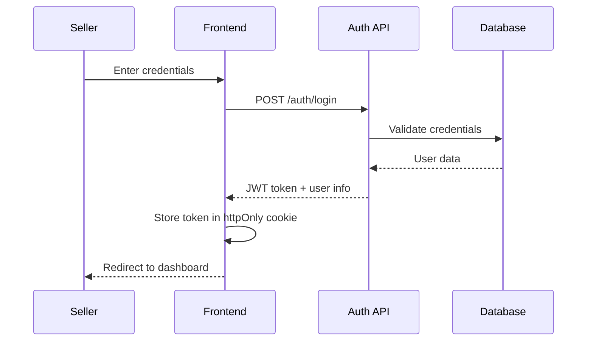

# Design Document

## Introduction

The Seller Frontend Interface is a comprehensive web application that provides sellers with a complete dashboard to manage their e-commerce operations. This design document outlines the technical architecture, user interface design, and system integration patterns that will deliver a responsive, secure, and intuitive seller experience.

## System Architecture

### High-Level Architecture

The seller frontend follows a modern web application architecture with clear separation of concerns:

```
┌─────────────────┐    ┌─────────────────┐    ┌─────────────────┐
│   Seller UI     │    │   API Gateway   │    │   Backend       │
│   (Frontend)    │◄──►│   (Middleware)  │◄──►│   Services      │
└─────────────────┘    └─────────────────┘    └─────────────────┘
         │                       │                       │
         ▼                       ▼                       ▼
┌─────────────────┐    ┌─────────────────┐    ┌─────────────────┐
│   Browser       │    │   Load Balancer │    │   Database      │
│   Storage       │    │   & Security    │    │   Layer         │
└─────────────────┘    └─────────────────┘    └─────────────────┘
```

### Component Architecture

The frontend application is structured using a modular component-based architecture:

- **Authentication Module**: Handles login, registration, and session management
- **Dashboard Module**: Provides overview and navigation hub
- **Product Management Module**: Manages product CRUD operations
- **Order Management Module**: Handles order viewing and status updates
- **Analytics Module**: Displays sales reports and performance metrics
- **Profile Module**: Manages seller account and business information

## User Interface Design

### Design System

#### Color Palette
- Primary: #2563EB (Blue 600) - Main actions and navigation
- Secondary: #10B981 (Emerald 500) - Success states and positive metrics
- Accent: #F59E0B (Amber 500) - Warnings and pending states
- Danger: #EF4444 (Red 500) - Errors and destructive actions
- Neutral: #6B7280 (Gray 500) - Text and borders
- Background: #F9FAFB (Gray 50) - Page backgrounds

#### Typography
- Headings: Inter, system-ui, sans-serif
- Body: Inter, system-ui, sans-serif
- Code: 'Fira Code', monospace

#### Spacing Scale
- Base unit: 4px
- Scale: 4px, 8px, 12px, 16px, 24px, 32px, 48px, 64px

### Layout Structure

#### Navigation Layout
```
┌─────────────────────────────────────────────────────────────┐
│                    Top Navigation Bar                        │
│  Logo    Dashboard  Products  Orders  Reports    Profile ▼  │
├─────────────────────────────────────────────────────────────┤
│                                                             │
│                    Main Content Area                        │
│                                                             │
│                                                             │
└─────────────────────────────────────────────────────────────┘
```

#### Dashboard Layout
```
┌─────────────────────────────────────────────────────────────┐
│                    Metrics Cards Row                        │
│  ┌─────────────┐ ┌─────────────┐ ┌─────────────┐ ┌─────────┐ │
│  │   Total     │ │   Active    │ │   Monthly   │ │  Low    │ │
│  │  Products   │ │   Orders    │ │   Sales     │ │ Stock   │ │
│  └─────────────┘ └─────────────┘ └─────────────┘ └─────────┘ │
├─────────────────────────────────────────────────────────────┤
│ ┌─────────────────────────────┐ ┌─────────────────────────┐ │
│ │      Recent Orders          │ │    Top Products         │ │
│ │                             │ │                         │ │
│ │                             │ │                         │ │
│ └─────────────────────────────┘ └─────────────────────────┘ │
└─────────────────────────────────────────────────────────────┘
```

## Technical Design

### Frontend Technology Stack

#### Core Framework
- **React 18+**: Component-based UI library with hooks and concurrent features
- **TypeScript**: Type-safe JavaScript for better development experience
- **Vite**: Fast build tool and development server

#### State Management
- **Zustand**: Lightweight state management for global application state
- **React Query (TanStack Query)**: Server state management and caching
- **React Hook Form**: Form state management with validation

#### Styling and UI
- **Tailwind CSS**: Utility-first CSS framework for rapid UI development
- **Headless UI**: Unstyled, accessible UI components
- **React Icons**: Comprehensive icon library

#### Routing and Navigation
- **React Router v6**: Client-side routing with nested routes
- **Protected Routes**: Authentication-based route protection

### Authentication System Design

#### Authentication Flow


#### Session Management
- JWT tokens stored in httpOnly cookies for security
- Automatic token refresh before expiration
- Session timeout after 24 hours of inactivity
- Secure logout with token invalidation

### Data Management Design

#### API Integration Pattern
```typescript
// API service layer
class SellerAPI {
  async getProducts(sellerId: string): Promise<Product[]>
  async createProduct(product: CreateProductRequest): Promise<Product>
  async updateProduct(id: string, updates: UpdateProductRequest): Promise<Product>
  async deleteProduct(id: string): Promise<void>
  
  async getOrders(sellerId: string): Promise<Order[]>
  async updateOrderStatus(orderId: string, status: OrderStatus): Promise<Order>
  
  async getSalesReport(sellerId: string, dateRange: DateRange): Promise<SalesReport>
}
```

#### State Management Structure
```typescript
// Global state structure
interface SellerState {
  auth: {
    user: Seller | null
    isAuthenticated: boolean
    isLoading: boolean
  }
  products: {
    items: Product[]
    isLoading: boolean
    error: string | null
  }
  orders: {
    items: Order[]
    isLoading: boolean
    error: string | null
  }
  dashboard: {
    metrics: DashboardMetrics
    isLoading: boolean
  }
}
```

## Page Designs

### 1. Authentication Pages

#### Login Page
- Clean, centered form design
- Email and password fields with validation
- "Remember me" checkbox
- "Forgot password" link
- Registration link for new sellers
- Loading states and error handling

#### Registration Page
- Multi-step form for seller onboarding
- Business information collection
- Email verification flow
- Terms and conditions acceptance
- Pending approval notification

### 2. Dashboard Page

#### Overview Section
- Key performance metrics in card layout
- Visual indicators for trends (up/down arrows)
- Quick action buttons for common tasks
- Responsive grid layout for different screen sizes

#### Recent Activity
- Recent orders table with status indicators
- Low stock alerts with action buttons
- Top-selling products list
- Quick navigation to detailed views

### 3. Product Management Pages

#### Product List Page
```
┌─────────────────────────────────────────────────────────────┐
│ Products                                    [+ Add Product] │
├─────────────────────────────────────────────────────────────┤
│ Search: [_______________] Filter: [Category ▼] [Status ▼]   │
├─────────────────────────────────────────────────────────────┤
│ ┌─────┐                                                     │
│ │ IMG │ Product Name        $99.99    In Stock (25)  [Edit] │
│ └─────┘ Category: Electronics                        [Del]  │
├─────────────────────────────────────────────────────────────┤
│ ┌─────┐                                                     │
│ │ IMG │ Another Product     $49.99    Low Stock (3) [Edit]  │
│ └─────┘ Category: Clothing                           [Del]  │
└─────────────────────────────────────────────────────────────┘
```

#### Product Form Page
- Tabbed interface for different sections
- Image upload with drag-and-drop
- Rich text editor for descriptions
- Category selection dropdown
- Stock management controls
- Price validation and formatting

### 4. Order Management Pages

#### Order List Page
```
┌─────────────────────────────────────────────────────────────┐
│ Orders                                                      │
├─────────────────────────────────────────────────────────────┤
│ Filter: [Status ▼] [Date Range] Search: [_____________]     │
├─────────────────────────────────────────────────────────────┤
│ #12345  John Doe        $129.99   Processing    2024-03-10  │
│         2 items                   [Update Status ▼]        │
├─────────────────────────────────────────────────────────────┤
│ #12344  Jane Smith      $89.99    Shipped       2024-03-09  │
│         1 item                    [View Details]            │
└─────────────────────────────────────────────────────────────┘
```

#### Order Details Page
- Customer information display
- Ordered items list with images
- Shipping address
- Order timeline/status history
- Status update controls
- Print/export options

### 5. Analytics and Reporting Pages

#### Sales Dashboard
- Revenue charts (line, bar, pie)
- Time period selectors
- Key metrics comparison
- Export functionality
- Responsive chart layouts

#### Product Performance
- Product-wise sales data
- Conversion rate metrics
- Inventory turnover analysis
- Performance recommendations

## Mobile Responsive Design

### Breakpoint Strategy
- Mobile: 320px - 767px
- Tablet: 768px - 1023px  
- Desktop: 1024px+

### Mobile Adaptations
- Collapsible navigation menu
- Stacked card layouts
- Touch-friendly button sizes (44px minimum)
- Simplified data tables with horizontal scroll
- Bottom sheet modals for forms

### Navigation Pattern
```
Mobile:
┌─────────────────────┐
│ ☰ Logo        👤   │ <- Header with hamburger menu
├─────────────────────┤
│                     │
│   Main Content      │
│                     │
└─────────────────────┘

Tablet/Desktop:
┌─────────────────────────────────────┐
│ Logo  Dashboard Products Orders ... │ <- Horizontal navigation
├─────────────────────────────────────┤
│                                     │
│           Main Content              │
│                                     │
└─────────────────────────────────────┘
```

## Security Design

### Frontend Security Measures

#### Authentication Security
- JWT tokens in httpOnly cookies
- CSRF protection with double-submit cookies
- Automatic token refresh
- Secure session management

#### Data Protection
- Input validation and sanitization
- XSS prevention through proper escaping
- Content Security Policy headers
- HTTPS enforcement

#### Access Control
- Role-based route protection
- Component-level permission checks
- API request authorization headers
- Seller data isolation

### Security Headers
```
Content-Security-Policy: default-src 'self'; script-src 'self' 'unsafe-inline'
X-Frame-Options: DENY
X-Content-Type-Options: nosniff
Referrer-Policy: strict-origin-when-cross-origin
```

## Performance Optimization

### Loading Performance
- Code splitting by route and feature
- Lazy loading of non-critical components
- Image optimization and lazy loading
- Bundle size optimization

### Runtime Performance
- React.memo for expensive components
- useMemo and useCallback for expensive calculations
- Virtual scrolling for large lists
- Debounced search inputs

### Caching Strategy
- API response caching with React Query
- Static asset caching
- Browser storage for user preferences
- CDN for image assets

## Integration Design

### API Integration

#### REST API Endpoints
```
Authentication:
POST /api/auth/login
POST /api/auth/register
POST /api/auth/logout
POST /api/auth/refresh

Products:
GET    /api/sellers/{sellerId}/products
POST   /api/sellers/{sellerId}/products
PUT    /api/sellers/{sellerId}/products/{productId}
DELETE /api/sellers/{sellerId}/products/{productId}

Orders:
GET /api/sellers/{sellerId}/orders
PUT /api/orders/{orderId}/status

Analytics:
GET /api/sellers/{sellerId}/analytics/sales
GET /api/sellers/{sellerId}/analytics/products
```

#### Error Handling
- Standardized error response format
- User-friendly error messages
- Retry mechanisms for failed requests
- Offline state handling

### Third-Party Integrations

#### Image Upload Service
- Direct upload to cloud storage
- Image processing and optimization
- Multiple format support
- Progress indicators

#### Analytics Service
- Event tracking for user actions
- Performance monitoring
- Error reporting
- Usage analytics

## Accessibility Design

### WCAG 2.1 AA Compliance
- Semantic HTML structure
- Proper heading hierarchy
- Alt text for images
- Keyboard navigation support
- Screen reader compatibility

### Accessibility Features
- High contrast mode support
- Focus indicators
- Skip navigation links
- ARIA labels and descriptions
- Color-blind friendly design

### Testing Strategy
- Automated accessibility testing
- Screen reader testing
- Keyboard-only navigation testing
- Color contrast validation

## Development Guidelines

### Code Organization
```
src/
├── components/          # Reusable UI components
├── pages/              # Page components
├── hooks/              # Custom React hooks
├── services/           # API services
├── stores/             # State management
├── utils/              # Utility functions
├── types/              # TypeScript type definitions
└── assets/             # Static assets
```

### Component Design Patterns
- Compound components for complex UI
- Render props for flexible composition
- Custom hooks for logic reuse
- Higher-order components for cross-cutting concerns

### Testing Strategy
- Unit tests for utility functions
- Component tests with React Testing Library
- Integration tests for user flows
- E2E tests for critical paths

This design provides a comprehensive foundation for building a modern, scalable, and user-friendly seller frontend interface that integrates seamlessly with the existing e-commerce platform while maintaining consistency with the customer frontend experience.