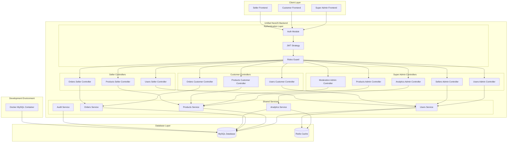
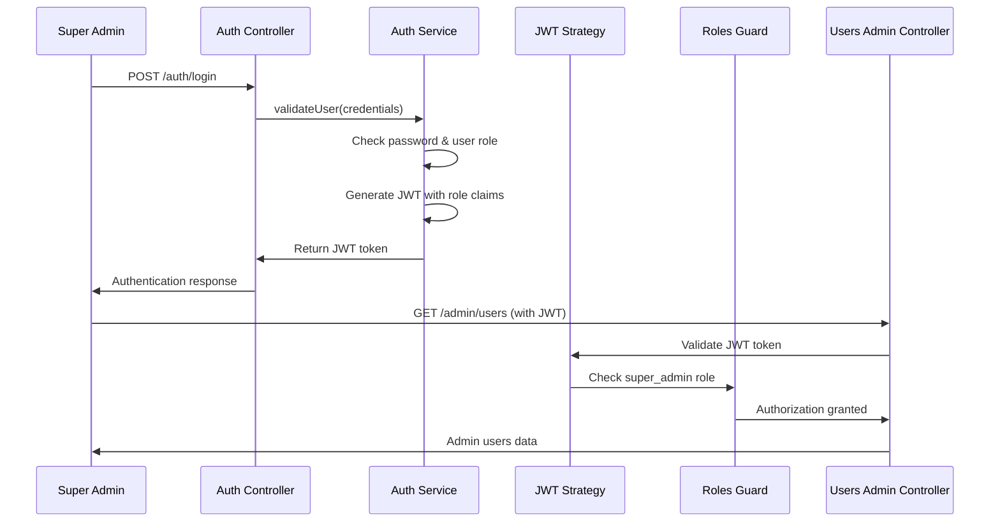
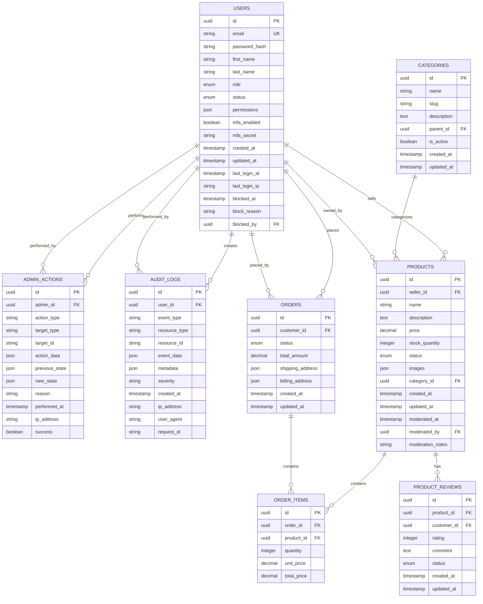

# Design Document: Super Admin Backend API

## Overview

The Super Admin Backend API represents the administrative layer of a unified NestJS backend application that serves all user types (customers, sellers, and super admins) in the multi-vendor e-commerce platform. This design focuses on the super admin-specific functionality within the unified architecture, providing elevated privileges and platform-wide control mechanisms through role-based access control.

This is NOT a separate API service, but rather the super admin-specific endpoints, services, and controllers within the single NestJS application. The design emphasizes JWT-based authentication with role claims, TypeORM entities for MySQL database operations, and Docker-based development environment setup.

### Key Design Principles

- **Unified Architecture**: Part of a single NestJS application serving all user types with role-based access control
- **JWT Authentication**: Role-based JWT tokens with super_admin claims and Passport.js integration
- **TypeORM Integration**: MySQL database with TypeORM entities and decorators
- **Docker Development**: Containerized MySQL database for local development
- **Role-Based Guards**: NestJS guards for super admin privilege validation
- **Shared Services**: Common business logic with role-specific access patterns
- **Audit Compliance**: Comprehensive logging and audit trails for all administrative actions

## Architecture

### Unified NestJS Application Architecture

The Super Admin functionality is implemented as part of a unified NestJS application with role-based access control:



### NestJS Module Structure

```typescript
// app.module.ts - Root module with all feature modules
@Module({
  imports: [
    ConfigModule.forRoot(),
    TypeOrmModule.forRoot(databaseConfig),
    AuthModule,
    UsersModule,
    ProductsModule,
    OrdersModule,
    AnalyticsModule,
    AuditModule,
  ],
  controllers: [],
  providers: [],
})
export class AppModule {}

// auth/auth.module.ts - Unified authentication
@Module({
  imports: [
    TypeOrmModule.forFeature([User]),
    JwtModule.register({
      secret: process.env.JWT_SECRET,
      signOptions: { expiresIn: '8h' },
    }),
    PassportModule,
  ],
  controllers: [AuthController],
  providers: [
    AuthService,
    JwtStrategy,
    RolesGuard,
    LocalStrategy,
  ],
  exports: [AuthService, JwtStrategy, RolesGuard],
})
export class AuthModule {}
```

### JWT Authentication with Role-Based Access Control

#### Authentication Flow with Passport.js



#### JWT Token Structure

```typescript
interface JWTPayload {
  sub: string;                    // user ID
  email: string;                  // user email
  role: 'customer' | 'seller' | 'super_admin';
  permissions: string[];          // role-specific permissions
  iat: number;                   // issued at
  exp: number;                   // expires at (8 hours)
}

// Example super admin JWT payload
const superAdminPayload: JWTPayload = {
  sub: 'admin-uuid-123',
  email: 'admin@platform.com',
  role: 'super_admin',
  permissions: [
    'user_management',
    'seller_management', 
    'product_moderation',
    'analytics_access',
    'system_administration'
  ],
  iat: 1640995200,
  exp: 1641024000
}
```

#### NestJS Authentication Implementation

```typescript
// auth/strategies/jwt.strategy.ts
@Injectable()
export class JwtStrategy extends PassportStrategy(Strategy) {
  constructor() {
    super({
      jwtFromRequest: ExtractJwt.fromAuthHeaderAsBearerToken(),
      ignoreExpiration: false,
      secretOrKey: process.env.JWT_SECRET,
    });
  }

  async validate(payload: JWTPayload) {
    return {
      userId: payload.sub,
      email: payload.email,
      role: payload.role,
      permissions: payload.permissions,
    };
  }
}

// auth/guards/roles.guard.ts
@Injectable()
export class RolesGuard implements CanActivate {
  constructor(private reflector: Reflector) {}

  canActivate(context: ExecutionContext): boolean {
    const requiredRoles = this.reflector.getAllAndOverride<string[]>(
      'roles',
      [context.getHandler(), context.getClass()]
    );
    
    if (!requiredRoles) {
      return true;
    }

    const { user } = context.switchToHttp().getRequest();
    return requiredRoles.includes(user.role);
  }
}

// auth/decorators/roles.decorator.ts
export const Roles = (...roles: string[]) => SetMetadata('roles', roles);
```

### Docker Development Environment

#### Docker Compose Configuration

```yaml
# docker-compose.yml
version: '3.8'

services:
  mysql:
    image: mysql:8.0
    container_name: ecommerce-mysql
    environment:
      MYSQL_ROOT_PASSWORD: root
      MYSQL_DATABASE: ecommerce
      MYSQL_USER: app_user
      MYSQL_PASSWORD: app_password
    ports:
      - "3306:3306"
    volumes:
      - mysql_data:/var/lib/mysql
      - ./docker/mysql/init:/docker-entrypoint-initdb.d
    command: --default-authentication-plugin=mysql_native_password

  redis:
    image: redis:7-alpine
    container_name: ecommerce-redis
    ports:
      - "6379:6379"
    volumes:
      - redis_data:/data

volumes:
  mysql_data:
  redis_data:
```

#### TypeORM Database Configuration

```typescript
// config/database.config.ts
import { TypeOrmModuleOptions } from '@nestjs/typeorm';

export const databaseConfig: TypeOrmModuleOptions = {
  type: 'mysql',
  host: process.env.DB_HOST || 'localhost',
  port: parseInt(process.env.DB_PORT) || 3306,
  username: process.env.DB_USERNAME || 'app_user',
  password: process.env.DB_PASSWORD || 'app_password',
  database: process.env.DB_NAME || 'ecommerce',
  entities: [__dirname + '/../**/*.entity{.ts,.js}'],
  synchronize: process.env.NODE_ENV === 'development',
  migrations: [__dirname + '/../migrations/*{.ts,.js}'],
  migrationsRun: true,
  logging: process.env.NODE_ENV === 'development',
  ssl: process.env.NODE_ENV === 'production' ? { rejectUnauthorized: false } : false,
};
```

## Components and Interfaces

### NestJS Controllers with Role-Based Access

#### Super Admin Users Controller

```typescript
// admin/controllers/users-admin.controller.ts
@Controller('admin/users')
@UseGuards(JwtAuthGuard, RolesGuard)
@Roles('super_admin')
export class UsersAdminController {
  constructor(private readonly usersService: UsersService) {}

  @Get()
  async getUsers(
    @Query() filters: UserFiltersDto,
    @Query() pagination: PaginationDto,
  ): Promise<UserPageDto> {
    return this.usersService.findUsersForAdmin(filters, pagination);
  }

  @Get(':id')
  async getUserById(@Param('id') userId: string): Promise<UserDetailDto> {
    return this.usersService.findUserDetailForAdmin(userId);
  }

  @Post('search')
  async searchUsers(@Body() searchQuery: SearchQueryDto): Promise<UserPageDto> {
    return this.usersService.searchUsersForAdmin(searchQuery);
  }

  @Put(':id')
  async updateUser(
    @Param('id') userId: string,
    @Body() updates: UserProfileUpdatesDto,
    @Request() req,
  ): Promise<UserDto> {
    return this.usersService.updateUserByAdmin(userId, updates, req.user.userId);
  }

  @Post(':id/block')
  async blockUser(
    @Param('id') userId: string,
    @Body() blockData: BlockUserDto,
    @Request() req,
  ): Promise<BlockResultDto> {
    return this.usersService.blockUser(userId, blockData, req.user.userId);
  }

  @Post(':id/unblock')
  async unblockUser(
    @Param('id') userId: string,
    @Body() unblockData: UnblockUserDto,
    @Request() req,
  ): Promise<UnblockResultDto> {
    return this.usersService.unblockUser(userId, unblockData, req.user.userId);
  }
}
```

#### Super Admin Analytics Controller

```typescript
// admin/controllers/analytics-admin.controller.ts
@Controller('admin/analytics')
@UseGuards(JwtAuthGuard, RolesGuard)
@Roles('super_admin')
export class AnalyticsAdminController {
  constructor(private readonly analyticsService: AnalyticsService) {}

  @Get('dashboard')
  async getDashboardMetrics(
    @Query() dateRange: DateRangeDto,
  ): Promise<DashboardMetricsDto> {
    return this.analyticsService.getDashboardMetrics(dateRange);
  }

  @Get('users/growth')
  async getUserGrowthAnalytics(
    @Query() period: AnalyticsPeriodDto,
  ): Promise<GrowthAnalyticsDto> {
    return this.analyticsService.getUserGrowthAnalytics(period);
  }

  @Get('sellers/performance')
  async getSellerPerformanceMetrics(
    @Query() dateRange: DateRangeDto,
  ): Promise<SellerMetricsDto> {
    return this.analyticsService.getSellerPerformanceMetrics(dateRange);
  }

  @Get('revenue')
  async getRevenueAnalytics(
    @Query() period: AnalyticsPeriodDto,
  ): Promise<RevenueAnalyticsDto> {
    return this.analyticsService.getRevenueAnalytics(period);
  }
}
```

#### Super Admin Products Controller

```typescript
// admin/controllers/products-admin.controller.ts
@Controller('admin/products')
@UseGuards(JwtAuthGuard, RolesGuard)
@Roles('super_admin')
export class ProductsAdminController {
  constructor(private readonly productsService: ProductsService) {}

  @Get('flagged')
  async getFlaggedProducts(
    @Query() filters: ModerationFiltersDto,
    @Query() pagination: PaginationDto,
  ): Promise<ModerationPageDto> {
    return this.productsService.getFlaggedProducts(filters, pagination);
  }

  @Get(':id/moderation')
  async getProductModerationDetails(
    @Param('id') productId: string,
  ): Promise<ModerationDetailDto> {
    return this.productsService.getProductModerationDetails(productId);
  }

  @Post(':id/approve')
  async approveProduct(
    @Param('id') productId: string,
    @Body() approvalData: ProductApprovalDto,
    @Request() req,
  ): Promise<ModerationResultDto> {
    return this.productsService.approveProduct(productId, approvalData, req.user.userId);
  }

  @Post(':id/remove')
  async removeProduct(
    @Param('id') productId: string,
    @Body() removalData: ProductRemovalDto,
    @Request() req,
  ): Promise<RemovalResultDto> {
    return this.productsService.removeProduct(productId, removalData, req.user.userId);
  }
}
```

### Shared Services with Role-Based Logic

#### Users Service with Admin Access

```typescript
// users/users.service.ts
@Injectable()
export class UsersService {
  constructor(
    @InjectRepository(User)
    private usersRepository: Repository<User>,
    private auditService: AuditService,
    private cacheManager: CacheManager,
  ) {}

  // Admin-specific methods
  async findUsersForAdmin(
    filters: UserFiltersDto,
    pagination: PaginationDto,
  ): Promise<UserPageDto> {
    const queryBuilder = this.usersRepository.createQueryBuilder('user');
    
    // Apply admin-specific filters
    if (filters.status) {
      queryBuilder.andWhere('user.status IN (:...status)', { status: filters.status });
    }
    
    if (filters.registrationDateRange) {
      queryBuilder.andWhere('user.createdAt BETWEEN :startDate AND :endDate', {
        startDate: filters.registrationDateRange.start,
        endDate: filters.registrationDateRange.end,
      });
    }

    // Apply pagination
    queryBuilder
      .skip(pagination.offset)
      .take(pagination.limit)
      .orderBy('user.createdAt', 'DESC');

    const [users, total] = await queryBuilder.getManyAndCount();
    
    return {
      users: users.map(user => this.mapToUserDto(user)),
      total,
      page: pagination.page,
      limit: pagination.limit,
    };
  }

  async blockUser(
    userId: string,
    blockData: BlockUserDto,
    adminId: string,
  ): Promise<BlockResultDto> {
    const user = await this.usersRepository.findOne({ where: { id: userId } });
    if (!user) {
      throw new NotFoundException('User not found');
    }

    // Update user status
    user.status = UserStatus.BLOCKED;
    user.blockedAt = new Date();
    user.blockReason = blockData.reason;
    user.blockedBy = adminId;

    await this.usersRepository.save(user);

    // Log admin action
    await this.auditService.logAdminAction({
      adminId,
      actionType: 'user_block',
      targetType: 'user',
      targetId: userId,
      actionData: blockData,
      reason: blockData.reason,
    });

    // Invalidate cache
    await this.cacheManager.del(`user:${userId}`);

    return {
      success: true,
      userId,
      blockedAt: user.blockedAt,
      reason: blockData.reason,
    };
  }

  // Customer-specific methods (role-filtered)
  async findUserProfile(userId: string, requestingRole: string): Promise<UserProfileDto> {
    const user = await this.usersRepository.findOne({ where: { id: userId } });
    if (!user) {
      throw new NotFoundException('User not found');
    }

    // Return different data based on requesting role
    if (requestingRole === 'super_admin') {
      return this.mapToAdminUserProfile(user);
    } else {
      return this.mapToPublicUserProfile(user);
    }
  }
}
```

#### Analytics Service with Admin Metrics

```typescript
// analytics/analytics.service.ts
@Injectable()
export class AnalyticsService {
  constructor(
    @InjectRepository(User)
    private usersRepository: Repository<User>,
    @InjectRepository(Order)
    private ordersRepository: Repository<Order>,
    @InjectRepository(Product)
    private productsRepository: Repository<Product>,
    private cacheManager: CacheManager,
  ) {}

  async getDashboardMetrics(dateRange: DateRangeDto): Promise<DashboardMetricsDto> {
    const cacheKey = `dashboard:metrics:${dateRange.start}:${dateRange.end}`;
    const cached = await this.cacheManager.get<DashboardMetricsDto>(cacheKey);
    
    if (cached) {
      return cached;
    }

    const [
      totalUsers,
      activeUsers,
      totalSellers,
      activeSellers,
      totalOrders,
      dailyRevenue,
    ] = await Promise.all([
      this.usersRepository.count({ where: { role: 'customer' } }),
      this.usersRepository.count({ 
        where: { 
          role: 'customer',
          lastLoginAt: MoreThan(new Date(Date.now() - 30 * 24 * 60 * 60 * 1000))
        }
      }),
      this.usersRepository.count({ where: { role: 'seller' } }),
      this.usersRepository.count({ 
        where: { 
          role: 'seller',
          status: 'active'
        }
      }),
      this.ordersRepository.count(),
      this.calculateDailyRevenue(dateRange),
    ]);

    const metrics: DashboardMetricsDto = {
      totalUsers,
      activeUsers,
      totalSellers,
      activeSellers,
      totalOrders,
      dailyRevenue,
      weeklyRevenue: await this.calculateWeeklyRevenue(),
      monthlyRevenue: await this.calculateMonthlyRevenue(),
      systemAlerts: await this.getSystemAlerts(),
      recentActions: await this.getRecentAdminActions(),
    };

    // Cache for 5 minutes
    await this.cacheManager.set(cacheKey, metrics, 300);
    
    return metrics;
  }

  private async calculateDailyRevenue(dateRange: DateRangeDto): Promise<number> {
    const result = await this.ordersRepository
      .createQueryBuilder('order')
      .select('SUM(order.total)', 'total')
      .where('order.createdAt BETWEEN :start AND :end', {
        start: dateRange.start,
        end: dateRange.end,
      })
      .andWhere('order.status = :status', { status: 'completed' })
      .getRawOne();

    return parseFloat(result.total) || 0;
  }
}
```

#### User Management Service

```typescript
interface UserManagementService {
  // User retrieval and search
  getUsers(filters: UserFilters, pagination: Pagination): Promise<UserPage>
  getUserById(userId: string): Promise<UserDetail>
  searchUsers(query: SearchQuery): Promise<UserPage>
  
  // User management operations
  updateUserProfile(userId: string, updates: UserProfileUpdates, adminId: string): Promise<User>
  blockUser(userId: string, reason: string, duration: BlockDuration, adminId: string): Promise<BlockResult>
  unblockUser(userId: string, reason: string, adminId: string): Promise<UnblockResult>
  
  // User analytics and insights
  getUserActivityHistory(userId: string, dateRange: DateRange): Promise<ActivityHistory>
  getUserOrderHistory(userId: string, pagination: Pagination): Promise<OrderHistory>
  getUserEngagementMetrics(userId: string): Promise<UserEngagement>
  
  // Bulk operations
  bulkUpdateUsers(userIds: string[], updates: BulkUserUpdates, adminId: string): Promise<BulkOperationResult>
  bulkBlockUsers(userIds: string[], reason: string, duration: BlockDuration, adminId: string): Promise<BulkOperationResult>
}

interface UserFilters {
  status?: UserStatus[]
  registrationDateRange?: DateRange
  lastLoginRange?: DateRange
  orderCountRange?: { min: number; max: number }
  totalSpentRange?: { min: number; max: number }
  location?: LocationFilter
}

interface UserDetail {
  id: string
  profile: UserProfile
  statistics: UserStatistics
  orderHistory: OrderSummary[]
  activityLog: ActivityEntry[]
  blockHistory: BlockEntry[]
  riskScore: number
  verificationStatus: VerificationStatus
}
```

#### Seller Management Service

```typescript
interface SellerManagementService {
  // Seller retrieval and management
  getSellers(filters: SellerFilters, pagination: Pagination): Promise<SellerPage>
  getSellerById(sellerId: string): Promise<SellerDetail>
  searchSellers(query: SearchQuery): Promise<SellerPage>
  
  // Seller approval workflow
  getPendingApprovals(pagination: Pagination): Promise<ApprovalPage>
  approveSeller(sellerId: string, adminId: string, notes?: string): Promise<ApprovalResult>
  rejectSeller(sellerId: string, reason: string, adminId: string): Promise<RejectionResult>
  bulkApproveReject(operations: ApprovalOperation[], adminId: string): Promise<BulkApprovalResult>
  
  // Seller performance monitoring
  getSellerPerformance(sellerId: string, dateRange: DateRange): Promise<SellerPerformance>
  getSellerComplianceStatus(sellerId: string): Promise<ComplianceStatus>
  generateSellerPerformanceReport(sellerId: string, period: ReportPeriod): Promise<PerformanceReport>
  
  // Seller account management
  updateSellerProfile(sellerId: string, updates: SellerProfileUpdates, adminId: string): Promise<Seller>
  suspendSeller(sellerId: string, reason: string, duration: SuspensionDuration, adminId: string): Promise<SuspensionResult>
  reactivateSeller(sellerId: string, reason: string, adminId: string): Promise<ReactivationResult>
}

interface SellerDetail {
  id: string
  businessProfile: BusinessProfile
  performanceMetrics: SellerPerformanceMetrics
  complianceHistory: ComplianceEntry[]
  productCatalog: ProductSummary[]
  salesAnalytics: SalesAnalytics
  customerFeedback: FeedbackSummary
  approvalHistory: ApprovalEntry[]
  riskAssessment: RiskAssessment
}
```

#### Product Moderation Service

```typescript
interface ProductModerationService {
  // Product moderation queue
  getFlaggedProducts(filters: ModerationFilters, pagination: Pagination): Promise<ModerationPage>
  getProductModerationDetails(productId: string): Promise<ModerationDetail>
  
  // Moderation actions
  approveProduct(productId: string, adminId: string, notes?: string): Promise<ModerationResult>
  removeProduct(productId: string, reason: string, policyViolation: PolicyViolation, adminId: string): Promise<RemovalResult>
  requestProductChanges(productId: string, changes: RequiredChanges, adminId: string): Promise<ChangeRequestResult>
  
  // Bulk moderation operations
  bulkModerateProducts(operations: ModerationOperation[], adminId: string): Promise<BulkModerationResult>
  bulkRemoveProducts(productIds: string[], reason: string, policyViolation: PolicyViolation, adminId: string): Promise<BulkRemovalResult>
  
  // Policy management
  getPolicyViolations(dateRange: DateRange): Promise<PolicyViolationAnalytics>
  updateModerationPolicies(policies: ModerationPolicy[], adminId: string): Promise<PolicyUpdateResult>
  generateModerationReport(period: ReportPeriod): Promise<ModerationReport>
}

interface ModerationDetail {
  product: ProductInfo
  seller: SellerInfo
  flaggingReason: FlaggingReason
  flaggedBy: FlaggedBy
  flaggedAt: Date
  previousViolations: ViolationHistory[]
  riskScore: number
  recommendedAction: RecommendedAction
  similarViolations: SimilarViolation[]
}
```

### Integration Service Architecture

#### Event-Driven Integration

```typescript
interface IntegrationService {
  // Event publishing
  publishUserEvent(event: UserEvent): Promise<PublishResult>
  publishSellerEvent(event: SellerEvent): Promise<PublishResult>
  publishProductEvent(event: ProductEvent): Promise<PublishResult>
  publishOrderEvent(event: OrderEvent): Promise<PublishResult>
  
  // Cross-system coordination
  coordinateUserStatusChange(userId: string, newStatus: UserStatus, reason: string): Promise<CoordinationResult>
  coordinateSellerApproval(sellerId: string, approved: boolean, reason: string): Promise<CoordinationResult>
  coordinateProductModeration(productId: string, action: ModerationAction, reason: string): Promise<CoordinationResult>
  
  // Data synchronization
  syncUserData(userId: string): Promise<SyncResult>
  syncSellerData(sellerId: string): Promise<SyncResult>
  syncProductData(productId: string): Promise<SyncResult>
  syncOrderData(orderId: string): Promise<SyncResult>
  
  // Health monitoring
  checkIntegrationHealth(): Promise<IntegrationHealth>
  getIntegrationMetrics(): Promise<IntegrationMetrics>
}

interface UserEvent {
  type: 'USER_BLOCKED' | 'USER_UNBLOCKED' | 'USER_PROFILE_UPDATED' | 'USER_DELETED'
  userId: string
  adminId: string
  timestamp: Date
  data: any
  reason?: string
}

interface CoordinationResult {
  success: boolean
  customerBackendResult?: SystemResult
  sellerBackendResult?: SystemResult
  errors?: IntegrationError[]
  rollbackRequired?: boolean
}
```

## Data Models

### Unified Database Schema with TypeORM Entities



### TypeORM Entity Implementations

#### User Entity (Unified for All Roles)

```typescript
// entities/user.entity.ts
import { Entity, PrimaryGeneratedColumn, Column, CreateDateColumn, UpdateDateColumn, OneToMany } from 'typeorm';

export enum UserRole {
  CUSTOMER = 'customer',
  SELLER = 'seller',
  SUPER_ADMIN = 'super_admin',
}

export enum UserStatus {
  ACTIVE = 'active',
  BLOCKED = 'blocked',
  SUSPENDED = 'suspended',
  PENDING_APPROVAL = 'pending_approval',
}

@Entity('users')
export class User {
  @PrimaryGeneratedColumn('uuid')
  id: string;

  @Column({ unique: true })
  email: string;

  @Column({ name: 'password_hash' })
  passwordHash: string;

  @Column({ name: 'first_name' })
  firstName: string;

  @Column({ name: 'last_name' })
  lastName: string;

  @Column({
    type: 'enum',
    enum: UserRole,
    default: UserRole.CUSTOMER,
  })
  role: UserRole;

  @Column({
    type: 'enum',
    enum: UserStatus,
    default: UserStatus.ACTIVE,
  })
  status: UserStatus;

  @Column({ type: 'json', nullable: true })
  permissions: string[];

  @Column({ name: 'mfa_enabled', default: false })
  mfaEnabled: boolean;

  @Column({ name: 'mfa_secret', nullable: true })
  mfaSecret: string;

  @CreateDateColumn({ name: 'created_at' })
  createdAt: Date;

  @UpdateDateColumn({ name: 'updated_at' })
  updatedAt: Date;

  @Column({ name: 'last_login_at', nullable: true })
  lastLoginAt: Date;

  @Column({ name: 'last_login_ip', nullable: true })
  lastLoginIp: string;

  @Column({ name: 'blocked_at', nullable: true })
  blockedAt: Date;

  @Column({ name: 'block_reason', nullable: true })
  blockReason: string;

  @Column({ name: 'blocked_by', nullable: true })
  blockedBy: string;

  @OneToMany(() => Product, product => product.seller)
  products: Product[];

  @OneToMany(() => Order, order => order.customer)
  orders: Order[];

  @OneToMany(() => AdminAction, action => action.admin)
  adminActions: AdminAction[];
}
```

#### Admin Action Entity

```typescript
// entities/admin-action.entity.ts
import { Entity, PrimaryGeneratedColumn, Column, CreateDateColumn, ManyToOne, JoinColumn } from 'typeorm';
import { User } from './user.entity';

export enum AdminActionType {
  USER_BLOCK = 'user_block',
  USER_UNBLOCK = 'user_unblock',
  USER_UPDATE = 'user_update',
  SELLER_APPROVE = 'seller_approve',
  SELLER_REJECT = 'seller_reject',
  SELLER_SUSPEND = 'seller_suspend',
  PRODUCT_APPROVE = 'product_approve',
  PRODUCT_REMOVE = 'product_remove',
  PRODUCT_FLAG = 'product_flag',
  CATEGORY_CREATE = 'category_create',
  CATEGORY_UPDATE = 'category_update',
  CATEGORY_DELETE = 'category_delete',
}

@Entity('admin_actions')
export class AdminAction {
  @PrimaryGeneratedColumn('uuid')
  id: string;

  @Column({ name: 'admin_id' })
  adminId: string;

  @Column({
    type: 'enum',
    enum: AdminActionType,
    name: 'action_type',
  })
  actionType: AdminActionType;

  @Column({ name: 'target_type' })
  targetType: string;

  @Column({ name: 'target_id' })
  targetId: string;

  @Column({ type: 'json', name: 'action_data' })
  actionData: any;

  @Column({ type: 'json', name: 'previous_state', nullable: true })
  previousState: any;

  @Column({ type: 'json', name: 'new_state', nullable: true })
  newState: any;

  @Column({ nullable: true })
  reason: string;

  @CreateDateColumn({ name: 'performed_at' })
  performedAt: Date;

  @Column({ name: 'ip_address', nullable: true })
  ipAddress: string;

  @Column({ default: true })
  success: boolean;

  @ManyToOne(() => User, user => user.adminActions)
  @JoinColumn({ name: 'admin_id' })
  admin: User;
}
```

#### Product Entity with Moderation

```typescript
// entities/product.entity.ts
import { Entity, PrimaryGeneratedColumn, Column, CreateDateColumn, UpdateDateColumn, ManyToOne, JoinColumn, OneToMany } from 'typeorm';
import { User } from './user.entity';
import { Category } from './category.entity';

export enum ProductStatus {
  DRAFT = 'draft',
  PENDING_REVIEW = 'pending_review',
  APPROVED = 'approved',
  REJECTED = 'rejected',
  REMOVED = 'removed',
}

@Entity('products')
export class Product {
  @PrimaryGeneratedColumn('uuid')
  id: string;

  @Column({ name: 'seller_id' })
  sellerId: string;

  @Column()
  name: string;

  @Column({ type: 'text' })
  description: string;

  @Column({ type: 'decimal', precision: 10, scale: 2 })
  price: number;

  @Column({ name: 'stock_quantity' })
  stockQuantity: number;

  @Column({
    type: 'enum',
    enum: ProductStatus,
    default: ProductStatus.DRAFT,
  })
  status: ProductStatus;

  @Column({ type: 'json', nullable: true })
  images: string[];

  @Column({ name: 'category_id' })
  categoryId: string;

  @CreateDateColumn({ name: 'created_at' })
  createdAt: Date;

  @UpdateDateColumn({ name: 'updated_at' })
  updatedAt: Date;

  @Column({ name: 'moderated_at', nullable: true })
  moderatedAt: Date;

  @Column({ name: 'moderated_by', nullable: true })
  moderatedBy: string;

  @Column({ name: 'moderation_notes', nullable: true })
  moderationNotes: string;

  @ManyToOne(() => User, user => user.products)
  @JoinColumn({ name: 'seller_id' })
  seller: User;

  @ManyToOne(() => Category, category => category.products)
  @JoinColumn({ name: 'category_id' })
  category: Category;

  @OneToMany(() => OrderItem, orderItem => orderItem.product)
  orderItems: OrderItem[];

  @OneToMany(() => ProductReview, review => review.product)
  reviews: ProductReview[];
}
```

#### Audit Log Entity

```typescript
// entities/audit-log.entity.ts
import { Entity, PrimaryGeneratedColumn, Column, CreateDateColumn, ManyToOne, JoinColumn } from 'typeorm';
import { User } from './user.entity';

@Entity('audit_logs')
export class AuditLog {
  @PrimaryGeneratedColumn('uuid')
  id: string;

  @Column({ name: 'user_id' })
  userId: string;

  @Column({ name: 'event_type' })
  eventType: string;

  @Column({ name: 'resource_type' })
  resourceType: string;

  @Column({ name: 'resource_id' })
  resourceId: string;

  @Column({ type: 'json', name: 'event_data' })
  eventData: any;

  @Column({ type: 'json', nullable: true })
  metadata: any;

  @Column({ default: 'INFO' })
  severity: string;

  @CreateDateColumn({ name: 'created_at' })
  createdAt: Date;

  @Column({ name: 'ip_address', nullable: true })
  ipAddress: string;

  @Column({ name: 'user_agent', nullable: true })
  userAgent: string;

  @Column({ name: 'request_id', nullable: true })
  requestId: string;

  @ManyToOne(() => User)
  @JoinColumn({ name: 'user_id' })
  user: User;
}
```$'### Database Migration and Setup

#### TypeORM Migration Configuration

```typescript
// config/database.config.ts
import { DataSource } from 'typeorm';
import { User } from '../entities/user.entity';
import { Product } from '../entities/product.entity';
import { Order } from '../entities/order.entity';
import { AdminAction } from '../entities/admin-action.entity';
import { AuditLog } from '../entities/audit-log.entity';

export const AppDataSource = new DataSource({
  type: 'mysql',
  host: process.env.DB_HOST || 'localhost',
  port: parseInt(process.env.DB_PORT) || 3306,
  username: process.env.DB_USERNAME || 'app_user',
  password: process.env.DB_PASSWORD || 'app_password',
  database: process.env.DB_NAME || 'ecommerce',
  entities: [User, Product, Order, AdminAction, AuditLog],
  migrations: ['src/migrations/*.ts'],
  synchronize: process.env.NODE_ENV === 'development',
  logging: process.env.NODE_ENV === 'development',
});
```

#### Initial Migration for Super Admin Setup

```typescript
// migrations/001-create-initial-schema.ts
import { MigrationInterface, QueryRunner } from 'typeorm';

export class CreateInitialSchema1640995200000 implements MigrationInterface {
  name = 'CreateInitialSchema1640995200000';

  public async up(queryRunner: QueryRunner): Promise<void> {
    // Create users table with role enum
    await queryRunner.query(`
      CREATE TABLE users (
        id VARCHAR(36) PRIMARY KEY,
        email VARCHAR(255) UNIQUE NOT NULL,
        password_hash VARCHAR(255) NOT NULL,
        first_name VARCHAR(255) NOT NULL,
        last_name VARCHAR(255) NOT NULL,
        role ENUM('customer', 'seller', 'super_admin') DEFAULT 'customer',
        status ENUM('active', 'blocked', 'suspended', 'pending_approval') DEFAULT 'active',
        permissions JSON,
        mfa_enabled BOOLEAN DEFAULT FALSE,
        mfa_secret VARCHAR(255),
        created_at TIMESTAMP DEFAULT CURRENT_TIMESTAMP,
        updated_at TIMESTAMP DEFAULT CURRENT_TIMESTAMP ON UPDATE CURRENT_TIMESTAMP,
        last_login_at TIMESTAMP NULL,
        last_login_ip VARCHAR(45),
        blocked_at TIMESTAMP NULL,
        block_reason TEXT,
        blocked_by VARCHAR(36),
        INDEX idx_users_email (email),
        INDEX idx_users_role (role),
        INDEX idx_users_status (status)
      )
    `);

    // Create admin_actions table
    await queryRunner.query(`
      CREATE TABLE admin_actions (
        id VARCHAR(36) PRIMARY KEY,
        admin_id VARCHAR(36) NOT NULL,
        action_type ENUM(
          'user_block', 'user_unblock', 'user_update',
          'seller_approve', 'seller_reject', 'seller_suspend',
          'product_approve', 'product_remove', 'product_flag',
          'category_create', 'category_update', 'category_delete'
        ) NOT NULL,
        target_type VARCHAR(50) NOT NULL,
        target_id VARCHAR(255) NOT NULL,
        action_data JSON NOT NULL,
        previous_state JSON,
        new_state JSON,
        reason TEXT,
        performed_at TIMESTAMP DEFAULT CURRENT_TIMESTAMP,
        ip_address VARCHAR(45),
        success BOOLEAN DEFAULT TRUE,
        FOREIGN KEY (admin_id) REFERENCES users(id),
        INDEX idx_admin_actions_admin_id (admin_id),
        INDEX idx_admin_actions_action_type (action_type),
        INDEX idx_admin_actions_target (target_type, target_id),
        INDEX idx_admin_actions_performed_at (performed_at)
      )
    `);

    // Create initial super admin user
    await queryRunner.query(`
      INSERT INTO users (
        id, email, password_hash, first_name, last_name, role, 
        permissions, mfa_enabled, created_at
      ) VALUES (
        UUID(), 'admin@platform.com', '$2b$10$hashedPasswordHere', 
        'Super', 'Admin', 'super_admin',
        '["user_management", "seller_management", "product_moderation", "analytics_access", "system_administration"]',
        TRUE, NOW()
      )
    `);
  }

  public async down(queryRunner: QueryRunner): Promise<void> {
    await queryRunner.query('DROP TABLE admin_actions');
    await queryRunner.query('DROP TABLE users');
  }
}
```

### Redis Caching with NestJS

#### Cache Manager Configuration

```typescript
// cache/cache.module.ts
import { Module } from '@nestjs/common';
import { CacheModule } from '@nestjs/cache-manager';
import { redisStore } from 'cache-manager-redis-store';

@Module({
  imports: [
    CacheModule.register({
      store: redisStore,
      host: process.env.REDIS_HOST || 'localhost',
      port: parseInt(process.env.REDIS_PORT) || 6379,
      ttl: 300, // 5 minutes default TTL
    }),
  ],
  exports: [CacheModule],
})
export class AppCacheModule {}
```

#### Admin Cache Service

```typescript
// cache/admin-cache.service.ts
import { Injectable, Inject } from '@nestjs/common';
import { CACHE_MANAGER } from '@nestjs/cache-manager';
import { Cache } from 'cache-manager';

@Injectable()
export class AdminCacheService {
  constructor(@Inject(CACHE_MANAGER) private cacheManager: Cache) {}

  // Dashboard metrics caching
  async cacheDashboardMetrics(metrics: any, ttl = 300): Promise<void> {
    await this.cacheManager.set('admin:dashboard:metrics', metrics, ttl);
  }

  async getCachedDashboardMetrics(): Promise<any> {
    return this.cacheManager.get('admin:dashboard:metrics');
  }

  // User management caching
  async cacheUserList(filters: string, users: any, ttl = 300): Promise<void> {
    const key = `admin:users:list:${Buffer.from(filters).toString('base64')}`;
    await this.cacheManager.set(key, users, ttl);
  }

  async getCachedUserList(filters: string): Promise<any> {
    const key = `admin:users:list:${Buffer.from(filters).toString('base64')}`;
    return this.cacheManager.get(key);
  }

  // Invalidation methods
  async invalidateUserCache(userId?: string): Promise<void> {
    if (userId) {
      await this.cacheManager.del(`admin:user:${userId}:detail`);
    }
    // Clear all user list caches
    const keys = await this.cacheManager.store.keys('admin:users:list:*');
    await Promise.all(keys.map(key => this.cacheManager.del(key)));
  }

  async invalidateDashboardCache(): Promise<void> {
    await this.cacheManager.del('admin:dashboard:metrics');
  }
}
```

## Error Handling

### NestJS Exception Handling for Admin Operations

The unified NestJS application implements comprehensive error handling for super admin operations with role-based error responses and detailed audit logging.

#### Global Exception Filter

```typescript
// filters/admin-exception.filter.ts
import { ExceptionFilter, Catch, ArgumentsHost, HttpException, HttpStatus } from '@nestjs/common';
import { Request, Response } from 'express';
import { AuditService } from '../audit/audit.service';

@Catch()
export class AdminExceptionFilter implements ExceptionFilter {
  constructor(private readonly auditService: AuditService) {}

  catch(exception: unknown, host: ArgumentsHost) {
    const ctx = host.switchToHttp();
    const response = ctx.getResponse<Response>();
    const request = ctx.getRequest<Request>();

    const status = exception instanceof HttpException 
      ? exception.getStatus() 
      : HttpStatus.INTERNAL_SERVER_ERROR;

    const message = exception instanceof HttpException 
      ? exception.getResponse() 
      : 'Internal server error';

    // Enhanced error response for admin operations
    const errorResponse = {
      error: {
        code: this.getErrorCode(exception),
        message: typeof message === 'string' ? message : (message as any).message,
        details: this.getErrorDetails(exception, request),
        adminContext: this.getAdminContext(request),
        timestamp: new Date().toISOString(),
        requestId: request.headers['x-request-id'] || 'unknown',
        path: request.url,
      },
    };

    // Log admin error for audit
    this.auditService.logAdminError({
      adminId: request.user?.userId,
      error: exception,
      request: {
        method: request.method,
        url: request.url,
        body: request.body,
        params: request.params,
        query: request.query,
      },
      ipAddress: request.ip,
      userAgent: request.get('User-Agent'),
    });

    response.status(status).json(errorResponse);
  }

  private getErrorCode(exception: unknown): string {
    if (exception instanceof HttpException) {
      const response = exception.getResponse();
      if (typeof response === 'object' && 'code' in response) {
        return response.code as string;
      }
    }
    return 'ADMIN_ERROR';
  }

  private getErrorDetails(exception: unknown, request: Request): any {
    if (request.user?.role === 'super_admin') {
      // Provide detailed error information for super admins
      return {
        operation: this.extractOperation(request),
        target: this.extractTarget(request),
        stackTrace: exception instanceof Error ? exception.stack : undefined,
      };
    }
    return {};
  }

  private getAdminContext(request: Request): any {
    if (request.user?.role === 'super_admin') {
      return {
        adminId: request.user.userId,
        permissions: request.user.permissions,
        ipAddress: request.ip,
      };
    }
    return {};
  }
}
```

#### Custom Admin Exceptions

```typescript
// exceptions/admin.exceptions.ts
import { HttpException, HttpStatus } from '@nestjs/common';

export class InsufficientPrivilegesException extends HttpException {
  constructor(requiredPermission: string) {
    super(
      {
        code: 'INSUFFICIENT_PRIVILEGES',
        message: `Insufficient privileges. Required: ${requiredPermission}`,
      },
      HttpStatus.FORBIDDEN,
    );
  }
}

export class AdminOperationFailedException extends HttpException {
  constructor(operation: string, reason: string) {
    super(
      {
        code: 'ADMIN_OPERATION_FAILED',
        message: `Administrative operation failed: ${operation}`,
        details: { reason },
      },
      HttpStatus.BAD_REQUEST,
    );
  }
}

export class UserManagementException extends HttpException {
  constructor(userId: string, operation: string, reason: string) {
    super(
      {
        code: 'USER_MANAGEMENT_ERROR',
        message: `User management operation failed`,
        details: {
          userId,
          operation,
          reason,
        },
      },
      HttpStatus.UNPROCESSABLE_ENTITY,
    );
  }
}
```

#### Error Response Examples

**Authentication Error (401)**
```json
{
  "error": {
    "code": "INVALID_ADMIN_TOKEN",
    "message": "Invalid or expired admin token",
    "details": {},
    "adminContext": {},
    "timestamp": "2024-03-10T10:30:00Z",
    "requestId": "admin_req_abc123",
    "path": "/admin/users"
  }
}
```

**Authorization Error (403)**
```json
{
  "error": {
    "code": "INSUFFICIENT_PRIVILEGES",
    "message": "Insufficient privileges. Required: user_management",
    "details": {
      "operation": "user_block",
      "target": "user_12345"
    },
    "adminContext": {
      "adminId": "admin_67890",
      "permissions": ["analytics_access"],
      "ipAddress": "192.168.1.100"
    },
    "timestamp": "2024-03-10T10:30:00Z",
    "requestId": "admin_req_def456",
    "path": "/admin/users/12345/block"
  }
}
```

## Testing Strategy

### NestJS Testing Framework for Admin Operations

The unified NestJS application employs a comprehensive testing strategy specifically designed for super admin functionality, including role-based access testing, database integration testing, and property-based testing for administrative correctness.

#### Testing Architecture

**Unit Tests (Foundation - 70% of tests)**
- **Framework**: Jest with NestJS testing utilities
- **Scope**: Admin services, controllers, guards, and business logic
- **Coverage Target**: 95%+ code coverage for admin-specific functionality
- **Focus Areas**:
  - Role-based access control validation
  - Admin business logic correctness
  - JWT token validation and role checking
  - Database operations with TypeORM
  - Cache management and invalidation

**Integration Tests (Service Layer - 25% of tests)**
- **Framework**: Jest with NestJS testing module and Docker test containers
- **Environment**: Isolated MySQL and Redis containers for testing
- **Scope**: Admin API endpoints, database operations, and service integration
- **Focus Areas**:
  - Admin API endpoint functionality
  - Database transaction integrity
  - Role-based data filtering
  - Cache consistency
  - Audit logging accuracy

**Property-Based Tests (Correctness Layer - 5% of tests)**
- **Framework**: fast-check for TypeScript with admin domain generators
- **Configuration**: Minimum 100 iterations per property with deterministic seeds
- **Focus Areas**:
  - Admin operation correctness across all inputs
  - Role-based access consistency
  - Audit trail completeness
  - Data serialization integrity

#### NestJS Test Module Setup

```typescript
// test/admin-test.module.ts
import { Test, TestingModule } from '@nestjs/testing';
import { TypeOrmModule } from '@nestjs/typeorm';
import { CacheModule } from '@nestjs/cache-manager';
import { JwtModule } from '@nestjs/jwt';
import { UsersModule } from '../src/users/users.module';
import { AuthModule } from '../src/auth/auth.module';
import { User } from '../src/entities/user.entity';
import { AdminAction } from '../src/entities/admin-action.entity';

export async function createAdminTestModule(): Promise<TestingModule> {
  return Test.createTestingModule({
    imports: [
      TypeOrmModule.forRoot({
        type: 'mysql',
        host: 'localhost',
        port: 3307, // Test database port
        username: 'test_user',
        password: 'test_password',
        database: 'test_ecommerce',
        entities: [User, AdminAction],
        synchronize: true,
        dropSchema: true,
      }),
      CacheModule.register({
        store: 'memory',
        ttl: 300,
      }),
      JwtModule.register({
        secret: 'test-secret',
        signOptions: { expiresIn: '1h' },
      }),
      UsersModule,
      AuthModule,
    ],
  }).compile();
}
```

#### Unit Testing Examples

```typescript
// test/users-admin.controller.spec.ts
import { Test, TestingModule } from '@nestjs/testing';
import { UsersAdminController } from '../src/admin/controllers/users-admin.controller';
import { UsersService } from '../src/users/users.service';
import { JwtAuthGuard } from '../src/auth/guards/jwt-auth.guard';
import { RolesGuard } from '../src/auth/guards/roles.guard';

describe('UsersAdminController', () => {
  let controller: UsersAdminController;
  let usersService: jest.Mocked<UsersService>;

  beforeEach(async () => {
    const mockUsersService = {
      findUsersForAdmin: jest.fn(),
      blockUser: jest.fn(),
      unblockUser: jest.fn(),
    };

    const module: TestingModule = await Test.createTestingModule({
      controllers: [UsersAdminController],
      providers: [
        {
          provide: UsersService,
          useValue: mockUsersService,
        },
      ],
    })
      .overrideGuard(JwtAuthGuard)
      .useValue({ canActivate: () => true })
      .overrideGuard(RolesGuard)
      .useValue({ canActivate: () => true })
      .compile();

    controller = module.get<UsersAdminController>(UsersAdminController);
    usersService = module.get(UsersService);
  });

  it('should block user with admin privileges', async () => {
    const userId = 'user-123';
    const blockData = { reason: 'Policy violation', duration: 'permanent' };
    const adminUser = { userId: 'admin-456', role: 'super_admin' };
    
    const expectedResult = {
      success: true,
      userId,
      blockedAt: new Date(),
      reason: blockData.reason,
    };

    usersService.blockUser.mockResolvedValue(expectedResult);

    const result = await controller.blockUser(userId, blockData, { user: adminUser });

    expect(result).toEqual(expectedResult);
    expect(usersService.blockUser).toHaveBeenCalledWith(userId, blockData, adminUser.userId);
  });

  it('should get users with admin filters', async () => {
    const filters = { status: ['active'], role: ['customer'] };
    const pagination = { page: 1, limit: 10, offset: 0 };
    
    const expectedUsers = {
      users: [{ id: 'user-1', email: 'user@test.com', role: 'customer' }],
      total: 1,
      page: 1,
      limit: 10,
    };

    usersService.findUsersForAdmin.mockResolvedValue(expectedUsers);

    const result = await controller.getUsers(filters, pagination);

    expect(result).toEqual(expectedUsers);
    expect(usersService.findUsersForAdmin).toHaveBeenCalledWith(filters, pagination);
  });
});
```

#### Integration Testing with Database

```typescript
// test/admin-integration.spec.ts
import { Test, TestingModule } from '@nestjs/testing';
import { INestApplication } from '@nestjs/common';
import { TypeOrmModule } from '@nestjs/typeorm';
import * as request from 'supertest';
import { User, UserRole, UserStatus } from '../src/entities/user.entity';
import { createAdminTestModule } from './admin-test.module';

describe('Admin Integration Tests', () => {
  let app: INestApplication;
  let module: TestingModule;
  let adminToken: string;

  beforeAll(async () => {
    module = await createAdminTestModule();
    app = module.createNestApplication();
    await app.init();

    // Create test admin user and get token
    const authService = module.get('AuthService');
    const testAdmin = {
      id: 'admin-test-123',
      email: 'admin@test.com',
      role: UserRole.SUPER_ADMIN,
      permissions: ['user_management', 'seller_management'],
    };
    
    adminToken = await authService.generateToken(testAdmin);
  });

  afterAll(async () => {
    await app.close();
  });

  it('should block user through admin endpoint', async () => {
    // First create a test user
    const userRepository = module.get('UserRepository');
    const testUser = userRepository.create({
      id: 'user-test-123',
      email: 'user@test.com',
      firstName: 'Test',
      lastName: 'User',
      role: UserRole.CUSTOMER,
      status: UserStatus.ACTIVE,
    });
    await userRepository.save(testUser);

    // Block the user via admin API
    const response = await request(app.getHttpServer())
      .post('/admin/users/user-test-123/block')
      .set('Authorization', `Bearer ${adminToken}`)
      .send({
        reason: 'Test blocking',
        duration: 'permanent',
      })
      .expect(200);

    expect(response.body.success).toBe(true);
    expect(response.body.userId).toBe('user-test-123');

    // Verify user is blocked in database
    const blockedUser = await userRepository.findOne({ 
      where: { id: 'user-test-123' } 
    });
    expect(blockedUser.status).toBe(UserStatus.BLOCKED);
    expect(blockedUser.blockReason).toBe('Test blocking');
  });

  it('should reject non-admin access to admin endpoints', async () => {
    // Create customer token
    const authService = module.get('AuthService');
    const customerToken = await authService.generateToken({
      id: 'customer-123',
      email: 'customer@test.com',
      role: UserRole.CUSTOMER,
      permissions: [],
    });

    await request(app.getHttpServer())
      .get('/admin/users')
      .set('Authorization', `Bearer ${customerToken}`)
      .expect(403);
  });
});
```peScript and comprehensive mocking for external dependencies
#### Property-Based Testing for Admin Operations

```typescript
// test/admin-property.spec.ts
import fc from 'fast-check';
import { UserRole, UserStatus } from '../src/entities/user.entity';

// Admin-specific generators
const adminUserGenerator = fc.record({
  id: fc.uuid(),
  email: fc.emailAddress(),
  role: fc.constantFrom(UserRole.SUPER_ADMIN),
  permissions: fc.array(fc.constantFrom(
    'user_management', 'seller_management', 'product_moderation', 'analytics_access'
  ), { minLength: 1, maxLength: 4 }),
});

const userManagementActionGenerator = fc.record({
  userId: fc.uuid(),
  adminId: fc.uuid(),
  action: fc.constantFrom('block', 'unblock', 'update'),
  reason: fc.string({ minLength: 10, maxLength: 200 }),
  timestamp: fc.date(),
});

const dashboardMetricsGenerator = fc.record({
  totalUsers: fc.integer({ min: 0, max: 1000000 }),
  activeUsers: fc.integer({ min: 0, max: 100000 }),
  totalSellers: fc.integer({ min: 0, max: 50000 }),
  dailyRevenue: fc.float({ min: 0, max: 1000000, noNaN: true }),
});

describe('Admin Property-Based Tests', () => {
  it('JWT token generation and validation consistency', () => {
    fc.assert(fc.property(
      adminUserGenerator,
      (adminUser) => {
        // Property 1: JWT token round-trip consistency
        const token = generateAdminJWT(adminUser);
        const decoded = verifyAdminJWT(token);
        
        expect(decoded.sub).toBe(adminUser.id);
        expect(decoded.role).toBe(adminUser.role);
        expect(decoded.permissions).toEqual(adminUser.permissions);
        expect(decoded.exp - decoded.iat).toBe(8 * 60 * 60); // 8 hours
      }
    ), { numRuns: 100 });
  });

  it('Admin action audit logging completeness', () => {
    fc.assert(fc.property(
      userManagementActionGenerator,
      (action) => {
        // Property 2: All admin actions are properly audited
        const auditLog = logAdminAction(action);
        
        expect(auditLog.adminId).toBe(action.adminId);
        expect(auditLog.targetId).toBe(action.userId);
        expect(auditLog.actionType).toBe(`user_${action.action}`);
        expect(auditLog.reason).toBe(action.reason);
        expect(auditLog.timestamp).toBeDefined();
        expect(auditLog.ipAddress).toBeDefined();
      }
    ), { numRuns: 100 });
  });

  it('Dashboard metrics response structure consistency', () => {
    fc.assert(fc.property(
      dashboardMetricsGenerator,
      (metrics) => {
        // Property 3: Dashboard metrics always have required fields
        const response = formatDashboardMetrics(metrics);
        
        expect(response).toHaveProperty('totalUsers');
        expect(response).toHaveProperty('activeUsers');
        expect(response).toHaveProperty('totalSellers');
        expect(response).toHaveProperty('dailyRevenue');
        expect(response).toHaveProperty('timestamp');
        expect(typeof response.totalUsers).toBe('number');
        expect(typeof response.dailyRevenue).toBe('number');
        expect(response.totalUsers).toBeGreaterThanOrEqual(0);
        expect(response.activeUsers).toBeLessThanOrEqual(response.totalUsers);
      }
    ), { numRuns: 100 });
  });

  it('Role-based access control consistency', () => {
    fc.assert(fc.property(
      fc.record({
        user: adminUserGenerator,
        requiredPermission: fc.constantFrom('user_management', 'seller_management', 'product_moderation'),
      }),
      ({ user, requiredPermission }) => {
        // Property 4: Access control is consistent with user permissions
        const hasAccess = checkAdminPermission(user, requiredPermission);
        const expectedAccess = user.permissions.includes(requiredPermission);
        
        expect(hasAccess).toBe(expectedAccess);
      }
    ), { numRuns: 100 });
  });

  it('Admin data serialization round-trip integrity', () => {
    fc.assert(fc.property(
      fc.record({
        adminAction: userManagementActionGenerator,
        metrics: dashboardMetricsGenerator,
      }),
      (adminData) => {
        // Property 5: JSON serialization preserves data integrity
        const serialized = JSON.stringify(adminData);
        const parsed = JSON.parse(serialized);
        
        expect(parsed).toEqual(adminData);
      }
    ), { numRuns: 100 });
  });
});
```

This comprehensive testing strategy ensures that the Super Admin functionality within the unified NestJS application maintains the highest standards of security, reliability, and correctness while providing mathematical guarantees through property-based testing. The combination of role-based unit tests, database integration validation, and property tests creates a robust quality assurance framework suitable for privileged administrative operations.

## Correctness Properties

*A property is a characteristic or behavior that should hold true across all valid executions of a system-essentially, a formal statement about what the system should do. Properties serve as the bridge between human-readable specifications and machine-verifiable correctness guarantees.*

### Property 1: Administrative Authentication Token Generation

*For any* valid super admin credentials with MFA verification, the authentication system should generate a JWT token with 8-hour expiration, admin ID, and privilege level included in the payload.

**Validates: Requirements 1.1, 1.6**

### Property 2: Invalid Authentication Rejection

*For any* invalid super admin credentials (wrong password, missing MFA, non-existent email), the authentication system should return 401 Unauthorized and log the attempt with IP address and timestamp.

**Validates: Requirements 1.2**

### Property 3: Multi-Factor Authentication Enforcement

*For any* super admin authentication attempt, the system should require valid MFA verification before generating authentication tokens, rejecting any attempt without proper MFA.

**Validates: Requirements 1.3**

### Property 4: Administrative Rate Limiting Enforcement

*For any* IP address, after 3 failed authentication attempts within 10 minutes, subsequent attempts should be blocked and return 429 Too Many Requests for 60 minutes.

**Validates: Requirements 1.4, 1.5**

### Property 5: Privileged Token Validation

*For any* protected administrative endpoint, requests with invalid or insufficient privilege tokens should be rejected with 403 Forbidden responses.

**Validates: Requirements 1.7**

### Property 6: Dashboard Metrics Completeness

*For any* dashboard metrics request, the response should include total users, active sellers, pending approvals, daily orders, revenue metrics, system health indicators, and recent administrative actions with proper timestamps.

**Validates: Requirements 2.1, 2.2, 2.3, 2.4, 2.5**

### Property 7: User Management Response Structure

*For any* user management request (listing, details, search), the response should include complete user information with registration date, status, activity metrics, and proper pagination structure.

**Validates: Requirements 3.1, 3.3**

### Property 8: User Management Search Functionality

*For any* valid search criteria (email, name, user ID, registration date, account status), the search should return relevant results that match the specified criteria.

**Validates: Requirements 3.2**

### Property 9: User Management Update Validation

*For any* user information update request, the system should validate changes against business rules before applying updates and coordinate with Customer Backend API.

**Validates: Requirements 3.4**

### Property 10: User Account Control Operations

*For any* user account blocking or unblocking operation, the system should execute the operation, track the reason, and maintain complete audit trails.

**Validates: Requirements 3.5**

### Property 11: Administrative Action Audit Logging

*For any* administrative action (user management, seller operations, product moderation), the audit system should create complete log entries with admin ID, timestamp, target details, and modification information.

**Validates: Requirements 3.7**

### Property 12: Administrative JSON Request Parsing

*For any* valid JSON request that conforms to administrative schemas, the API should successfully parse the request according to schema specifications.

**Validates: Requirements 25.1**

### Property 13: Invalid JSON Error Handling

*For any* malformed or invalid JSON request, the API should return 400 Bad Request with descriptive error messages and proper error structure.

**Validates: Requirements 25.2**

### Property 14: Administrative Response Serialization

*For any* administrative API response, the data should be serialized to valid JSON format with consistent administrative data structure across all endpoints.

**Validates: Requirements 25.3**

### Property 15: Administrative Data Round-Trip Integrity

*For any* valid administrative API request object, the sequence of parsing then serializing then parsing should produce an equivalent object, ensuring data integrity through the serialization cycle.

**Validates: Requirements 25.4**

### Property 16: Administrative Input Validation

*For any* administrative API request, input data should be validated against defined schemas before processing, rejecting invalid data with appropriate error responses.

**Validates: Requirements 25.5**

### Property 17: Administrative Error Response Consistency

*For any* error condition across all administrative endpoints, the error response should follow the standardized administrative error format with consistent fields and security context.

**Validates: Requirements 25.6**

### Property 18: International Character Encoding

*For any* administrative data containing international characters (Unicode), the system should handle character encoding properly throughout storage, retrieval, processing, and cross-system synchronization.

**Validates: Requirements 25.7**

#### Unit Testing for Administrative Operations

**Administrative Service Testing**
```typescript
describe('AdminAuthenticationService', () => {
  let adminAuthService: AdminAuthenticationService
  let mockAdminRepository: jest.Mocked<AdminRepository>
  let mockMFAService: jest.Mocked<MFAService>
  let mockSecurityService: jest.Mocked<SecurityService>
  
  beforeEach(() => {
    mockAdminRepository = createMockAdminRepository()
    mockMFAService = createMockMFAService()
    mockSecurityService = createMockSecurityService()
    adminAuthService = new AdminAuthenticationService(
      mockAdminRepository, 
      mockMFAService, 
      mockSecurityService
    )
  })
  
  it('should authenticate admin with valid credentials and MFA', async () => {
    const credentials = {
      email: 'admin@platform.com',
      password: 'SecureAdminPass123',
      mfaCode: '123456',
      ipAddress: '192.168.1.100'
    }
    
    mockAdminRepository.findByEmail.mockResolvedValue({
      id: 'admin123',
      email: credentials.email,
      passwordHash: 'hashedPassword',
      mfaEnabled: true,
      permissions: ['user_management', 'seller_management']
    })
    
    mockMFAService.verifyCode.mockResolvedValue(true)
    mockSecurityService.validateIPAddress.mockResolvedValue(true)
    
    const result = await adminAuthService.authenticateWithMFA(credentials)
    
    expect(result.success).toBe(true)
    expect(result.token).toBeDefined()
    expect(result.admin.permissions).toContain('user_management')
    expect(mockMFAService.verifyCode).toHaveBeenCalledWith('admin123', '123456')
  })
  
  it('should reject authentication without valid MFA', async () => {
    const credentials = {
      email: 'admin@platform.com',
      password: 'SecureAdminPass123',
      mfaCode: '000000', // Invalid MFA code
      ipAddress: '192.168.1.100'
    }
    
    mockAdminRepository.findByEmail.mockResolvedValue({
      id: 'admin123',
      email: credentials.email,
      passwordHash: 'hashedPassword',
      mfaEnabled: true
    })
    
    mockMFAService.verifyCode.mockResolvedValue(false)
    
    await expect(adminAuthService.authenticateWithMFA(credentials))
      .rejects.toThrow('Invalid MFA code')
    
    expect(mockSecurityService.logFailedAuthentication).toHaveBeenCalled()
  })
})
```

**Cross-System Integration Testing**
```typescript
describe('Integration Service Tests', () => {
  let integrationService: IntegrationService
  let mockCustomerBackend: jest.Mocked<CustomerBackendClient>
  let mockSellerBackend: jest.Mocked<SellerBackendClient>
  let mockEventQueue: jest.Mocked<EventQueue>
  
  beforeEach(() => {
    mockCustomerBackend = createMockCustomerBackend()
    mockSellerBackend = createMockSellerBackend()
    mockEventQueue = createMockEventQueue()
    integrationService = new IntegrationService(
      mockCustomerBackend,
      mockSellerBackend,
      mockEventQueue
    )
  })
  
  it('should coordinate user blocking across all systems', async () => {
    const blockOperation = {
      userId: 'user123',
      reason: 'Policy violation',
      duration: 'permanent',
      adminId: 'admin456'
    }
    
    mockCustomerBackend.blockUser.mockResolvedValue({ success: true })
    mockEventQueue.publish.mockResolvedValue({ success: true })
    
    const result = await integrationService.coordinateUserBlock(blockOperation)
    
    expect(result.success).toBe(true)
    expect(mockCustomerBackend.blockUser).toHaveBeenCalledWith({
      userId: 'user123',
      reason: 'Policy violation',
      duration: 'permanent'
    })
    expect(mockEventQueue.publish).toHaveBeenCalledWith({
      type: 'USER_BLOCKED',
      userId: 'user123',
      adminId: 'admin456'
    })
  })
  
  it('should handle integration failures with rollback', async () => {
    const blockOperation = {
      userId: 'user123',
      reason: 'Policy violation',
      duration: 'permanent',
      adminId: 'admin456'
    }
    
    mockCustomerBackend.blockUser.mockRejectedValue(new Error('Customer backend unavailable'))
    
    const result = await integrationService.coordinateUserBlock(blockOperation)
    
    expect(result.success).toBe(false)
    expect(result.rollbackRequired).toBe(true)
    expect(result.errors).toHaveLength(1)
    expect(result.errors[0].system).toBe('customer_backend')
  })
})
```

#### Security Testing for Administrative Operations

**Administrative Security Testing**
```typescript
describe('Administrative Security Tests', () => {
  it('should prevent privilege escalation attacks', async () => {
    const lowPrivilegeToken = generateAdminToken('admin123', ['content_moderation'])
    
    const response = await request(app)
      .post('/api/admin/users/block')
      .set('Authorization', `Bearer ${lowPrivilegeToken}`)
      .send({
        userId: 'user456',
        reason: 'Test block'
      })
      .expect(403)
    
    expect(response.body.error.code).toBe('INSUFFICIENT_PRIVILEGES')
  })
  
  it('should enforce administrative rate limiting', async () => {
    const adminCredentials = {
      email: 'admin@test.com',
      password: 'wrongpassword',
      mfaCode: '000000'
    }
    
    // Make 3 failed authentication attempts
    for (let i = 0; i < 3; i++) {
      await request(app)
        .post('/api/admin/auth/login')
        .send(adminCredentials)
        .expect(401)
    }
    
    // 4th attempt should be rate limited
    await request(app)
      .post('/api/admin/auth/login')
      .send(adminCredentials)
      .expect(429)
  })
  
  it('should validate administrative input against injection attacks', async () => {
    const maliciousInputs = [
      "'; DROP TABLE super_admins; --",
      "<script>alert('xss')</script>",
      "admin'/*",
      "1; DELETE FROM audit_logs; --"
    ]
    
    const validToken = generateAdminToken('admin123', ['user_management'])
    
    for (const input of maliciousInputs) {
      const response = await request(app)
        .post('/api/admin/users/search')
        .set('Authorization', `Bearer ${validToken}`)
        .send({ query: input })
        .expect(400)
      
      expect(response.body.error.code).toBe('VALIDATION_ERROR')
    }
  })
})
```

This comprehensive testing strategy ensures that the Super Admin Backend API maintains the highest standards of security, reliability, and correctness while providing mathematical guarantees through property-based testing. The combination of administrative-specific unit tests, cross-system integration validation, property tests for universal correctness, and security tests for vulnerability prevention creates a robust quality assurance framework suitable for privileged administrative operations.