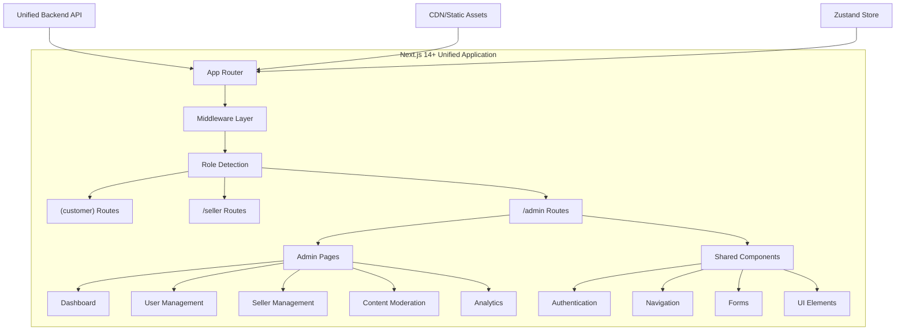
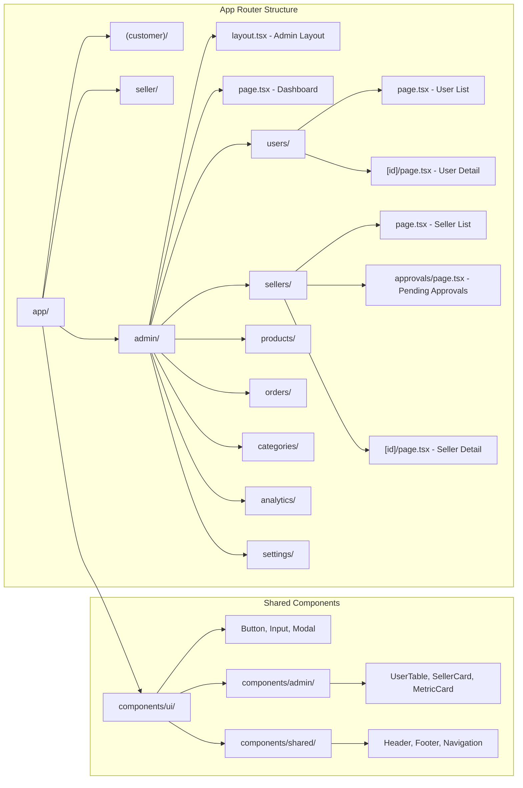

# Design Document: Super Admin Frontend Interface

## Introduction

The Super Admin Frontend Interface is part of a unified Next.js application that provides role-based interfaces for all user types (customer, seller, super_admin). This design document outlines the super admin-specific interface patterns, routing structure, and components within the unified architecture that delivers a comprehensive administrative dashboard for platform oversight and management.

## Unified Architecture Overview

### Next.js 14+ Unified Application Architecture

The super admin interface is implemented within a unified Next.js 14+ application using the App Router architecture. The application dynamically renders different interfaces based on authenticated user roles through middleware and role-based routing:



### Next.js App Router Structure for Super Admins

The super admin interface follows Next.js 14+ App Router conventions with protected admin routes:



### Technology Stack

#### Core Framework & Runtime
- **Next.js 14+**: Full-stack React framework with App Router, Server Components, and Server Actions
- **React 18+**: Component-based UI with concurrent features and streaming SSR
- **TypeScript**: Type-safe development with enhanced IDE support and compile-time validation
- **Node.js**: Server-side runtime for API routes and middleware

#### State Management & Data Fetching
- **Zustand**: Lightweight global state management for user session and admin-specific state
- **TanStack Query (React Query)**: Server state management, caching, and synchronization
- **React Hook Form**: Form state management with validation and performance optimization
- **SWR**: Alternative data fetching with built-in caching (where TanStack Query isn't used)

#### Styling & UI Components
- **Tailwind CSS**: Utility-first CSS framework for rapid development and consistent design
- **shadcn/ui**: High-quality, accessible React components built on Radix UI primitives
- **Headless UI**: Unstyled, accessible UI components for custom implementations
- **Framer Motion**: Animation library for smooth interactions and page transitions
- **Lucide React**: Modern icon library with consistent design

#### Authentication & Security
- **NextAuth.js**: Complete authentication solution with JWT and session management
- **Custom JWT Handling**: Alternative JWT implementation with role-based claims
- **Next.js Middleware**: Route protection and role-based access control
- **bcrypt**: Password hashing for secure authentication

#### Charts & Analytics
- **Recharts**: Composable charting library for React
- **Chart.js**: Alternative charting solution with React wrapper
- **Date-fns**: Date manipulation and formatting utilities

## Components and Interfaces

### Next.js App Router Pages for Super Admins

#### 1. Admin Route Group - `app/admin/`
```typescript
// app/admin/layout.tsx
interface AdminLayoutProps {
  children: React.ReactNode
}

export default function AdminLayout({ children }: AdminLayoutProps) {
  return (
    <div className="min-h-screen bg-gray-50">
      <AdminHeader />
      <div className="flex">
        <AdminSidebar />
        <main className="flex-1 p-6">
          <div className="max-w-7xl mx-auto">
            {children}
          </div>
        </main>
      </div>
    </div>
  )
}

// app/admin/page.tsx - Dashboard
export default function AdminDashboard() {
  return (
    <>
      <div className="mb-8">
        <h1 className="text-3xl font-bold text-gray-900">Platform Overview</h1>
        <p className="text-gray-600">Monitor and manage your e-commerce platform</p>
      </div>
      
      <PlatformMetrics />
      
      <div className="grid grid-cols-1 lg:grid-cols-2 gap-6 mt-8">
        <RecentActivity />
        <SystemAlerts />
      </div>
      
      <div className="grid grid-cols-1 lg:grid-cols-3 gap-6 mt-8">
        <PendingApprovals />
        <RecentOrders />
        <TopPerformers />
      </div>
    </>
  )
}
```
#### 2. User Management Components
```typescript
// app/admin/users/page.tsx - User Management
interface UserManagementPageProps {
  searchParams: {
    status?: string
    search?: string
    page?: string
    sortBy?: string
  }
}

export default function UserManagementPage({ searchParams }: UserManagementPageProps) {
  return (
    <div className="space-y-6">
      <div className="flex justify-between items-center">
        <div>
          <h1 className="text-2xl font-bold">User Management</h1>
          <p className="text-gray-600">Manage customer accounts and user data</p>
        </div>
        <div className="flex space-x-3">
          <Button variant="outline">Export Users</Button>
          <Button>Add User</Button>
        </div>
      </div>
      
      <UserFilters searchParams={searchParams} />
      <UserTable searchParams={searchParams} />
    </div>
  )
}

// components/admin/users/UserTable.tsx
interface UserTableProps {
  searchParams: {
    status?: string
    search?: string
    page?: string
    sortBy?: string
  }
}

export function UserTable({ searchParams }: UserTableProps) {
  const { data: users, isLoading } = useQuery({
    queryKey: ['admin-users', searchParams],
    queryFn: () => adminAPI.getUsers(searchParams),
  })
  
  if (isLoading) return <UserTableSkeleton />
  
  return (
    <div className="bg-white rounded-lg shadow-sm border">
      <div className="overflow-x-auto">
        <table className="w-full">
          <thead className="bg-gray-50 border-b">
            <tr>
              <th className="px-6 py-3 text-left text-xs font-medium text-gray-500 uppercase tracking-wider">
                User
              </th>
              <th className="px-6 py-3 text-left text-xs font-medium text-gray-500 uppercase tracking-wider">
                Status
              </th>
              <th className="px-6 py-3 text-left text-xs font-medium text-gray-500 uppercase tracking-wider">
                Joined
              </th>
              <th className="px-6 py-3 text-left text-xs font-medium text-gray-500 uppercase tracking-wider">
                Orders
              </th>
              <th className="px-6 py-3 text-left text-xs font-medium text-gray-500 uppercase tracking-wider">
                Total Spent
              </th>
              <th className="px-6 py-3 text-right text-xs font-medium text-gray-500 uppercase tracking-wider">
                Actions
              </th>
            </tr>
          </thead>
          <tbody className="divide-y divide-gray-200">
            {users?.map((user) => (
              <UserTableRow key={user.id} user={user} />
            ))}
          </tbody>
        </table>
      </div>
      
      <UserTablePagination searchParams={searchParams} />
    </div>
  )
}

// components/admin/users/UserTableRow.tsx
interface UserTableRowProps {
  user: User
}

export function UserTableRow({ user }: UserTableRowProps) {
  const { mutate: updateUserStatus } = useMutation({
    mutationFn: (data: { userId: string; status: UserStatus }) => 
      adminAPI.updateUserStatus(data.userId, data.status),
    onSuccess: () => {
      toast.success('User status updated successfully')
      queryClient.invalidateQueries(['admin-users'])
    },
  })
  
  return (
    <tr className="hover:bg-gray-50">
      <td className="px-6 py-4 whitespace-nowrap">
        <div className="flex items-center">
          <Avatar className="h-10 w-10">
            <AvatarImage src={user.avatar} alt={user.name} />
            <AvatarFallback>{user.name.charAt(0)}</AvatarFallback>
          </Avatar>
          <div className="ml-4">
            <div className="text-sm font-medium text-gray-900">{user.name}</div>
            <div className="text-sm text-gray-500">{user.email}</div>
          </div>
        </div>
      </td>
      <td className="px-6 py-4 whitespace-nowrap">
        <UserStatusBadge status={user.status} />
      </td>
      <td className="px-6 py-4 whitespace-nowrap text-sm text-gray-500">
        {formatDate(user.createdAt)}
      </td>
      <td className="px-6 py-4 whitespace-nowrap text-sm text-gray-900">
        {user.orderCount}
      </td>
      <td className="px-6 py-4 whitespace-nowrap text-sm text-gray-900">
        ${user.totalSpent.toFixed(2)}
      </td>
      <td className="px-6 py-4 whitespace-nowrap text-right text-sm font-medium">
        <DropdownMenu>
          <DropdownMenuTrigger asChild>
            <Button variant="ghost" size="sm">
              <MoreHorizontal className="h-4 w-4" />
            </Button>
          </DropdownMenuTrigger>
          <DropdownMenuContent align="end">
            <DropdownMenuItem asChild>
              <Link href={`/admin/users/${user.id}`}>View Details</Link>
            </DropdownMenuItem>
            <DropdownMenuItem 
              onClick={() => updateUserStatus({ userId: user.id, status: 'suspended' })}
              className="text-red-600"
            >
              Suspend User
            </DropdownMenuItem>
          </DropdownMenuContent>
        </DropdownMenu>
      </td>
    </tr>
  )
}
```
#### 3. Seller Management and Approval System
```typescript
// app/admin/sellers/page.tsx - Seller Management
export default function SellerManagementPage({ searchParams }: SellerManagementPageProps) {
  return (
    <div className="space-y-6">
      <div className="flex justify-between items-center">
        <div>
          <h1 className="text-2xl font-bold">Seller Management</h1>
          <p className="text-gray-600">Monitor and manage seller accounts</p>
        </div>
        <div className="flex space-x-3">
          <Button variant="outline" asChild>
            <Link href="/admin/sellers/approvals">
              Pending Approvals ({pendingCount})
            </Link>
          </Button>
          <Button variant="outline">Export Sellers</Button>
        </div>
      </div>
      
      <SellerFilters searchParams={searchParams} />
      <SellerTable searchParams={searchParams} />
    </div>
  )
}

// app/admin/sellers/approvals/page.tsx - Seller Approvals
export default function SellerApprovalsPage() {
  const { data: pendingApprovals, isLoading } = useQuery({
    queryKey: ['pending-seller-approvals'],
    queryFn: () => adminAPI.getPendingSellerApprovals(),
  })
  
  return (
    <div className="space-y-6">
      <div className="flex justify-between items-center">
        <div>
          <h1 className="text-2xl font-bold">Seller Approvals</h1>
          <p className="text-gray-600">Review and approve seller applications</p>
        </div>
        <div className="flex space-x-3">
          <Button variant="outline">Bulk Approve</Button>
          <Button variant="outline">Bulk Reject</Button>
        </div>
      </div>
      
      {isLoading ? (
        <ApprovalsSkeleton />
      ) : (
        <div className="grid gap-6">
          {pendingApprovals?.map((application) => (
            <SellerApplicationCard 
              key={application.id} 
              application={application} 
            />
          ))}
        </div>
      )}
    </div>
  )
}

// components/admin/sellers/SellerApplicationCard.tsx
interface SellerApplicationCardProps {
  application: SellerApplication
}

export function SellerApplicationCard({ application }: SellerApplicationCardProps) {
  const { mutate: approveApplication } = useMutation({
    mutationFn: (data: { applicationId: string; notes?: string }) =>
      adminAPI.approveSellerApplication(data.applicationId, data.notes),
    onSuccess: () => {
      toast.success('Seller application approved')
      queryClient.invalidateQueries(['pending-seller-approvals'])
    },
  })
  
  const { mutate: rejectApplication } = useMutation({
    mutationFn: (data: { applicationId: string; reason: string }) =>
      adminAPI.rejectSellerApplication(data.applicationId, data.reason),
    onSuccess: () => {
      toast.success('Seller application rejected')
      queryClient.invalidateQueries(['pending-seller-approvals'])
    },
  })
  
  return (
    <div className="bg-white rounded-lg shadow-sm border p-6">
      <div className="flex justify-between items-start mb-6">
        <div>
          <h3 className="text-lg font-semibold">{application.businessName}</h3>
          <p className="text-gray-600">{application.contactEmail}</p>
          <p className="text-sm text-gray-500">
            Applied {formatDate(application.createdAt)}
          </p>
        </div>
        <div className="flex space-x-3">
          <Button 
            variant="outline" 
            onClick={() => approveApplication({ applicationId: application.id })}
            className="text-green-600 border-green-600 hover:bg-green-50"
          >
            Approve
          </Button>
          <Button 
            variant="outline"
            onClick={() => {/* Open rejection modal */}}
            className="text-red-600 border-red-600 hover:bg-red-50"
          >
            Reject
          </Button>
        </div>
      </div>
      
      <div className="grid grid-cols-1 md:grid-cols-2 gap-6">
        <div>
          <h4 className="font-medium mb-3">Business Information</h4>
          <div className="space-y-2 text-sm">
            <div><span className="text-gray-500">Business Type:</span> {application.businessType}</div>
            <div><span className="text-gray-500">Tax ID:</span> {application.taxId}</div>
            <div><span className="text-gray-500">Address:</span> {application.businessAddress}</div>
            <div><span className="text-gray-500">Phone:</span> {application.phoneNumber}</div>
          </div>
        </div>
        
        <div>
          <h4 className="font-medium mb-3">Product Categories</h4>
          <div className="flex flex-wrap gap-2">
            {application.productCategories.map((category) => (
              <Badge key={category} variant="secondary">
                {category}
              </Badge>
            ))}
          </div>
          
          <h4 className="font-medium mb-3 mt-4">Documents</h4>
          <div className="space-y-2">
            {application.documents.map((doc) => (
              <div key={doc.id} className="flex items-center justify-between">
                <span className="text-sm">{doc.name}</span>
                <Button variant="ghost" size="sm" asChild>
                  <a href={doc.url} target="_blank" rel="noopener noreferrer">
                    View
                  </a>
                </Button>
              </div>
            ))}
          </div>
        </div>
      </div>
    </div>
  )
}
```
#### 4. Product Content Moderation System
```typescript
// app/admin/products/page.tsx - Product Moderation
export default function ProductModerationPage({ searchParams }: ProductModerationPageProps) {
  return (
    <div className="space-y-6">
      <div className="flex justify-between items-center">
        <div>
          <h1 className="text-2xl font-bold">Product Moderation</h1>
          <p className="text-gray-600">Review and moderate product listings</p>
        </div>
        <div className="flex space-x-3">
          <Button variant="outline">Bulk Approve</Button>
          <Button variant="outline">Bulk Remove</Button>
          <Button variant="outline">Export Report</Button>
        </div>
      </div>
      
      <ProductModerationFilters searchParams={searchParams} />
      <ProductModerationGrid searchParams={searchParams} />
    </div>
  )
}

// components/admin/products/ProductModerationCard.tsx
interface ProductModerationCardProps {
  product: ProductForModeration
}

export function ProductModerationCard({ product }: ProductModerationCardProps) {
  const { mutate: approveProduct } = useMutation({
    mutationFn: (productId: string) => adminAPI.approveProduct(productId),
    onSuccess: () => {
      toast.success('Product approved')
      queryClient.invalidateQueries(['admin-products-moderation'])
    },
  })
  
  const { mutate: removeProduct } = useMutation({
    mutationFn: (data: { productId: string; reason: string }) =>
      adminAPI.removeProduct(data.productId, data.reason),
    onSuccess: () => {
      toast.success('Product removed')
      queryClient.invalidateQueries(['admin-products-moderation'])
    },
  })
  
  return (
    <div className="bg-white rounded-lg shadow-sm border overflow-hidden">
      <div className="aspect-square relative">
        <Image
          src={product.images[0]?.url || '/placeholder-product.jpg'}
          alt={product.name}
          fill
          className="object-cover"
        />
        <div className="absolute top-2 right-2">
          <ProductStatusBadge status={product.moderationStatus} />
        </div>
      </div>
      
      <div className="p-4">
        <h3 className="font-semibold text-lg mb-2 line-clamp-2">{product.name}</h3>
        <p className="text-gray-600 text-sm mb-3 line-clamp-3">{product.description}</p>
        
        <div className="flex justify-between items-center mb-3">
          <span className="font-semibold text-lg">${product.price}</span>
          <Badge variant="secondary">{product.category.name}</Badge>
        </div>
        
        <div className="text-sm text-gray-500 mb-4">
          <p>Seller: {product.seller.businessName}</p>
          <p>Listed: {formatDate(product.createdAt)}</p>
          {product.flaggedReasons.length > 0 && (
            <div className="mt-2">
              <p className="text-red-600 font-medium">Flagged for:</p>
              <ul className="list-disc list-inside">
                {product.flaggedReasons.map((reason, index) => (
                  <li key={index} className="text-red-600">{reason}</li>
                ))}
              </ul>
            </div>
          )}
        </div>
        
        <div className="flex space-x-2">
          <Button 
            size="sm" 
            onClick={() => approveProduct(product.id)}
            className="flex-1"
          >
            Approve
          </Button>
          <Button 
            size="sm" 
            variant="destructive"
            onClick={() => {/* Open removal modal */}}
            className="flex-1"
          >
            Remove
          </Button>
          <Button size="sm" variant="outline" asChild>
            <Link href={`/admin/products/${product.id}`}>Details</Link>
          </Button>
        </div>
      </div>
    </div>
  )
}
```

#### 5. Platform Analytics and Reporting
```typescript
// app/admin/analytics/page.tsx - Analytics Dashboard
export default function AnalyticsDashboard() {
  const [dateRange, setDateRange] = useState<DateRange>({
    from: subDays(new Date(), 30),
    to: new Date(),
  })
  
  const { data: analytics, isLoading } = useQuery({
    queryKey: ['admin-analytics', dateRange],
    queryFn: () => adminAPI.getPlatformAnalytics(dateRange),
  })
  
  return (
    <div className="space-y-6">
      <div className="flex justify-between items-center">
        <div>
          <h1 className="text-2xl font-bold">Platform Analytics</h1>
          <p className="text-gray-600">Comprehensive platform performance insights</p>
        </div>
        <div className="flex space-x-3">
          <DateRangePicker value={dateRange} onChange={setDateRange} />
          <Button variant="outline">Export Report</Button>
        </div>
      </div>
      
      {isLoading ? (
        <AnalyticsSkeleton />
      ) : (
        <>
          <PlatformMetricsGrid metrics={analytics.metrics} />
          
          <div className="grid grid-cols-1 lg:grid-cols-2 gap-6">
            <RevenueChart data={analytics.revenueData} />
            <UserGrowthChart data={analytics.userGrowthData} />
          </div>
          
          <div className="grid grid-cols-1 lg:grid-cols-3 gap-6">
            <TopCategoriesChart data={analytics.categoryData} />
            <SellerPerformanceChart data={analytics.sellerData} />
            <GeographicDistribution data={analytics.geoData} />
          </div>
          
          <div className="grid grid-cols-1 lg:grid-cols-2 gap-6">
            <ConversionFunnelChart data={analytics.conversionData} />
            <CustomerRetentionChart data={analytics.retentionData} />
          </div>
        </>
      )}
    </div>
  )
}

// components/admin/analytics/PlatformMetricsGrid.tsx
interface PlatformMetricsGridProps {
  metrics: PlatformMetrics
}

export function PlatformMetricsGrid({ metrics }: PlatformMetricsGridProps) {
  const metricCards = [
    {
      title: 'Total Revenue',
      value: `$${metrics.totalRevenue.toLocaleString()}`,
      change: metrics.revenueChange,
      icon: DollarSign,
      color: 'text-green-600',
    },
    {
      title: 'Active Users',
      value: metrics.activeUsers.toLocaleString(),
      change: metrics.userChange,
      icon: Users,
      color: 'text-blue-600',
    },
    {
      title: 'Total Orders',
      value: metrics.totalOrders.toLocaleString(),
      change: metrics.orderChange,
      icon: ShoppingCart,
      color: 'text-purple-600',
    },
    {
      title: 'Active Sellers',
      value: metrics.activeSellers.toLocaleString(),
      change: metrics.sellerChange,
      icon: Store,
      color: 'text-orange-600',
    },
    {
      title: 'Conversion Rate',
      value: `${metrics.conversionRate.toFixed(2)}%`,
      change: metrics.conversionChange,
      icon: TrendingUp,
      color: 'text-emerald-600',
    },
    {
      title: 'Avg Order Value',
      value: `$${metrics.avgOrderValue.toFixed(2)}`,
      change: metrics.aovChange,
      icon: CreditCard,
      color: 'text-indigo-600',
    },
  ]
  
  return (
    <div className="grid grid-cols-1 md:grid-cols-2 lg:grid-cols-3 gap-6">
      {metricCards.map((metric) => (
        <MetricCard key={metric.title} {...metric} />
      ))}
    </div>
  )
}
```
#### 6. Unified State Management with Zustand
```typescript
// store/adminStore.ts
interface AdminState {
  // Authentication state (shared across all roles)
  auth: {
    user: SuperAdmin | null
    role: 'super_admin'
    permissions: string[]
    isAuthenticated: boolean
    isLoading: boolean
  }
  
  // Admin-specific state
  admin: {
    dashboard: {
      metrics: PlatformMetrics | null
      alerts: SystemAlert[]
      recentActivity: AdminActivity[]
      isLoading: boolean
    }
    users: {
      items: User[]
      totalCount: number
      isLoading: boolean
      error: string | null
    }
    sellers: {
      items: Seller[]
      pendingApprovals: SellerApplication[]
      totalCount: number
      isLoading: boolean
      error: string | null
    }
    products: {
      flaggedItems: ProductForModeration[]
      totalCount: number
      isLoading: boolean
      error: string | null
    }
    analytics: {
      platformMetrics: PlatformAnalytics | null
      isLoading: boolean
      dateRange: DateRange
    }
  }
  
  // Shared state (used by multiple roles)
  shared: {
    categories: Category[]
    notifications: Notification[]
  }
  
  // Actions
  login: (credentials: LoginCredentials) => Promise<void>
  logout: () => void
  fetchDashboardData: () => Promise<void>
  updateUserStatus: (userId: string, status: UserStatus) => Promise<void>
  approveSellerApplication: (applicationId: string, notes?: string) => Promise<void>
  rejectSellerApplication: (applicationId: string, reason: string) => Promise<void>
  moderateProduct: (productId: string, action: 'approve' | 'remove', reason?: string) => Promise<void>
  fetchAnalytics: (dateRange: DateRange) => Promise<void>
}

export const useAdminStore = create<AdminState>((set, get) => ({
  auth: {
    user: null,
    role: 'super_admin',
    permissions: [],
    isAuthenticated: false,
    isLoading: false,
  },
  admin: {
    dashboard: {
      metrics: null,
      alerts: [],
      recentActivity: [],
      isLoading: false,
    },
    users: { items: [], totalCount: 0, isLoading: false, error: null },
    sellers: { items: [], pendingApprovals: [], totalCount: 0, isLoading: false, error: null },
    products: { flaggedItems: [], totalCount: 0, isLoading: false, error: null },
    analytics: { platformMetrics: null, isLoading: false, dateRange: { from: subDays(new Date(), 30), to: new Date() } },
  },
  shared: {
    categories: [],
    notifications: [],
  },
  
  login: async (credentials) => {
    set((state) => ({ auth: { ...state.auth, isLoading: true } }))
    try {
      const response = await adminAPI.login(credentials)
      set((state) => ({
        auth: {
          ...state.auth,
          user: response.user,
          isAuthenticated: true,
          permissions: response.permissions,
          isLoading: false,
        }
      }))
    } catch (error) {
      set((state) => ({ auth: { ...state.auth, isLoading: false } }))
      throw error
    }
  },
  
  fetchDashboardData: async () => {
    set((state) => ({
      admin: {
        ...state.admin,
        dashboard: { ...state.admin.dashboard, isLoading: true }
      }
    }))
    
    try {
      const [metrics, alerts, activity] = await Promise.all([
        adminAPI.getPlatformMetrics(),
        adminAPI.getSystemAlerts(),
        adminAPI.getRecentActivity(),
      ])
      
      set((state) => ({
        admin: {
          ...state.admin,
          dashboard: {
            metrics,
            alerts,
            recentActivity: activity,
            isLoading: false,
          }
        }
      }))
    } catch (error) {
      set((state) => ({
        admin: {
          ...state.admin,
          dashboard: { ...state.admin.dashboard, isLoading: false }
        }
      }))
    }
  },
  
  updateUserStatus: async (userId, status) => {
    try {
      const updatedUser = await adminAPI.updateUserStatus(userId, status)
      set((state) => ({
        admin: {
          ...state.admin,
          users: {
            ...state.admin.users,
            items: state.admin.users.items.map(user =>
              user.id === userId ? updatedUser : user
            )
          }
        }
      }))
      toast.success('User status updated successfully')
    } catch (error) {
      toast.error('Failed to update user status')
    }
  },
  
  approveSellerApplication: async (applicationId, notes) => {
    try {
      await adminAPI.approveSellerApplication(applicationId, notes)
      set((state) => ({
        admin: {
          ...state.admin,
          sellers: {
            ...state.admin.sellers,
            pendingApprovals: state.admin.sellers.pendingApprovals.filter(
              app => app.id !== applicationId
            )
          }
        }
      }))
      toast.success('Seller application approved')
    } catch (error) {
      toast.error('Failed to approve seller application')
    }
  },
  
  moderateProduct: async (productId, action, reason) => {
    try {
      await adminAPI.moderateProduct(productId, action, reason)
      set((state) => ({
        admin: {
          ...state.admin,
          products: {
            ...state.admin.products,
            flaggedItems: state.admin.products.flaggedItems.filter(
              product => product.id !== productId
            )
          }
        }
      }))
      toast.success(`Product ${action}d successfully`)
    } catch (error) {
      toast.error(`Failed to ${action} product`)
    }
  },
}))
```

## User Interface Design

### Design System

#### Color Palette
- Primary: #1F2937 (Gray 800) - Professional admin interface
- Secondary: #3B82F6 (Blue 500) - Actions and links
- Success: #10B981 (Emerald 500) - Approvals and positive metrics
- Warning: #F59E0B (Amber 500) - Pending items and warnings
- Danger: #EF4444 (Red 500) - Rejections and critical alerts
- Neutral: #6B7280 (Gray 500) - Text and borders
- Background: #F9FAFB (Gray 50) - Page backgrounds

#### Typography
- Headings: Inter, system-ui, sans-serif (weights: 600, 700)
- Body: Inter, system-ui, sans-serif (weights: 400, 500)
- Code: 'Fira Code', monospace

#### Spacing Scale
- Base unit: 4px
- Scale: 4px, 8px, 12px, 16px, 24px, 32px, 48px, 64px, 96px

### Layout Structure

#### Admin Navigation Layout
```
┌─────────────────────────────────────────────────────────────┐
│                    Admin Header Bar                         │
│  Logo    Dashboard  Users  Sellers  Products  Analytics  ▼ │
├─────────────────────────────────────────────────────────────┤
│ ┌─────────────┐                                             │
│ │             │                                             │
│ │   Sidebar   │              Main Content Area             │
│ │             │                                             │
│ │             │                                             │
│ └─────────────┘                                             │
└─────────────────────────────────────────────────────────────┘
```

#### Dashboard Layout
```
┌─────────────────────────────────────────────────────────────┐
│                    Platform Metrics Row                     │
│  ┌─────────┐ ┌─────────┐ ┌─────────┐ ┌─────────┐ ┌─────────┐ │
│  │Revenue  │ │ Users   │ │ Orders  │ │Sellers  │ │Conv Rate│ │
│  │$125.5K  │ │ 12,543  │ │ 1,847   │ │  234    │ │  3.2%   │ │
│  └─────────┘ └─────────┘ └─────────┘ └─────────┘ └─────────┘ │
├─────────────────────────────────────────────────────────────┤
│ ┌─────────────────────────────┐ ┌─────────────────────────┐ │
│ │      Recent Activity        │ │    System Alerts        │ │
│ │                             │ │                         │ │
│ └─────────────────────────────┘ └─────────────────────────┘ │
├─────────────────────────────────────────────────────────────┤
│ ┌─────────────┐ ┌─────────────┐ ┌─────────────────────────┐ │
│ │  Pending    │ │   Recent    │ │    Top Performers       │ │
│ │ Approvals   │ │   Orders    │ │                         │ │
│ └─────────────┘ └─────────────┘ └─────────────────────────┘ │
└─────────────────────────────────────────────────────────────┘
```
## Technical Design

### Frontend Technology Stack

#### Core Framework
- **Next.js 14+**: React framework with App Router for role-based routing
- **TypeScript**: Type-safe JavaScript for better development experience
- **React 18+**: Component-based UI library with concurrent features

#### State Management
- **Zustand**: Lightweight state management for unified application state
- **TanStack Query (React Query)**: Server state management and caching
- **React Hook Form**: Form state management with validation

#### Styling and UI
- **Tailwind CSS**: Utility-first CSS framework for rapid UI development
- **shadcn/ui**: High-quality, accessible React components built on Radix UI
- **Lucide React**: Modern icon library
- **Recharts**: Composable charting library for analytics

#### Authentication and Routing
- **NextAuth.js** or **Custom JWT**: Authentication with role-based access control
- **Next.js App Router**: File-based routing with role-specific route groups
- **Next.js Middleware**: Route protection and role validation

### Unified Architecture Implementation

#### Next.js App Router Structure
```
src/app/
├── (customer)/              # Customer routes (public)
│   ├── page.tsx            # Home page
│   ├── products/           # Product catalog
│   └── cart/               # Shopping cart
├── seller/                 # Seller routes (protected)
│   ├── layout.tsx          # Seller-specific layout
│   ├── page.tsx            # Seller dashboard
│   └── ...
├── admin/                  # Admin routes (protected)
│   ├── layout.tsx          # Admin-specific layout
│   ├── page.tsx            # Admin dashboard
│   ├── users/              # User management
│   │   ├── page.tsx        # User list
│   │   └── [id]/           # User details
│   ├── sellers/            # Seller management
│   │   ├── page.tsx        # Seller list
│   │   ├── approvals/      # Pending approvals
│   │   └── [id]/           # Seller details
│   ├── products/           # Product moderation
│   │   ├── page.tsx        # Product list
│   │   └── [id]/           # Product details
│   ├── orders/             # Order oversight
│   ├── categories/         # Category management
│   ├── analytics/          # Platform analytics
│   └── settings/           # Admin settings
└── api/                    # API routes (if needed)
```

#### Role-Based Layout System
```typescript
// src/app/admin/layout.tsx
import { AdminNavigation } from '@/components/admin/AdminNavigation'
import { RoleGuard } from '@/components/auth/RoleGuard'

export default function AdminLayout({
  children,
}: {
  children: React.ReactNode
}) {
  return (
    <RoleGuard allowedRoles={['super_admin']}>
      <div className="min-h-screen bg-gray-50">
        <AdminNavigation />
        <main className="lg:pl-64">
          <div className="px-4 sm:px-6 lg:px-8 py-8">
            <div className="max-w-7xl mx-auto">
              {children}
            </div>
          </div>
        </main>
      </div>
    </RoleGuard>
  )
}
```

### Authentication System Design

#### Next.js Middleware for Super Admin Protection
```typescript
// middleware.ts
import { NextResponse } from 'next/server'
import type { NextRequest } from 'next/server'
import { verifyJWT } from '@/lib/auth'

export async function middleware(request: NextRequest) {
  const token = request.cookies.get('auth-token')?.value
  
  // Protect admin routes
  if (request.nextUrl.pathname.startsWith('/admin')) {
    if (!token) {
      return NextResponse.redirect(new URL('/login', request.url))
    }
    
    try {
      const payload = await verifyJWT(token)
      if (payload.role !== 'super_admin') {
        return NextResponse.redirect(new URL('/unauthorized', request.url))
      }
      
      // Additional security: Check for MFA if required
      if (payload.requiresMFA && !payload.mfaVerified) {
        return NextResponse.redirect(new URL('/auth/mfa', request.url))
      }
    } catch (error) {
      return NextResponse.redirect(new URL('/login', request.url))
    }
  }
  
  return NextResponse.next()
}

export const config = {
  matcher: ['/admin/:path*']
}
```

#### Multi-Factor Authentication Flow
```typescript
// components/admin/auth/MFAVerification.tsx
interface MFAVerificationProps {
  onSuccess: () => void
  onCancel: () => void
}

export function MFAVerification({ onSuccess, onCancel }: MFAVerificationProps) {
  const [code, setCode] = useState('')
  const [isLoading, setIsLoading] = useState(false)
  
  const handleVerify = async () => {
    setIsLoading(true)
    try {
      await adminAPI.verifyMFA(code)
      onSuccess()
    } catch (error) {
      toast.error('Invalid verification code')
    } finally {
      setIsLoading(false)
    }
  }
  
  return (
    <div className="max-w-md mx-auto bg-white rounded-lg shadow-lg p-6">
      <div className="text-center mb-6">
        <Shield className="h-12 w-12 text-blue-600 mx-auto mb-4" />
        <h2 className="text-xl font-semibold">Two-Factor Authentication</h2>
        <p className="text-gray-600">Enter the verification code from your authenticator app</p>
      </div>
      
      <div className="space-y-4">
        <Input
          value={code}
          onChange={(e) => setCode(e.target.value)}
          placeholder="Enter 6-digit code"
          maxLength={6}
          className="text-center text-lg tracking-widest"
        />
        
        <div className="flex space-x-3">
          <Button 
            onClick={handleVerify} 
            disabled={code.length !== 6 || isLoading}
            className="flex-1"
          >
            {isLoading ? 'Verifying...' : 'Verify'}
          </Button>
          <Button variant="outline" onClick={onCancel} className="flex-1">
            Cancel
          </Button>
        </div>
      </div>
    </div>
  )
}
```

### Data Management Design

#### API Integration Pattern
```typescript
// lib/adminAPI.ts
class AdminAPI {
  // Authentication
  async login(credentials: LoginCredentials): Promise<AuthResponse>
  async verifyMFA(code: string): Promise<void>
  async logout(): Promise<void>
  
  // Dashboard
  async getPlatformMetrics(): Promise<PlatformMetrics>
  async getSystemAlerts(): Promise<SystemAlert[]>
  async getRecentActivity(): Promise<AdminActivity[]>
  
  // User Management
  async getUsers(params: UserQueryParams): Promise<PaginatedUsers>
  async getUserById(id: string): Promise<UserDetails>
  async updateUserStatus(id: string, status: UserStatus): Promise<User>
  async blockUser(id: string, reason: string, duration?: number): Promise<void>
  
  // Seller Management
  async getSellers(params: SellerQueryParams): Promise<PaginatedSellers>
  async getPendingSellerApprovals(): Promise<SellerApplication[]>
  async approveSellerApplication(id: string, notes?: string): Promise<void>
  async rejectSellerApplication(id: string, reason: string): Promise<void>
  async getSellerById(id: string): Promise<SellerDetails>
  
  // Product Moderation
  async getFlaggedProducts(params: ProductQueryParams): Promise<PaginatedProducts>
  async approveProduct(id: string): Promise<void>
  async removeProduct(id: string, reason: string): Promise<void>
  async getProductById(id: string): Promise<ProductDetails>
  
  // Analytics
  async getPlatformAnalytics(dateRange: DateRange): Promise<PlatformAnalytics>
  async exportAnalyticsReport(params: ExportParams): Promise<Blob>
  
  // Categories
  async getCategories(): Promise<Category[]>
  async createCategory(data: CreateCategoryData): Promise<Category>
  async updateCategory(id: string, data: UpdateCategoryData): Promise<Category>
  async deleteCategory(id: string): Promise<void>
  
  // Orders
  async getOrders(params: OrderQueryParams): Promise<PaginatedOrders>
  async getOrderById(id: string): Promise<OrderDetails>
  async updateOrderStatus(id: string, status: OrderStatus): Promise<Order>
}

export const adminAPI = new AdminAPI()
```
## Page Designs

### 1. Authentication Pages

#### Super Admin Login Page
- Enhanced security with MFA requirement
- Professional admin-focused design
- Session timeout warnings
- IP address logging and monitoring
- Failed attempt tracking and lockout

#### Multi-Factor Authentication Page
- TOTP authenticator app integration
- Backup code support
- Clear security messaging
- Timeout handling for verification

### 2. Dashboard Page

#### Platform Overview Section
- Real-time platform metrics with trend indicators
- System health monitoring
- Critical alerts and notifications
- Quick action buttons for common admin tasks

#### Activity Monitoring
- Recent administrative actions log
- User activity summaries
- Seller performance highlights
- System performance metrics

### 3. User Management Pages

#### User List Page
```
┌─────────────────────────────────────────────────────────────┐
│ User Management                              [Export] [Add] │
├─────────────────────────────────────────────────────────────┤
│ Search: [_______________] Status: [All ▼] Date: [Range ▼]   │
├─────────────────────────────────────────────────────────────┤
│ ┌─────┐                                                     │
│ │ AVT │ John Doe            Active      2024-01-15    [⋮]   │
│ └─────┘ john@example.com    25 orders   $1,250.00          │
├─────────────────────────────────────────────────────────────┤
│ ┌─────┐                                                     │
│ │ AVT │ Jane Smith          Suspended   2024-02-20    [⋮]   │
│ └─────┘ jane@example.com    12 orders   $890.50            │
└─────────────────────────────────────────────────────────────┘
```

#### User Details Page
- Complete user profile information
- Order history and spending patterns
- Account activity timeline
- Administrative action history
- Block/unblock controls with reason tracking

### 4. Seller Management Pages

#### Seller List Page
```
┌─────────────────────────────────────────────────────────────┐
│ Seller Management                    [Approvals] [Export]   │
├─────────────────────────────────────────────────────────────┤
│ Search: [_______________] Status: [All ▼] Rating: [All ▼]   │
├─────────────────────────────────────────────────────────────┤
│ ┌─────┐                                                     │
│ │ LOG │ Tech Store Inc      Approved    4.8★  $15.2K  [⋮]  │
│ └─────┘ tech@store.com      245 products      1,234 sales  │
├─────────────────────────────────────────────────────────────┤
│ ┌─────┐                                                     │
│ │ LOG │ Fashion Hub         Pending     N/A   $0      [⋮]  │
│ └─────┘ info@fashion.com    0 products        0 sales      │
└─────────────────────────────────────────────────────────────┘
```

#### Seller Approval Page
- Detailed application review interface
- Document verification tools
- Bulk approval/rejection capabilities
- Communication templates for notifications

### 5. Product Moderation Pages

#### Product Moderation Grid
```
┌─────────────────────────────────────────────────────────────┐
│ Product Moderation                   [Bulk Actions ▼]      │
├─────────────────────────────────────────────────────────────┤
│ Filter: [Flagged ▼] Category: [All ▼] Seller: [All ▼]      │
├─────────────────────────────────────────────────────────────┤
│ ┌─────────────┐ ┌─────────────┐ ┌─────────────┐ ┌─────────┐ │
│ │ [IMG] FLAGGED│ │ [IMG] FLAGGED│ │ [IMG] FLAGGED│ │ [IMG]   │ │
│ │ Product Name │ │ Product Name │ │ Product Name │ │ Product │ │
│ │ $99.99       │ │ $49.99       │ │ $129.99      │ │ $79.99  │ │
│ │ [Approve]    │ │ [Approve]    │ │ [Approve]    │ │ [Approve│ │
│ │ [Remove]     │ │ [Remove]     │ │ [Remove]     │ │ [Remove]│ │
│ └─────────────┘ └─────────────┘ └─────────────┘ └─────────┘ │
└─────────────────────────────────────────────────────────────┘
```

#### Product Details Page
- Complete product information display
- Flagging reason analysis
- Seller communication tools
- Policy compliance checking

### 6. Analytics and Reporting Pages

#### Analytics Dashboard
- Interactive charts and graphs
- Customizable date ranges
- Export functionality for reports
- Drill-down capabilities for detailed analysis

#### Revenue Analytics
- Revenue trends and forecasting
- Commission tracking
- Payment method analysis
- Geographic revenue distribution

## Mobile Responsive Design

### Breakpoint Strategy
- Mobile: 320px - 767px
- Tablet: 768px - 1023px  
- Desktop: 1024px+

### Mobile Adaptations
- Collapsible admin sidebar
- Touch-friendly action buttons
- Simplified data tables with horizontal scroll
- Modal-based forms for complex operations
- Condensed metric cards

### Navigation Pattern
```
Mobile:
┌─────────────────────┐
│ ☰ Admin Panel   👤  │ <- Header with hamburger menu
├─────────────────────┤
│                     │
│   Main Content      │
│                     │
└─────────────────────┘

Tablet/Desktop:
┌─────────────────────────────────────┐
│ Admin Panel  Dashboard Users ... 👤 │ <- Horizontal navigation
├─────────────────────────────────────┤
│ │                                   │
│ │           Main Content            │
│ │                                   │
└─────────────────────────────────────┘
```

## Security Design

### Frontend Security Measures

#### Enhanced Authentication Security
- Multi-factor authentication requirement
- Session timeout with warnings
- IP address whitelisting capabilities
- Failed login attempt monitoring
- Automatic account lockout protection

#### Data Protection
- Comprehensive input validation and sanitization
- XSS prevention through proper escaping
- CSRF protection with token validation
- Content Security Policy headers
- HTTPS enforcement with HSTS

#### Access Control
- Role-based route protection with middleware
- Component-level permission checks
- API request authorization headers
- Admin action logging and audit trails
- Principle of least privilege enforcement

### Security Headers
```
Content-Security-Policy: default-src 'self'; script-src 'self' 'unsafe-inline'
X-Frame-Options: DENY
X-Content-Type-Options: nosniff
Referrer-Policy: strict-origin-when-cross-origin
Strict-Transport-Security: max-age=31536000; includeSubDomains
```

## Performance Optimization

### Loading Performance
- Code splitting by admin feature areas
- Lazy loading of analytics components
- Image optimization for user avatars and product images
- Bundle size optimization with tree shaking

### Runtime Performance
- React.memo for expensive admin components
- Virtual scrolling for large data tables
- Debounced search and filter inputs
- Optimistic updates for admin actions

### Caching Strategy
- API response caching with React Query
- Static asset caching with CDN
- Browser storage for admin preferences
- Real-time data with WebSocket connections

## Integration Design

### API Integration

#### REST API Endpoints
```
Authentication:
POST /api/admin/auth/login
POST /api/admin/auth/mfa/verify
POST /api/admin/auth/logout

Dashboard:
GET /api/admin/dashboard/metrics
GET /api/admin/dashboard/alerts
GET /api/admin/dashboard/activity

User Management:
GET    /api/admin/users
GET    /api/admin/users/{userId}
PUT    /api/admin/users/{userId}/status
POST   /api/admin/users/{userId}/block

Seller Management:
GET    /api/admin/sellers
GET    /api/admin/sellers/approvals
POST   /api/admin/sellers/{sellerId}/approve
POST   /api/admin/sellers/{sellerId}/reject

Product Moderation:
GET    /api/admin/products/flagged
POST   /api/admin/products/{productId}/approve
POST   /api/admin/products/{productId}/remove

Analytics:
GET /api/admin/analytics/platform
GET /api/admin/analytics/revenue
GET /api/admin/analytics/users
```

#### Error Handling
- Standardized admin error response format
- User-friendly error messages for admin actions
- Retry mechanisms for failed admin operations
- Offline state handling with queue management

### Third-Party Integrations

#### Analytics Service
- Admin action tracking
- Performance monitoring for admin interface
- Error reporting and alerting
- Usage analytics for admin features

#### Notification Service
- Email notifications for critical alerts
- SMS notifications for security events
- In-app notifications for admin actions
- Webhook integrations for external systems

## Accessibility Design

### WCAG 2.1 AA Compliance
- Semantic HTML structure for admin interfaces
- Proper heading hierarchy in admin pages
- Alt text for all admin interface images
- Keyboard navigation support for all admin functions
- Screen reader compatibility for admin tools

### Accessibility Features
- High contrast mode for admin interface
- Focus indicators for admin controls
- Skip navigation links for admin pages
- ARIA labels for complex admin components
- Color-blind friendly design for admin charts

### Testing Strategy
- Automated accessibility testing for admin components
- Screen reader testing for admin workflows
- Keyboard-only navigation testing
- Color contrast validation for admin interface

## Development Guidelines

### Code Organization
```
src/
├── components/
│   ├── ui/              # Reusable UI components
│   ├── admin/           # Admin-specific components
│   │   ├── auth/        # Authentication components
│   │   ├── dashboard/   # Dashboard components
│   │   ├── users/       # User management components
│   │   ├── sellers/     # Seller management components
│   │   ├── products/    # Product moderation components
│   │   └── analytics/   # Analytics components
│   └── shared/          # Shared components across roles
├── app/
│   └── admin/           # Admin route pages
├── hooks/               # Custom React hooks
├── lib/                 # Utility functions and API clients
├── store/               # Zustand state management
├── types/               # TypeScript type definitions
└── utils/               # Helper functions
```

### Component Design Patterns
- Compound components for complex admin interfaces
- Render props for flexible admin component composition
- Custom hooks for admin-specific logic reuse
- Higher-order components for admin permission checking

### Testing Strategy
- Unit tests for admin utility functions
- Component tests for admin interface components
- Integration tests for admin user flows
- E2E tests for critical admin workflows

This comprehensive design provides a robust foundation for building a modern, secure, and user-friendly super admin frontend interface that integrates seamlessly with the unified e-commerce platform architecture while maintaining the highest standards of security and usability for administrative operations.