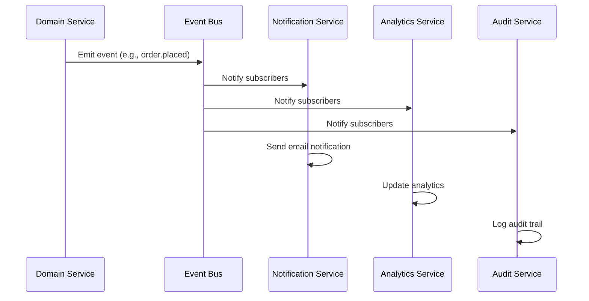
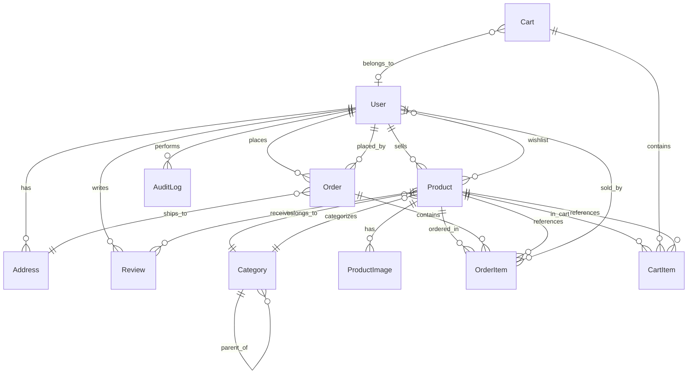

# Design Document: Unified Backend API

## Overview

The Unified Backend API is a comprehensive NestJS-based RESTful API system that serves as the single backend service for the multi-vendor e-commerce platform. This unified architecture handles all operations for customers, sellers, and super administrators through role-based access control, eliminating the need for separate backend services.

### Core Architecture Principles

- **Single Application**: One NestJS application serving all user types with role-based guards
- **JWT Authentication**: Passport.js-based authentication with role claims (customer, seller, super_admin)
- **MySQL Database**: TypeORM entities with unified schema and role-based data filtering
- **Event-Driven**: Event bus for cross-role coordination and real-time updates
- **Domain-Based Modules**: Organized by business domains (auth, users, products, orders) with role validation
- **Docker Development**: MySQL container for local development environment

### Technology Stack

- **Framework**: NestJS with TypeScript
- **Database**: MySQL 8.0+ with TypeORM
- **Authentication**: JWT tokens with Passport.js strategies
- **Validation**: class-validator and class-transformer
- **Documentation**: Swagger/OpenAPI
- **Caching**: Redis for performance optimization
- **Events**: NestJS Event Emitter or Bull queues
- **Testing**: Jest with property-based testing library (fast-check)

### Key Design Goals

1. Unified codebase with role-based access control
2. High performance (95% of requests < 200ms for reads, < 300ms for writes)
3. Horizontal scalability through stateless design
4. Comprehensive audit logging for compliance
5. Event-driven architecture for real-time coordination
6. Security-first approach with defense in depth
7. GDPR compliance and data privacy
8. Extensibility for future features

## Architecture

### System Architecture

```mermaid
graph TB
    subgraph "Client Layer"
        CF[Customer Frontend]
        SF[Seller Frontend]
        AF[Admin Frontend]
    end
    
    subgraph "API Gateway Layer"
        AG[NestJS API Gateway]
        AG --> Auth[Authentication Middleware]
        AG --> RG[Role Guards]
        AG --> RL[Rate Limiter]
    end

    
    subgraph "Service Layer"
        AuthS[Authentication Service]
        UserS[User Service]
        ProdS[Product Service]
        CartS[Cart Service]
        OrderS[Order Service]
        PayS[Payment Service]
        InvS[Inventory Service]
        RevS[Review Service]
        AnalS[Analytics Service]
        NotifS[Notification Service]
        AuditS[Audit Service]
        SearchS[Search Engine]
        ModS[Moderation Service]
        ApprS[Approval Service]
        CatS[Category Service]
        SecS[Security Service]
        EventS[Event Service]
    end
    
    subgraph "Data Layer"
        DB[(MySQL Database)]
        Cache[(Redis Cache)]
        Files[File Storage]
    end
    
    subgraph "External Services"
        Email[Email Service]
        Payment[Payment Gateways]
        Ship[Shipping Providers]
    end
    
    CF --> AG
    SF --> AG
    AF --> AG
    
    AG --> AuthS
    AG --> UserS
    AG --> ProdS
    AG --> CartS
    AG --> OrderS
    
    AuthS --> DB
    UserS --> DB
    ProdS --> DB
    CartS --> DB
    OrderS --> DB
    
    ProdS --> Cache
    SearchS --> Cache
    
    OrderS --> PayS
    OrderS --> InvS
    PayS --> Payment
    NotifS --> Email
    OrderS --> Ship
    
    EventS --> AuthS
    EventS --> OrderS
    EventS --> ProdS
    EventS --> InvS
    
    AuditS --> DB
    SecS --> DB
```



### Module Architecture

The NestJS application is organized into domain-based modules with clear separation of concerns:

**Core Modules:**
- `AuthModule`: Authentication, registration, JWT token management
- `UsersModule`: User profile management, addresses, wishlists
- `ProductsModule`: Product catalog, images, search
- `CartModule`: Shopping cart operations
- `OrdersModule`: Order placement, tracking, fulfillment
- `PaymentModule`: Payment processing (COD and online)
- `InventoryModule`: Stock management and tracking
- `ReviewsModule`: Product reviews and ratings

**Administrative Modules:**
- `ApprovalModule`: Seller approval workflows
- `ModerationModule`: Content moderation and policy enforcement
- `CategoryModule`: Product taxonomy management
- `AnalyticsModule`: Platform and seller analytics
- `AuditModule`: Comprehensive audit logging

**Infrastructure Modules:**
- `SecurityModule`: Rate limiting, threat detection, encryption
- `NotificationModule`: Email notifications and alerts
- `EventModule`: Event bus for cross-module communication
- `SearchModule`: Full-text search engine
- `IntegrationModule`: External service integrations

### Role-Based Access Control


**JWT Token Structure:**
```typescript
interface JWTPayload {
  sub: string;                                    // User ID
  email: string;                                  // User email
  role: 'customer' | 'seller' | 'super_admin';   // User role
  permissions: string[];                          // Granular permissions
  iat: number;                                    // Issued at
  exp: number;                                    // Expiration
}
```

**Role-Based Guards:**
```typescript
@Injectable()
export class RolesGuard implements CanActivate {
  constructor(private reflector: Reflector) {}
  
  canActivate(context: ExecutionContext): boolean {
    const requiredRoles = this.reflector.getAllAndOverride<Role[]>(ROLES_KEY, [
      context.getHandler(),
      context.getClass(),
    ]);
    
    if (!requiredRoles) {
      return true;
    }
    
    const { user } = context.switchToHttp().getRequest();
    return requiredRoles.some((role) => user.role === role);
  }
}
```

**Permission Matrix:**

| Feature | Customer | Seller | Super Admin |
|---------|----------|--------|-------------|
| Authentication | Login, Register | Login, Register (pending approval) | Login, MFA |
| User Profile | Own profile CRUD | Own profile CRUD | All profiles CRUD |
| Products | Read active products | CRUD own products | CRUD all products, moderate |
| Cart | CRUD own cart | - | - |
| Orders | Create, read own orders | Read orders with own products, update status | Read all orders, full management |
| Payments | Process own payments | - | View all transactions |
| Inventory | View availability | Manage own inventory | View all inventory |
| Reviews | Create, read reviews | Read reviews for own products | Moderate all reviews |
| Analytics | - | Own sales analytics | Platform-wide analytics |
| Seller Approval | - | View own status | Approve/reject sellers |
| Categories | Read categories | Read categories | CRUD categories |
| Audit Logs | - | - | Read all logs |

### Event-Driven Architecture

**Event Types:**
- `user.registered`: New user registration
- `user.verified`: Email verification completed
- `seller.approved`: Seller account approved
- `seller.rejected`: Seller account rejected
- `product.created`: New product added
- `product.updated`: Product information changed
- `product.deleted`: Product removed
- `inventory.updated`: Stock quantity changed
- `inventory.low`: Low stock alert
- `order.placed`: New order created
- `order.status_changed`: Order status updated
- `payment.processed`: Payment completed
- `payment.failed`: Payment failed
- `review.submitted`: New review added
- `review.moderated`: Review approved/rejected
- `content.flagged`: Content reported for moderation

**Event Flow:**


### Security Architecture

**Defense in Depth Layers:**
1. **Transport Security**: HTTPS/TLS 1.3 encryption
2. **Authentication**: JWT tokens with secure signing
3. **Authorization**: Role-based guards on all endpoints
4. **Input Validation**: class-validator on all DTOs
5. **Rate Limiting**: Role-specific request limits
6. **SQL Injection Prevention**: TypeORM parameterized queries
7. **XSS Prevention**: Output sanitization
8. **CSRF Protection**: Token-based validation
9. **Audit Logging**: Comprehensive activity tracking
10. **Threat Detection**: Anomaly detection and alerting

**Rate Limiting Strategy:**
- Customers: 100 requests/minute
- Sellers: 200 requests/minute
- Super Admins: 500 requests/minute
- Failed login attempts: 5 per 15 minutes (customers/sellers), 3 per 15 minutes (admins)
- Password reset: 3 per hour per email

## Components and Interfaces

### Authentication Module

**Endpoints:**
- `POST /api/auth/register` - User registration (all roles)
- `POST /api/auth/login` - User login (all roles)
- `POST /api/auth/logout` - User logout (authenticated)
- `POST /api/auth/refresh` - Token refresh (authenticated)
- `POST /api/auth/forgot-password` - Password reset request
- `POST /api/auth/reset-password` - Password reset completion
- `POST /api/auth/verify-email` - Email verification
- `POST /api/auth/resend-verification` - Resend verification email

**DTOs:**
```typescript
// Registration DTO
export class RegisterDto {
  @IsEmail()
  email: string;

  @IsString()
  @MinLength(8)
  password: string;

  @IsEnum(['customer', 'seller'])
  role: 'customer' | 'seller';

  @IsString()
  name: string;

  // Seller-specific fields (conditional validation)
  @ValidateIf(o => o.role === 'seller')
  @IsString()
  businessName?: string;

  @ValidateIf(o => o.role === 'seller')
  @IsString()
  phoneNumber?: string;
}

// Login DTO
export class LoginDto {
  @IsEmail()
  email: string;

  @IsString()
  password: string;

  @IsOptional()
  @IsString()
  mfaCode?: string;  // For super admin MFA
}

// Login Response
export class LoginResponseDto {
  accessToken: string;
  refreshToken: string;
  user: {
    id: string;
    email: string;
    role: string;
    name: string;
  };
}
```

**Service Methods:**
```typescript
export class AuthService {
  async register(dto: RegisterDto): Promise<User>;
  async login(dto: LoginDto): Promise<LoginResponseDto>;
  async validateUser(email: string, password: string): Promise<User | null>;
  async generateTokens(user: User): Promise<{ accessToken: string; refreshToken: string }>;
  async refreshToken(refreshToken: string): Promise<{ accessToken: string }>;
  async forgotPassword(email: string): Promise<void>;
  async resetPassword(token: string, newPassword: string): Promise<void>;
  async verifyEmail(token: string): Promise<void>;
  async validateMFA(userId: string, code: string): Promise<boolean>;
}
```

### Users Module

**Endpoints:**
- `GET /api/users/profile` - Get own profile (authenticated)
- `PUT /api/users/profile` - Update own profile (authenticated)
- `GET /api/users/addresses` - Get addresses (customer)
- `POST /api/users/addresses` - Add address (customer)
- `PUT /api/users/addresses/:id` - Update address (customer)
- `DELETE /api/users/addresses/:id` - Delete address (customer)
- `GET /api/users/wishlist` - Get wishlist (customer)
- `POST /api/users/wishlist/:productId` - Add to wishlist (customer)
- `DELETE /api/users/wishlist/:productId` - Remove from wishlist (customer)
- `GET /api/users` - List users (admin)
- `GET /api/users/:id` - Get user details (admin)
- `PUT /api/users/:id` - Update user (admin)
- `POST /api/users/:id/block` - Block user (admin)
- `POST /api/users/:id/unblock` - Unblock user (admin)

**DTOs:**
```typescript
export class UpdateProfileDto {
  @IsOptional()
  @IsString()
  name?: string;

  @IsOptional()
  @IsEmail()
  email?: string;

  @IsOptional()
  @IsString()
  phoneNumber?: string;

  // Seller-specific
  @IsOptional()
  @IsString()
  businessName?: string;

  @IsOptional()
  @IsString()
  businessDescription?: string;
}

export class AddressDto {
  @IsString()
  street: string;

  @IsString()
  city: string;

  @IsString()
  state: string;

  @IsString()
  postalCode: string;

  @IsString()
  country: string;

  @IsOptional()
  @IsBoolean()
  isDefault?: boolean;
}
```

### Products Module

**Endpoints:**
- `GET /api/products` - List products (role-based filtering)
- `GET /api/products/:id` - Get product details (role-based)
- `POST /api/products` - Create product (seller)
- `PUT /api/products/:id` - Update product (seller, admin)
- `DELETE /api/products/:id` - Delete product (seller, admin)
- `POST /api/products/:id/images` - Upload images (seller)
- `DELETE /api/products/:id/images/:imageId` - Delete image (seller)
- `GET /api/products/search` - Search products (all)
- `POST /api/products/:id/flag` - Flag product (admin)
- `POST /api/products/:id/approve` - Approve product (admin)

**DTOs:**
```typescript
export class CreateProductDto {
  @IsString()
  @MinLength(3)
  name: string;

  @IsString()
  @MinLength(10)
  description: string;

  @IsNumber()
  @Min(0)
  price: number;

  @IsUUID()
  categoryId: string;

  @IsInt()
  @Min(0)
  stockQuantity: number;

  @IsOptional()
  @IsString()
  sku?: string;

  @IsOptional()
  @IsArray()
  @IsString({ each: true })
  tags?: string[];
}

export class ProductResponseDto {
  id: string;
  name: string;
  description: string;
  price: number;
  category: CategoryDto;
  stockQuantity: number;
  images: ImageDto[];
  seller: SellerDto;
  averageRating: number;
  reviewCount: number;
  isActive: boolean;
  createdAt: Date;
  updatedAt: Date;
}

export class ProductSearchDto {
  @IsOptional()
  @IsString()
  query?: string;

  @IsOptional()
  @IsUUID()
  categoryId?: string;

  @IsOptional()
  @IsNumber()
  minPrice?: number;

  @IsOptional()
  @IsNumber()
  maxPrice?: number;

  @IsOptional()
  @IsUUID()
  sellerId?: string;

  @IsOptional()
  @IsInt()
  @Min(1)
  page?: number = 1;

  @IsOptional()
  @IsInt()
  @Min(1)
  @Max(100)
  limit?: number = 20;

  @IsOptional()
  @IsEnum(['price', 'name', 'rating', 'newest'])
  sortBy?: string;

  @IsOptional()
  @IsEnum(['asc', 'desc'])
  sortOrder?: string;
}
```

### Cart Module

**Endpoints:**
- `GET /api/cart` - Get cart (customer, guest)
- `POST /api/cart/items` - Add item to cart (customer, guest)
- `PUT /api/cart/items/:itemId` - Update cart item (customer, guest)
- `DELETE /api/cart/items/:itemId` - Remove cart item (customer, guest)
- `DELETE /api/cart` - Clear cart (customer, guest)
- `POST /api/cart/merge` - Merge guest cart (customer)

**DTOs:**
```typescript
export class AddToCartDto {
  @IsUUID()
  productId: string;

  @IsInt()
  @Min(1)
  quantity: number;
}

export class UpdateCartItemDto {
  @IsInt()
  @Min(1)
  quantity: number;
}

export class CartResponseDto {
  items: CartItemDto[];
  subtotal: number;
  tax: number;
  shippingEstimate: number;
  total: number;
}

export class CartItemDto {
  id: string;
  product: ProductResponseDto;
  quantity: number;
  price: number;
  subtotal: number;
}
```

### Orders Module

**Endpoints:**
- `GET /api/orders` - List orders (role-based filtering)
- `GET /api/orders/:id` - Get order details (role-based)
- `POST /api/orders` - Place order (customer)
- `PUT /api/orders/:id/status` - Update order status (seller, admin)
- `POST /api/orders/:id/cancel` - Cancel order (customer, admin)
- `GET /api/orders/:id/tracking` - Get tracking info (customer, seller)

**DTOs:**
```typescript
export class CreateOrderDto {
  @IsUUID()
  addressId: string;

  @IsEnum(['cod', 'online'])
  paymentMethod: 'cod' | 'online';

  @IsOptional()
  @IsString()
  couponCode?: string;

  @IsOptional()
  @IsString()
  notes?: string;

  // For online payment
  @ValidateIf(o => o.paymentMethod === 'online')
  @IsString()
  paymentToken?: string;
}

export class OrderResponseDto {
  id: string;
  orderNumber: string;
  customer: CustomerDto;
  items: OrderItemDto[];
  shippingAddress: AddressDto;
  paymentMethod: string;
  paymentStatus: string;
  orderStatus: string;
  subtotal: number;
  tax: number;
  shippingCost: number;
  discount: number;
  total: number;
  createdAt: Date;
  updatedAt: Date;
}

export class UpdateOrderStatusDto {
  @IsEnum(['placed', 'confirmed', 'processing', 'shipped', 'out_for_delivery', 'delivered', 'cancelled'])
  status: string;

  @IsOptional()
  @IsString()
  notes?: string;

  @IsOptional()
  @IsString()
  trackingNumber?: string;
}
```

### Reviews Module

**Endpoints:**
- `GET /api/products/:productId/reviews` - Get product reviews (all)
- `POST /api/products/:productId/reviews` - Submit review (customer)
- `PUT /api/reviews/:id` - Update review (customer)
- `DELETE /api/reviews/:id` - Delete review (customer, admin)
- `POST /api/reviews/:id/moderate` - Moderate review (admin)

**DTOs:**
```typescript
export class CreateReviewDto {
  @IsInt()
  @Min(1)
  @Max(5)
  rating: number;

  @IsOptional()
  @IsString()
  @MinLength(10)
  @MaxLength(1000)
  comment?: string;
}

export class ReviewResponseDto {
  id: string;
  customer: CustomerDto;
  product: ProductResponseDto;
  rating: number;
  comment: string;
  isVerifiedPurchase: boolean;
  isApproved: boolean;
  createdAt: Date;
  updatedAt: Date;
}
```

### Analytics Module

**Endpoints:**
- `GET /api/analytics/seller/dashboard` - Seller dashboard metrics (seller)
- `GET /api/analytics/seller/sales` - Sales analytics (seller)
- `GET /api/analytics/seller/products` - Product performance (seller)
- `GET /api/analytics/admin/dashboard` - Platform dashboard (admin)
- `GET /api/analytics/admin/users` - User analytics (admin)
- `GET /api/analytics/admin/sellers` - Seller performance (admin)
- `GET /api/analytics/admin/revenue` - Revenue analytics (admin)

**DTOs:**
```typescript
export class SellerDashboardDto {
  totalSales: number;
  orderCount: number;
  averageOrderValue: number;
  productCount: number;
  activeProducts: number;
  lowStockProducts: number;
  pendingOrders: number;
  recentOrders: OrderSummaryDto[];
  topProducts: ProductPerformanceDto[];
  salesTrend: SalesTrendDto[];
}

export class AdminDashboardDto {
  totalUsers: number;
  totalCustomers: number;
  totalSellers: number;
  activeSellers: number;
  pendingApprovals: number;
  totalProducts: number;
  totalOrders: number;
  dailyRevenue: number;
  weeklyRevenue: number;
  monthlyRevenue: number;
  recentActivity: ActivityDto[];
}

export class DateRangeDto {
  @IsDateString()
  startDate: string;

  @IsDateString()
  endDate: string;
}
```

### Approval Module

**Endpoints:**
- `GET /api/approvals/pending` - Get pending seller approvals (admin)
- `POST /api/approvals/:sellerId/approve` - Approve seller (admin)
- `POST /api/approvals/:sellerId/reject` - Reject seller (admin)
- `GET /api/approvals/status` - Get own approval status (seller)

**DTOs:**
```typescript
export class ApprovalActionDto {
  @IsOptional()
  @IsString()
  reason?: string;

  @IsOptional()
  @IsString()
  notes?: string;
}

export class PendingApprovalDto {
  seller: SellerDto;
  submittedAt: Date;
  businessName: string;
  contactName: string;
  phoneNumber: string;
  email: string;
}
```

## Data Models

### Database Schema

**Core Entities:**

```typescript
// User Entity
@Entity('users')
export class User {
  @PrimaryGeneratedColumn('uuid')
  id: string;

  @Column({ unique: true })
  email: string;

  @Column()
  password: string;

  @Column()
  name: string;

  @Column({
    type: 'enum',
    enum: ['customer', 'seller', 'super_admin'],
    default: 'customer'
  })
  role: UserRole;

  @Column({ default: false })
  isEmailVerified: boolean;

  @Column({ default: true })
  isActive: boolean;

  @Column({ nullable: true })
  phoneNumber: string;

  // Seller-specific fields
  @Column({ nullable: true })
  businessName: string;

  @Column({ type: 'text', nullable: true })
  businessDescription: string;

  @Column({
    type: 'enum',
    enum: ['pending', 'approved', 'rejected'],
    nullable: true
  })
  approvalStatus: string;

  @Column({ type: 'timestamp', nullable: true })
  approvedAt: Date;

  @Column({ nullable: true })
  approvedBy: string;

  @CreateDateColumn()
  createdAt: Date;

  @UpdateDateColumn()
  updatedAt: Date;

  @OneToMany(() => Address, address => address.user)
  addresses: Address[];

  @OneToMany(() => Product, product => product.seller)
  products: Product[];

  @OneToMany(() => Order, order => order.customer)
  orders: Order[];

  @OneToMany(() => Review, review => review.customer)
  reviews: Review[];

  @ManyToMany(() => Product)
  @JoinTable({ name: 'wishlists' })
  wishlist: Product[];
}

// Product Entity
@Entity('products')
export class Product {
  @PrimaryGeneratedColumn('uuid')
  id: string;

  @Column()
  name: string;

  @Column({ type: 'text' })
  description: string;

  @Column({ type: 'decimal', precision: 10, scale: 2 })
  price: number;

  @Column({ nullable: true })
  sku: string;

  @Column({ default: 0 })
  stockQuantity: number;

  @Column({ default: true })
  isActive: boolean;

  @Column({ default: false })
  isFlagged: boolean;

  @Column({ type: 'simple-array', nullable: true })
  tags: string[];

  @ManyToOne(() => User, user => user.products)
  seller: User;

  @ManyToOne(() => Category, category => category.products)
  category: Category;

  @OneToMany(() => ProductImage, image => image.product, { cascade: true })
  images: ProductImage[];

  @OneToMany(() => Review, review => review.product)
  reviews: Review[];

  @Column({ type: 'decimal', precision: 3, scale: 2, default: 0 })
  averageRating: number;

  @Column({ default: 0 })
  reviewCount: number;

  @CreateDateColumn()
  createdAt: Date;

  @UpdateDateColumn()
  updatedAt: Date;
}

// Order Entity
@Entity('orders')
export class Order {
  @PrimaryGeneratedColumn('uuid')
  id: string;

  @Column({ unique: true })
  orderNumber: string;

  @ManyToOne(() => User, user => user.orders)
  customer: User;

  @OneToMany(() => OrderItem, item => item.order, { cascade: true })
  items: OrderItem[];

  @ManyToOne(() => Address)
  shippingAddress: Address;

  @Column({
    type: 'enum',
    enum: ['cod', 'online']
  })
  paymentMethod: string;

  @Column({
    type: 'enum',
    enum: ['pending', 'completed', 'failed', 'refunded'],
    default: 'pending'
  })
  paymentStatus: string;

  @Column({
    type: 'enum',
    enum: ['placed', 'confirmed', 'processing', 'shipped', 'out_for_delivery', 'delivered', 'cancelled'],
    default: 'placed'
  })
  orderStatus: string;

  @Column({ type: 'decimal', precision: 10, scale: 2 })
  subtotal: number;

  @Column({ type: 'decimal', precision: 10, scale: 2 })
  tax: number;

  @Column({ type: 'decimal', precision: 10, scale: 2 })
  shippingCost: number;

  @Column({ type: 'decimal', precision: 10, scale: 2, default: 0 })
  discount: number;

  @Column({ type: 'decimal', precision: 10, scale: 2 })
  total: number;

  @Column({ nullable: true })
  trackingNumber: string;

  @Column({ type: 'text', nullable: true })
  notes: string;

  @CreateDateColumn()
  createdAt: Date;

  @UpdateDateColumn()
  updatedAt: Date;
}

// OrderItem Entity
@Entity('order_items')
export class OrderItem {
  @PrimaryGeneratedColumn('uuid')
  id: string;

  @ManyToOne(() => Order, order => order.items)
  order: Order;

  @ManyToOne(() => Product)
  product: Product;

  @ManyToOne(() => User)
  seller: User;

  @Column()
  quantity: number;

  @Column({ type: 'decimal', precision: 10, scale: 2 })
  price: number;

  @Column({ type: 'decimal', precision: 10, scale: 2 })
  subtotal: number;
}

// Review Entity
@Entity('reviews')
export class Review {
  @PrimaryGeneratedColumn('uuid')
  id: string;

  @ManyToOne(() => User, user => user.reviews)
  customer: User;

  @ManyToOne(() => Product, product => product.reviews)
  product: Product;

  @Column({ type: 'int' })
  rating: number;

  @Column({ type: 'text', nullable: true })
  comment: string;

  @Column({ default: false })
  isVerifiedPurchase: boolean;

  @Column({ default: true })
  isApproved: boolean;

  @CreateDateColumn()
  createdAt: Date;

  @UpdateDateColumn()
  updatedAt: Date;
}

// Category Entity
@Entity('categories')
export class Category {
  @PrimaryGeneratedColumn('uuid')
  id: string;

  @Column({ unique: true })
  name: string;

  @Column({ unique: true })
  slug: string;

  @Column({ type: 'text', nullable: true })
  description: string;

  @ManyToOne(() => Category, category => category.children, { nullable: true })
  parent: Category;

  @OneToMany(() => Category, category => category.parent)
  children: Category[];

  @OneToMany(() => Product, product => product.category)
  products: Product[];

  @Column({ default: 0 })
  displayOrder: number;

  @Column({ default: true })
  isActive: boolean;

  @CreateDateColumn()
  createdAt: Date;

  @UpdateDateColumn()
  updatedAt: Date;
}

// Address Entity
@Entity('addresses')
export class Address {
  @PrimaryGeneratedColumn('uuid')
  id: string;

  @ManyToOne(() => User, user => user.addresses)
  user: User;

  @Column()
  street: string;

  @Column()
  city: string;

  @Column()
  state: string;

  @Column()
  postalCode: string;

  @Column()
  country: string;

  @Column({ default: false })
  isDefault: boolean;

  @CreateDateColumn()
  createdAt: Date;

  @UpdateDateColumn()
  updatedAt: Date;
}

// Cart Entity (for persistent carts)
@Entity('carts')
export class Cart {
  @PrimaryGeneratedColumn('uuid')
  id: string;

  @ManyToOne(() => User, { nullable: true })
  user: User;

  @Column({ nullable: true })
  sessionToken: string;

  @OneToMany(() => CartItem, item => item.cart, { cascade: true })
  items: CartItem[];

  @CreateDateColumn()
  createdAt: Date;

  @UpdateDateColumn()
  updatedAt: Date;

  @Column({ type: 'timestamp', nullable: true })
  expiresAt: Date;
}

// CartItem Entity
@Entity('cart_items')
export class CartItem {
  @PrimaryGeneratedColumn('uuid')
  id: string;

  @ManyToOne(() => Cart, cart => cart.items)
  cart: Cart;

  @ManyToOne(() => Product)
  product: Product;

  @Column()
  quantity: number;

  @UpdateDateColumn()
  updatedAt: Date;
}

// AuditLog Entity
@Entity('audit_logs')
export class AuditLog {
  @PrimaryGeneratedColumn('uuid')
  id: string;

  @ManyToOne(() => User, { nullable: true })
  user: User;

  @Column()
  action: string;

  @Column()
  entity: string;

  @Column({ nullable: true })
  entityId: string;

  @Column({ type: 'json', nullable: true })
  changes: any;

  @Column()
  ipAddress: string;

  @Column({ nullable: true })
  userAgent: string;

  @CreateDateColumn()
  createdAt: Date;
}
```

### Database Indexes

**Performance-Critical Indexes:**
```sql
-- Users table
CREATE INDEX idx_users_email ON users(email);
CREATE INDEX idx_users_role ON users(role);
CREATE INDEX idx_users_approval_status ON users(approval_status);

-- Products table
CREATE INDEX idx_products_seller_id ON products(seller_id);
CREATE INDEX idx_products_category_id ON products(category_id);
CREATE INDEX idx_products_is_active ON products(is_active);
CREATE INDEX idx_products_name ON products(name);
CREATE FULLTEXT INDEX idx_products_search ON products(name, description);

-- Orders table
CREATE INDEX idx_orders_customer_id ON orders(customer_id);
CREATE INDEX idx_orders_order_number ON orders(order_number);
CREATE INDEX idx_orders_order_status ON orders(order_status);
CREATE INDEX idx_orders_created_at ON orders(created_at);

-- Order Items table
CREATE INDEX idx_order_items_seller_id ON order_items(seller_id);
CREATE INDEX idx_order_items_product_id ON order_items(product_id);

-- Reviews table
CREATE INDEX idx_reviews_product_id ON reviews(product_id);
CREATE INDEX idx_reviews_customer_id ON reviews(customer_id);
CREATE INDEX idx_reviews_is_approved ON reviews(is_approved);

-- Audit Logs table
CREATE INDEX idx_audit_logs_user_id ON audit_logs(user_id);
CREATE INDEX idx_audit_logs_entity ON audit_logs(entity, entity_id);
CREATE INDEX idx_audit_logs_created_at ON audit_logs(created_at);
```

### Database Relationships




## Correctness Properties

A property is a characteristic or behavior that should hold true across all valid executions of a system—essentially, a formal statement about what the system should do. Properties serve as the bridge between human-readable specifications and machine-verifiable correctness guarantees.

### Property 1: Authentication Token Structure

For any valid user credentials, when authentication succeeds, the generated JWT token must contain user ID, role (customer, seller, or super_admin), and permissions array in the payload.

**Validates: Requirements 1.1, 1.6**

### Property 2: Authentication Error Handling

For any invalid credentials, authentication attempts must return 401 Unauthorized status and create an audit log entry with IP address, user agent, and timestamp.

**Validates: Requirements 1.2, 1.9**

### Property 3: Role-Based Registration Status

For any valid registration request, customer accounts must be created with active status, while seller accounts must be created with pending approval status.

**Validates: Requirements 2.1, 2.2**

### Property 4: Email Uniqueness Enforcement

For any registration attempt with an email that already exists in the system, the registration must fail with 409 Conflict error.

**Validates: Requirements 2.3**

### Property 5: Password Hashing Security

For any user password, the stored value in the database must be a bcrypt hash (not plaintext), and verifying the original password against the hash must succeed.

**Validates: Requirements 2.8**

### Property 6: Role-Based Profile Access

For any authenticated user, they must only be able to access and modify their own profile data, unless they have super_admin role which grants access to all profiles.

**Validates: Requirements 3.1, 3.7**

### Property 7: Resource Limit Enforcement

For any user attempting to exceed system limits (10 addresses per customer, 5 images per product, 100 wishlist items per customer), the operation must be rejected with appropriate validation error.

**Validates: Requirements 4.7, 7.4, 17.5**

### Property 8: Product Validation Rules

For any product creation or update, price must be a positive number with maximum 2 decimal places, and stock quantity must be a non-negative integer, otherwise the operation must fail with validation error.

**Validates: Requirements 6.4, 6.5**

### Property 9: Seller Product Ownership

For any seller attempting to modify a product, the operation must succeed only if they own the product, or fail with 403 Forbidden if they don't own it (unless the user is super_admin).

**Validates: Requirements 6.9**

### Property 10: File Size Validation

For any image upload attempt, files exceeding 5 MB must be rejected with appropriate validation error.

**Validates: Requirements 7.3**

### Property 11: Search Result Ordering

For any product search query with results, the returned products must be ordered by relevance score in descending order.

**Validates: Requirements 8.2**

### Property 12: Cart Total Calculation

For any shopping cart, the total amount must equal the sum of subtotal, taxes, and shipping estimates.

**Validates: Requirements 9.5**

### Property 13: Cart Availability Synchronization

For any cart containing products that become unavailable, those products must be automatically removed from the cart.

**Validates: Requirements 9.7**

### Property 14: Cart Merge Conflict Resolution

For any cart merge operation where both carts contain the same product, the resulting cart must preserve the higher quantity for that product.

**Validates: Requirements 10.4**

### Property 15: Inventory Reduction on Order

For any order placement, the stock quantity of each ordered product must be reduced by the ordered quantity.

**Validates: Requirements 11.4, 15.2**

### Property 16: Multi-Seller Order Splitting

For any order containing products from multiple sellers, separate order records must be created for each seller's products.

**Validates: Requirements 11.5**

### Property 17: Role-Based Order Visibility

For any order query, customers must only see their own orders, sellers must only see orders containing their products, and super admins must see all orders.

**Validates: Requirements 13.9**

### Property 18: Order Status Transition Validation

For any order status update, only valid state transitions must be allowed (e.g., placed → confirmed → processing → shipped → delivered), and invalid transitions must be rejected.

**Validates: Requirements 14.3**

### Property 19: Stock Availability Marking

For any product, when stock quantity reaches zero, the product must be automatically marked as out of stock (isActive = false or availability flag).

**Validates: Requirements 15.3**

### Property 20: Non-Negative Stock Invariant

For any inventory operation, the resulting stock quantity must never be negative; operations that would cause negative stock must be rejected.

**Validates: Requirements 15.5**

### Property 21: Review Uniqueness Per Customer-Product

For any customer-product pair, only one review must be allowed; attempting to create a second review for the same product by the same customer must fail.

**Validates: Requirements 16.3**

### Property 22: Verified Purchase Review Requirement

For any review submission, the customer must have a completed order containing the product being reviewed, otherwise the review must be rejected.

**Validates: Requirements 16.6**

### Property 23: User Account Blocking Enforcement

For any user account that is blocked, authentication attempts must fail with 403 Forbidden status.

**Validates: Requirements 19.5**

### Property 24: Password Reset Token Single-Use

For any password reset token, it must only be usable once; attempting to reuse the same token must fail.

**Validates: Requirements 26.5**

### Property 25: Audit Log Integrity

For any audit log entry, it must contain a valid cryptographic signature that can be verified, ensuring tamper detection.

**Validates: Requirements 28.4**

### Property 26: Role-Based Rate Limiting

For any user role, when request rate exceeds the role-specific limit (100/min for customers, 200/min for sellers, 500/min for admins), subsequent requests must return 429 Too Many Requests.

**Validates: Requirements 30.3**

### Property 27: Transaction Atomicity

For any multi-table database operation, either all changes must be committed successfully, or all changes must be rolled back on error (no partial commits).

**Validates: Requirements 31.3**

### Property 28: API Serialization Round-Trip

For any valid API request or response object, serializing to JSON then deserializing back must produce an equivalent object (round-trip property).

**Validates: Requirements 35.4**

### Property 29: Input Validation Before Processing

For any API request with invalid data according to DTO schemas, the request must be rejected with 400 Bad Request before any business logic processing occurs.

**Validates: Requirements 35.5**

## Error Handling

### Error Response Format

All API errors follow a consistent structure:

```typescript
export class ErrorResponseDto {
  statusCode: number;
  message: string | string[];
  error: string;
  timestamp: string;
  path: string;
  requestId: string;
}
```

### HTTP Status Codes

- **200 OK**: Successful GET, PUT requests
- **201 Created**: Successful POST requests creating resources
- **204 No Content**: Successful DELETE requests
- **400 Bad Request**: Invalid input data, validation errors
- **401 Unauthorized**: Missing or invalid authentication token
- **403 Forbidden**: Authenticated but insufficient permissions
- **404 Not Found**: Resource does not exist
- **409 Conflict**: Resource conflict (e.g., duplicate email)
- **429 Too Many Requests**: Rate limit exceeded
- **500 Internal Server Error**: Unexpected server errors
- **503 Service Unavailable**: Service temporarily unavailable

### Error Handling Strategy

**Validation Errors:**
```typescript
@Post('products')
@UseGuards(JwtAuthGuard, RolesGuard)
@Roles('seller')
async createProduct(@Body() dto: CreateProductDto) {
  // class-validator automatically validates DTO
  // Returns 400 with detailed validation errors if invalid
  return this.productsService.create(dto);
}
```

**Business Logic Errors:**
```typescript
export class ProductsService {
  async create(dto: CreateProductDto): Promise<Product> {
    // Check business rules
    if (dto.price <= 0) {
      throw new BadRequestException('Price must be positive');
    }
    
    // Check authorization
    const seller = await this.usersService.findOne(sellerId);
    if (seller.approvalStatus !== 'approved') {
      throw new ForbiddenException('Seller account not approved');
    }
    
    // Create product
    return this.productRepository.save(product);
  }
}
```

**Database Errors:**
```typescript
try {
  await this.productRepository.save(product);
} catch (error) {
  if (error.code === 'ER_DUP_ENTRY') {
    throw new ConflictException('Product SKU already exists');
  }
  throw new InternalServerErrorException('Database error occurred');
}
```

**External Service Errors:**
```typescript
try {
  await this.paymentGateway.processPayment(paymentData);
} catch (error) {
  this.logger.error('Payment processing failed', error);
  throw new BadRequestException('Payment processing failed');
}
```

### Global Exception Filter

```typescript
@Catch()
export class AllExceptionsFilter implements ExceptionFilter {
  catch(exception: unknown, host: ArgumentsHost) {
    const ctx = host.switchToHttp();
    const response = ctx.getResponse();
    const request = ctx.getRequest();

    const status = exception instanceof HttpException
      ? exception.getStatus()
      : HttpStatus.INTERNAL_SERVER_ERROR;

    const message = exception instanceof HttpException
      ? exception.getResponse()
      : 'Internal server error';

    // Log error
    this.auditService.logError({
      statusCode: status,
      message,
      path: request.url,
      method: request.method,
      userId: request.user?.id,
      timestamp: new Date().toISOString(),
    });

    response.status(status).json({
      statusCode: status,
      message,
      timestamp: new Date().toISOString(),
      path: request.url,
      requestId: request.id,
    });
  }
}
```

### Retry Logic

For transient failures with external services:

```typescript
export class PaymentService {
  async processPayment(data: PaymentData): Promise<PaymentResult> {
    const maxRetries = 3;
    let lastError: Error;

    for (let attempt = 1; attempt <= maxRetries; attempt++) {
      try {
        return await this.paymentGateway.charge(data);
      } catch (error) {
        lastError = error;
        if (attempt < maxRetries && this.isRetryable(error)) {
          await this.delay(attempt * 1000); // Exponential backoff
          continue;
        }
        break;
      }
    }

    throw new BadRequestException('Payment processing failed after retries');
  }

  private isRetryable(error: any): boolean {
    return error.code === 'NETWORK_ERROR' || error.code === 'TIMEOUT';
  }
}
```

### Circuit Breaker Pattern

For external service resilience:

```typescript
export class EmailService {
  private circuitBreaker = {
    failures: 0,
    threshold: 5,
    timeout: 60000, // 1 minute
    state: 'CLOSED' as 'CLOSED' | 'OPEN' | 'HALF_OPEN',
    nextAttempt: Date.now(),
  };

  async sendEmail(data: EmailData): Promise<void> {
    if (this.circuitBreaker.state === 'OPEN') {
      if (Date.now() < this.circuitBreaker.nextAttempt) {
        throw new ServiceUnavailableException('Email service temporarily unavailable');
      }
      this.circuitBreaker.state = 'HALF_OPEN';
    }

    try {
      await this.emailProvider.send(data);
      this.circuitBreaker.failures = 0;
      this.circuitBreaker.state = 'CLOSED';
    } catch (error) {
      this.circuitBreaker.failures++;
      
      if (this.circuitBreaker.failures >= this.circuitBreaker.threshold) {
        this.circuitBreaker.state = 'OPEN';
        this.circuitBreaker.nextAttempt = Date.now() + this.circuitBreaker.timeout;
      }
      
      throw error;
    }
  }
}
```

## Testing Strategy

### Dual Testing Approach

The unified backend API requires both unit testing and property-based testing for comprehensive coverage:

**Unit Tests:**
- Specific examples demonstrating correct behavior
- Edge cases and boundary conditions
- Error handling scenarios
- Integration points between modules
- Mock external dependencies

**Property-Based Tests:**
- Universal properties that hold for all inputs
- Comprehensive input coverage through randomization
- Validation of correctness properties from design
- Role-based access control verification
- Data integrity and consistency checks

### Property-Based Testing Configuration

**Library**: fast-check (TypeScript property-based testing library)

**Configuration:**
- Minimum 100 iterations per property test
- Each test references its design document property
- Tag format: `Feature: unified-backend-api, Property {number}: {property_text}`

**Example Property Test:**
```typescript
import * as fc from 'fast-check';

describe('Property 5: Password Hashing Security', () => {
  it('should store bcrypt hashes and verify correctly', async () => {
    // Feature: unified-backend-api, Property 5: Password Hashing Security
    await fc.assert(
      fc.asyncProperty(
        fc.string({ minLength: 8, maxLength: 100 }), // Random passwords
        async (password) => {
          // Hash the password
          const hashedPassword = await authService.hashPassword(password);
          
          // Verify it's a bcrypt hash (starts with $2b$)
          expect(hashedPassword).toMatch(/^\$2b\$/);
          
          // Verify it's not the plaintext password
          expect(hashedPassword).not.toBe(password);
          
          // Verify the original password can be verified
          const isValid = await authService.verifyPassword(password, hashedPassword);
          expect(isValid).toBe(true);
          
          // Verify a different password fails
          const isInvalid = await authService.verifyPassword(password + 'x', hashedPassword);
          expect(isInvalid).toBe(false);
        }
      ),
      { numRuns: 100 }
    );
  });
});
```

**Example Property Test for Cart Totals:**
```typescript
describe('Property 12: Cart Total Calculation', () => {
  it('should calculate total as subtotal + tax + shipping', async () => {
    // Feature: unified-backend-api, Property 12: Cart Total Calculation
    await fc.assert(
      fc.asyncProperty(
        fc.array(
          fc.record({
            productId: fc.uuid(),
            quantity: fc.integer({ min: 1, max: 10 }),
            price: fc.float({ min: 0.01, max: 1000, noNaN: true }),
          }),
          { minLength: 1, maxLength: 10 }
        ),
        fc.float({ min: 0, max: 100, noNaN: true }), // tax
        fc.float({ min: 0, max: 50, noNaN: true }),  // shipping
        async (items, taxRate, shippingCost) => {
          // Create cart with items
          const cart = await cartService.createCart(items);
          
          // Calculate expected values
          const expectedSubtotal = items.reduce(
            (sum, item) => sum + item.price * item.quantity,
            0
          );
          const expectedTax = expectedSubtotal * (taxRate / 100);
          const expectedTotal = expectedSubtotal + expectedTax + shippingCost;
          
          // Get cart totals
          const cartTotals = await cartService.calculateTotals(cart.id, taxRate, shippingCost);
          
          // Verify calculation
          expect(cartTotals.subtotal).toBeCloseTo(expectedSubtotal, 2);
          expect(cartTotals.tax).toBeCloseTo(expectedTax, 2);
          expect(cartTotals.shipping).toBeCloseTo(shippingCost, 2);
          expect(cartTotals.total).toBeCloseTo(expectedTotal, 2);
        }
      ),
      { numRuns: 100 }
    );
  });
});
```

**Example Property Test for Role-Based Access:**
```typescript
describe('Property 9: Seller Product Ownership', () => {
  it('should only allow sellers to modify their own products', async () => {
    // Feature: unified-backend-api, Property 9: Seller Product Ownership
    await fc.assert(
      fc.asyncProperty(
        fc.record({
          sellerId: fc.uuid(),
          productId: fc.uuid(),
          otherSellerId: fc.uuid(),
          updateData: fc.record({
            name: fc.string({ minLength: 3 }),
            price: fc.float({ min: 0.01, max: 10000 }),
          }),
        }),
        async ({ sellerId, productId, otherSellerId, updateData }) => {
          // Create product owned by sellerId
          const product = await productService.create({
            ...updateData,
            sellerId,
            id: productId,
          });
          
          // Seller should be able to update their own product
          const updateResult = await productService.update(
            productId,
            updateData,
            sellerId
          );
          expect(updateResult).toBeDefined();
          
          // Other seller should NOT be able to update
          await expect(
            productService.update(productId, updateData, otherSellerId)
          ).rejects.toThrow(ForbiddenException);
        }
      ),
      { numRuns: 100 }
    );
  });
});
```

### Unit Testing Strategy

**Test Organization:**
```
src/
├── auth/
│   ├── auth.service.spec.ts
│   ├── auth.controller.spec.ts
│   └── guards/
│       └── roles.guard.spec.ts
├── products/
│   ├── products.service.spec.ts
│   ├── products.controller.spec.ts
│   └── products.property.spec.ts  # Property-based tests
└── orders/
    ├── orders.service.spec.ts
    ├── orders.controller.spec.ts
    └── orders.property.spec.ts
```

**Unit Test Coverage Goals:**
- Controllers: 100% (all endpoints)
- Services: 90%+ (business logic)
- Guards: 100% (security critical)
- DTOs: Validation rules tested
- Utilities: 100%

**Integration Tests:**
- End-to-end API flows
- Database transactions
- Event publishing and handling
- External service mocking
- Role-based access scenarios

### Performance Testing

**Load Testing Targets:**
- 95% of read requests < 200ms
- 95% of write requests < 300ms
- Support 1000 concurrent users
- Handle 10,000 requests per minute

**Tools:**
- Artillery or k6 for load testing
- New Relic or DataDog for monitoring
- Jest performance tests for critical paths

### Security Testing

**Security Test Coverage:**
- SQL injection prevention
- XSS attack prevention
- CSRF token validation
- JWT token tampering detection
- Rate limiting enforcement
- Role-based access control
- Input validation bypass attempts
- Authentication bypass attempts

**Tools:**
- OWASP ZAP for security scanning
- npm audit for dependency vulnerabilities
- Snyk for continuous security monitoring

