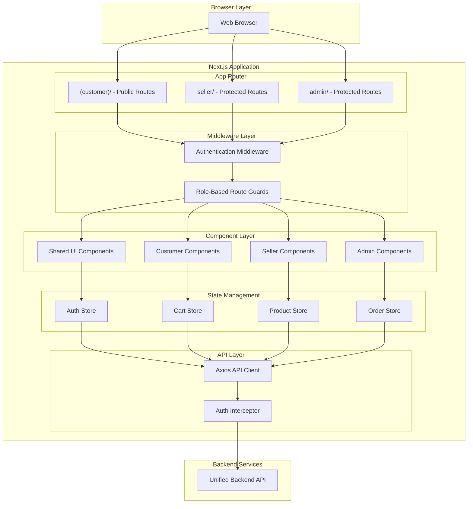

# Design Document: Unified Frontend Application

## Overview

The Unified Frontend Application is a comprehensive Next.js-based single-page application that serves as the sole frontend interface for the multi-vendor e-commerce platform. This unified architecture provides three distinct role-based interfaces (customer, seller, super admin) through a single application with dynamic routing and component rendering based on user authentication and authorization.

### Core Architecture Principles

- **Single Application**: One Next.js 14+ app with App Router serving all user types
- **Role-Based Routing**: Dynamic route protection and interface switching based on JWT role claims
- **TypeScript Throughout**: Full type safety across components, hooks, and utilities
- **Tailwind CSS**: Utility-first styling with responsive design patterns
- **Zustand State Management**: Lightweight, scalable state management with role-based stores
- **NextAuth.js Authentication**: Secure JWT-based authentication with role handling
- **Component Reusability**: Shared UI components with role-specific variants
- **Server Components**: Leverage Next.js 14 server components for performance

### Technology Stack

- **Framework**: Next.js 14+ with App Router and TypeScript
- **Styling**: Tailwind CSS with custom design system
- **State Management**: Zustand for global state
- **Authentication**: NextAuth.js with JWT strategy
- **UI Components**: shadcn/ui (Radix UI primitives)
- **Forms**: React Hook Form with Zod validation
- **API Client**: Axios with interceptors for auth
- **Testing**: Jest, React Testing Library, Playwright for E2E
- **Property Testing**: fast-check for correctness validation

### Key Design Goals

1. Unified codebase with role-based interface separation
2. High performance (First Contentful Paint < 1.5s, Time to Interactive < 3s)
3. Mobile-first responsive design (320px to 2560px)
4. SEO optimization for customer-facing pages
5. Accessibility compliance (WCAG 2.1 Level AA)
6. Offline-capable cart for customers
7. Real-time updates for orders and inventory
8. Secure session management with CSRF protection


## Architecture

### Application Architecture




### Directory Structure

```
src/
├── app/                          # Next.js 14 App Router
│   ├── (customer)/              # Customer interface (public)
│   │   ├── page.tsx             # Home page
│   │   ├── layout.tsx           # Customer layout
│   │   ├── products/            # Product catalog
│   │   │   ├── page.tsx         # Product listing
│   │   │   └── [id]/            # Product details
│   │   ├── cart/                # Shopping cart
│   │   ├── checkout/            # Checkout flow
│   │   ├── orders/              # Order history
│   │   ├── wishlist/            # Wishlist
│   │   └── account/             # Customer account
│   ├── seller/                  # Seller interface (protected)
│   │   ├── layout.tsx           # Seller layout with auth
│   │   ├── dashboard/           # Seller dashboard
│   │   ├── products/            # Product management
│   │   ├── orders/              # Order fulfillment
│   │   ├── inventory/           # Inventory management
│   │   ├── analytics/           # Sales analytics
│   │   └── profile/             # Seller profile
│   ├── admin/                   # Admin interface (protected)
│   │   ├── layout.tsx           # Admin layout with auth
│   │   ├── dashboard/           # Platform dashboard
│   │   ├── users/               # User management
│   │   ├── sellers/             # Seller management
│   │   ├── products/            # Product moderation
│   │   ├── orders/              # Order oversight
│   │   ├── categories/          # Category management
│   │   └── analytics/           # Platform analytics
│   ├── auth/                    # Authentication pages
│   │   ├── login/               # Login page
│   │   ├── register/            # Registration page
│   │   └── reset-password/      # Password reset
│   ├── api/                     # API routes (NextAuth)
│   │   └── auth/
│   ├── layout.tsx               # Root layout
│   └── middleware.ts            # Route protection
├── components/                   # React components
│   ├── ui/                      # Shared UI primitives (shadcn/ui)
│   │   ├── button.tsx
│   │   ├── input.tsx
│   │   ├── card.tsx
│   │   └── ...
│   ├── customer/                # Customer-specific components
│   │   ├── ProductCard.tsx
│   │   ├── CartItem.tsx
│   │   └── OrderCard.tsx
│   ├── seller/                  # Seller-specific components
│   │   ├── ProductForm.tsx
│   │   ├── OrderTable.tsx
│   │   └── AnalyticsChart.tsx
│   ├── admin/                   # Admin-specific components
│   │   ├── UserTable.tsx
│   │   ├── SellerApproval.tsx
│   │   └── PlatformMetrics.tsx
│   └── shared/                  # Shared across roles
│       ├── Header.tsx
│       ├── Footer.tsx
│       └── Sidebar.tsx
├── lib/                         # Utilities and configurations
│   ├── api/                     # API client
│   │   ├── client.ts            # Axios instance
│   │   ├── auth.ts              # Auth endpoints
│   │   ├── products.ts          # Product endpoints
│   │   ├── orders.ts            # Order endpoints
│   │   └── ...
│   ├── utils/                   # Utility functions
│   │   ├── format.ts            # Formatting helpers
│   │   ├── validation.ts        # Validation schemas
│   │   └── constants.ts         # App constants
│   └── types/                   # TypeScript types
│       ├── user.ts
│       ├── product.ts
│       └── order.ts
├── hooks/                       # Custom React hooks
│   ├── useAuth.ts               # Authentication hook
│   ├── useCart.ts               # Cart management hook
│   ├── useProducts.ts           # Product data hook
│   └── useOrders.ts             # Order data hook
├── store/                       # Zustand state management
│   ├── authStore.ts             # Auth state
│   ├── cartStore.ts             # Cart state
│   ├── productStore.ts          # Product state
│   └── orderStore.ts            # Order state
└── styles/                      # Global styles
    └── globals.css              # Tailwind + custom styles
```


### Role-Based Routing Strategy

**Route Protection Matrix:**

| Route Pattern | Customer | Seller | Super Admin | Guest |
|--------------|----------|--------|-------------|-------|
| `/` (home) | ✓ | ✓ | ✓ | ✓ |
| `/products/*` | ✓ | ✓ | ✓ | ✓ |
| `/cart` | ✓ | - | - | ✓ |
| `/checkout` | ✓ | - | - | - |
| `/orders` | ✓ (own) | - | - | - |
| `/wishlist` | ✓ | - | - | - |
| `/account` | ✓ | - | - | - |
| `/seller/*` | - | ✓ | - | - |
| `/admin/*` | - | - | ✓ | - |
| `/auth/*` | ✓ | ✓ | ✓ | ✓ |

**Middleware Implementation:**

```typescript
// middleware.ts
import { NextResponse } from 'next/server';
import type { NextRequest } from 'next/server';
import { getToken } from 'next-auth/jwt';

export async function middleware(request: NextRequest) {
  const token = await getToken({ 
    req: request, 
    secret: process.env.NEXTAUTH_SECRET 
  });

  const { pathname } = request.nextUrl;

  // Public routes - allow all
  if (
    pathname.startsWith('/auth') ||
    pathname.startsWith('/products') ||
    pathname === '/' ||
    pathname.startsWith('/_next') ||
    pathname.startsWith('/api/auth')
  ) {
    return NextResponse.next();
  }

  // Protected routes - require authentication
  if (!token) {
    const loginUrl = new URL('/auth/login', request.url);
    loginUrl.searchParams.set('callbackUrl', pathname);
    return NextResponse.redirect(loginUrl);
  }

  // Seller routes - require seller role
  if (pathname.startsWith('/seller')) {
    if (token.role !== 'seller') {
      return NextResponse.redirect(new URL('/', request.url));
    }
    
    // Check seller approval status
    if (token.approvalStatus !== 'approved') {
      return NextResponse.redirect(new URL('/seller/pending', request.url));
    }
  }

  // Admin routes - require super_admin role
  if (pathname.startsWith('/admin')) {
    if (token.role !== 'super_admin') {
      return NextResponse.redirect(new URL('/', request.url));
    }
  }

  // Customer-only routes
  if (
    pathname.startsWith('/checkout') ||
    pathname.startsWith('/orders') ||
    pathname.startsWith('/wishlist')
  ) {
    if (token.role !== 'customer') {
      return NextResponse.redirect(new URL('/', request.url));
    }
  }

  return NextResponse.next();
}

export const config = {
  matcher: [
    '/((?!_next/static|_next/image|favicon.ico).*)',
  ],
};
```


### Authentication Flow

**NextAuth.js Configuration:**

```typescript
// app/api/auth/[...nextauth]/route.ts
import NextAuth, { NextAuthOptions } from 'next-auth';
import CredentialsProvider from 'next-auth/providers/credentials';
import { apiClient } from '@/lib/api/client';

export const authOptions: NextAuthOptions = {
  providers: [
    CredentialsProvider({
      name: 'Credentials',
      credentials: {
        email: { label: 'Email', type: 'email' },
        password: { label: 'Password', type: 'password' },
        mfaCode: { label: 'MFA Code', type: 'text', optional: true },
      },
      async authorize(credentials) {
        if (!credentials?.email || !credentials?.password) {
          return null;
        }

        try {
          const response = await apiClient.post('/auth/login', {
            email: credentials.email,
            password: credentials.password,
            mfaCode: credentials.mfaCode,
          });

          const { accessToken, refreshToken, user } = response.data;

          return {
            id: user.id,
            email: user.email,
            name: user.name,
            role: user.role,
            approvalStatus: user.approvalStatus,
            accessToken,
            refreshToken,
          };
        } catch (error) {
          return null;
        }
      },
    }),
  ],
  callbacks: {
    async jwt({ token, user, account }) {
      // Initial sign in
      if (account && user) {
        return {
          ...token,
          accessToken: user.accessToken,
          refreshToken: user.refreshToken,
          role: user.role,
          approvalStatus: user.approvalStatus,
        };
      }

      // Return previous token if not expired
      return token;
    },
    async session({ session, token }) {
      session.user = {
        ...session.user,
        id: token.sub,
        role: token.role,
        approvalStatus: token.approvalStatus,
      };
      session.accessToken = token.accessToken;
      return session;
    },
  },
  pages: {
    signIn: '/auth/login',
    signOut: '/auth/logout',
    error: '/auth/error',
  },
  session: {
    strategy: 'jwt',
    maxAge: 24 * 60 * 60, // 24 hours
  },
  secret: process.env.NEXTAUTH_SECRET,
};

const handler = NextAuth(authOptions);
export { handler as GET, handler as POST };
```

**Authentication Hook:**

```typescript
// hooks/useAuth.ts
import { useSession, signIn, signOut } from 'next-auth/react';
import { useRouter } from 'next/navigation';
import { useAuthStore } from '@/store/authStore';

export function useAuth() {
  const { data: session, status } = useSession();
  const router = useRouter();
  const { setUser, clearUser } = useAuthStore();

  const login = async (email: string, password: string, mfaCode?: string) => {
    const result = await signIn('credentials', {
      email,
      password,
      mfaCode,
      redirect: false,
    });

    if (result?.ok && session?.user) {
      setUser(session.user);
      
      // Role-based redirect
      switch (session.user.role) {
        case 'seller':
          router.push('/seller/dashboard');
          break;
        case 'super_admin':
          router.push('/admin/dashboard');
          break;
        default:
          router.push('/');
      }
    }

    return result;
  };

  const logout = async () => {
    clearUser();
    await signOut({ redirect: true, callbackUrl: '/' });
  };

  return {
    user: session?.user,
    isAuthenticated: status === 'authenticated',
    isLoading: status === 'loading',
    role: session?.user?.role,
    login,
    logout,
  };
}
```


## Components and Interfaces

### State Management Architecture

**Zustand Store Structure:**

```typescript
// store/authStore.ts
import { create } from 'zustand';
import { persist } from 'zustand/middleware';

interface User {
  id: string;
  email: string;
  name: string;
  role: 'customer' | 'seller' | 'super_admin';
  approvalStatus?: string;
}

interface AuthState {
  user: User | null;
  isAuthenticated: boolean;
  setUser: (user: User) => void;
  clearUser: () => void;
}

export const useAuthStore = create<AuthState>()(
  persist(
    (set) => ({
      user: null,
      isAuthenticated: false,
      setUser: (user) => set({ user, isAuthenticated: true }),
      clearUser: () => set({ user: null, isAuthenticated: false }),
    }),
    {
      name: 'auth-storage',
    }
  )
);
```

```typescript
// store/cartStore.ts
import { create } from 'zustand';
import { persist } from 'zustand/middleware';

interface CartItem {
  id: string;
  product: Product;
  quantity: number;
  price: number;
}

interface CartState {
  items: CartItem[];
  subtotal: number;
  tax: number;
  shipping: number;
  total: number;
  addItem: (product: Product, quantity: number) => void;
  updateQuantity: (itemId: string, quantity: number) => void;
  removeItem: (itemId: string) => void;
  clearCart: () => void;
  calculateTotals: () => void;
}

export const useCartStore = create<CartState>()(
  persist(
    (set, get) => ({
      items: [],
      subtotal: 0,
      tax: 0,
      shipping: 0,
      total: 0,
      
      addItem: (product, quantity) => {
        const items = get().items;
        const existingItem = items.find(item => item.product.id === product.id);
        
        if (existingItem) {
          set({
            items: items.map(item =>
              item.product.id === product.id
                ? { ...item, quantity: item.quantity + quantity }
                : item
            ),
          });
        } else {
          set({
            items: [...items, {
              id: crypto.randomUUID(),
              product,
              quantity,
              price: product.price,
            }],
          });
        }
        
        get().calculateTotals();
      },
      
      updateQuantity: (itemId, quantity) => {
        if (quantity <= 0) {
          get().removeItem(itemId);
          return;
        }
        
        set({
          items: get().items.map(item =>
            item.id === itemId ? { ...item, quantity } : item
          ),
        });
        
        get().calculateTotals();
      },
      
      removeItem: (itemId) => {
        set({
          items: get().items.filter(item => item.id !== itemId),
        });
        
        get().calculateTotals();
      },
      
      clearCart: () => {
        set({
          items: [],
          subtotal: 0,
          tax: 0,
          shipping: 0,
          total: 0,
        });
      },
      
      calculateTotals: () => {
        const items = get().items;
        const subtotal = items.reduce(
          (sum, item) => sum + item.price * item.quantity,
          0
        );
        const tax = subtotal * 0.1; // 10% tax
        const shipping = subtotal > 50 ? 0 : 5; // Free shipping over $50
        const total = subtotal + tax + shipping;
        
        set({ subtotal, tax, shipping, total });
      },
    }),
    {
      name: 'cart-storage',
    }
  )
);
```


```typescript
// store/productStore.ts
import { create } from 'zustand';

interface ProductState {
  products: Product[];
  selectedProduct: Product | null;
  filters: ProductFilters;
  setProducts: (products: Product[]) => void;
  setSelectedProduct: (product: Product | null) => void;
  updateFilters: (filters: Partial<ProductFilters>) => void;
}

export const useProductStore = create<ProductState>((set) => ({
  products: [],
  selectedProduct: null,
  filters: {},
  setProducts: (products) => set({ products }),
  setSelectedProduct: (product) => set({ selectedProduct: product }),
  updateFilters: (filters) => set((state) => ({
    filters: { ...state.filters, ...filters },
  })),
}));
```

### API Client Configuration

```typescript
// lib/api/client.ts
import axios from 'axios';
import { getSession } from 'next-auth/react';

export const apiClient = axios.create({
  baseURL: process.env.NEXT_PUBLIC_API_URL || 'http://localhost:3001/api',
  timeout: 10000,
  headers: {
    'Content-Type': 'application/json',
  },
});

// Request interceptor - add auth token
apiClient.interceptors.request.use(
  async (config) => {
    const session = await getSession();
    
    if (session?.accessToken) {
      config.headers.Authorization = `Bearer ${session.accessToken}`;
    }
    
    return config;
  },
  (error) => Promise.reject(error)
);

// Response interceptor - handle errors
apiClient.interceptors.response.use(
  (response) => response,
  async (error) => {
    if (error.response?.status === 401) {
      // Token expired - redirect to login
      window.location.href = '/auth/login';
    }
    
    return Promise.reject(error);
  }
);
```


### Customer Interface Components

**Product Catalog Component:**

```typescript
// components/customer/ProductCard.tsx
import Image from 'next/image';
import Link from 'next/link';
import { Button } from '@/components/ui/button';
import { useCartStore } from '@/store/cartStore';

interface ProductCardProps {
  product: Product;
}

export function ProductCard({ product }: ProductCardProps) {
  const addItem = useCartStore((state) => state.addItem);

  const handleAddToCart = () => {
    addItem(product, 1);
  };

  return (
    <div className="border rounded-lg p-4 hover:shadow-lg transition">
      <Link href={`/products/${product.id}`}>
        <div className="relative h-48 mb-4">
          <Image
            src={product.images[0]?.url || '/placeholder.png'}
            alt={product.name}
            fill
            className="object-cover rounded"
          />
        </div>
        <h3 className="font-semibold text-lg mb-2">{product.name}</h3>
        <p className="text-gray-600 text-sm mb-2 line-clamp-2">
          {product.description}
        </p>
        <div className="flex items-center justify-between">
          <span className="text-xl font-bold">${product.price}</span>
          {product.stockQuantity > 0 ? (
            <span className="text-green-600 text-sm">In Stock</span>
          ) : (
            <span className="text-red-600 text-sm">Out of Stock</span>
          )}
        </div>
      </Link>
      <Button
        onClick={handleAddToCart}
        disabled={product.stockQuantity === 0}
        className="w-full mt-4"
      >
        Add to Cart
      </Button>
    </div>
  );
}
```

**Shopping Cart Component:**

```typescript
// components/customer/CartItem.tsx
import Image from 'next/image';
import { Button } from '@/components/ui/button';
import { Input } from '@/components/ui/input';
import { useCartStore } from '@/store/cartStore';

interface CartItemProps {
  item: CartItem;
}

export function CartItem({ item }: CartItemProps) {
  const { updateQuantity, removeItem } = useCartStore();

  return (
    <div className="flex gap-4 border-b pb-4">
      <div className="relative w-24 h-24">
        <Image
          src={item.product.images[0]?.url || '/placeholder.png'}
          alt={item.product.name}
          fill
          className="object-cover rounded"
        />
      </div>
      <div className="flex-1">
        <h3 className="font-semibold">{item.product.name}</h3>
        <p className="text-gray-600">${item.price}</p>
        <div className="flex items-center gap-2 mt-2">
          <Input
            type="number"
            min="1"
            value={item.quantity}
            onChange={(e) => updateQuantity(item.id, parseInt(e.target.value))}
            className="w-20"
          />
          <Button
            variant="destructive"
            size="sm"
            onClick={() => removeItem(item.id)}
          >
            Remove
          </Button>
        </div>
      </div>
      <div className="text-right">
        <p className="font-bold">${(item.price * item.quantity).toFixed(2)}</p>
      </div>
    </div>
  );
}
```


### Seller Interface Components

**Product Management Form:**

```typescript
// components/seller/ProductForm.tsx
import { useForm } from 'react-hook-form';
import { zodResolver } from '@hookform/resolvers/zod';
import * as z from 'zod';
import { Button } from '@/components/ui/button';
import { Input } from '@/components/ui/input';
import { Textarea } from '@/components/ui/textarea';

const productSchema = z.object({
  name: z.string().min(3, 'Name must be at least 3 characters'),
  description: z.string().min(10, 'Description must be at least 10 characters'),
  price: z.number().positive('Price must be positive'),
  stockQuantity: z.number().int().min(0, 'Stock cannot be negative'),
  categoryId: z.string().uuid('Invalid category'),
});

type ProductFormData = z.infer<typeof productSchema>;

interface ProductFormProps {
  initialData?: Product;
  onSubmit: (data: ProductFormData) => Promise<void>;
}

export function ProductForm({ initialData, onSubmit }: ProductFormProps) {
  const {
    register,
    handleSubmit,
    formState: { errors, isSubmitting },
  } = useForm<ProductFormData>({
    resolver: zodResolver(productSchema),
    defaultValues: initialData,
  });

  return (
    <form onSubmit={handleSubmit(onSubmit)} className="space-y-4">
      <div>
        <label className="block text-sm font-medium mb-1">Product Name</label>
        <Input {...register('name')} />
        {errors.name && (
          <p className="text-red-600 text-sm mt-1">{errors.name.message}</p>
        )}
      </div>

      <div>
        <label className="block text-sm font-medium mb-1">Description</label>
        <Textarea {...register('description')} rows={4} />
        {errors.description && (
          <p className="text-red-600 text-sm mt-1">{errors.description.message}</p>
        )}
      </div>

      <div className="grid grid-cols-2 gap-4">
        <div>
          <label className="block text-sm font-medium mb-1">Price</label>
          <Input
            type="number"
            step="0.01"
            {...register('price', { valueAsNumber: true })}
          />
          {errors.price && (
            <p className="text-red-600 text-sm mt-1">{errors.price.message}</p>
          )}
        </div>

        <div>
          <label className="block text-sm font-medium mb-1">Stock Quantity</label>
          <Input
            type="number"
            {...register('stockQuantity', { valueAsNumber: true })}
          />
          {errors.stockQuantity && (
            <p className="text-red-600 text-sm mt-1">{errors.stockQuantity.message}</p>
          )}
        </div>
      </div>

      <Button type="submit" disabled={isSubmitting}>
        {isSubmitting ? 'Saving...' : 'Save Product'}
      </Button>
    </form>
  );
}
```


### Admin Interface Components

**User Management Table:**

```typescript
// components/admin/UserTable.tsx
import { useState } from 'react';
import { Button } from '@/components/ui/button';
import { apiClient } from '@/lib/api/client';

interface UserTableProps {
  users: User[];
  onUserUpdate: () => void;
}

export function UserTable({ users, onUserUpdate }: UserTableProps) {
  const [loading, setLoading] = useState<string | null>(null);

  const handleBlockUser = async (userId: string) => {
    setLoading(userId);
    try {
      await apiClient.post(`/users/${userId}/block`, {
        reason: 'Policy violation',
        duration: 'permanent',
      });
      onUserUpdate();
    } catch (error) {
      console.error('Failed to block user:', error);
    } finally {
      setLoading(null);
    }
  };

  return (
    <div className="overflow-x-auto">
      <table className="min-w-full divide-y divide-gray-200">
        <thead className="bg-gray-50">
          <tr>
            <th className="px-6 py-3 text-left text-xs font-medium text-gray-500 uppercase">
              Email
            </th>
            <th className="px-6 py-3 text-left text-xs font-medium text-gray-500 uppercase">
              Name
            </th>
            <th className="px-6 py-3 text-left text-xs font-medium text-gray-500 uppercase">
              Role
            </th>
            <th className="px-6 py-3 text-left text-xs font-medium text-gray-500 uppercase">
              Status
            </th>
            <th className="px-6 py-3 text-left text-xs font-medium text-gray-500 uppercase">
              Actions
            </th>
          </tr>
        </thead>
        <tbody className="bg-white divide-y divide-gray-200">
          {users.map((user) => (
            <tr key={user.id}>
              <td className="px-6 py-4 whitespace-nowrap">{user.email}</td>
              <td className="px-6 py-4 whitespace-nowrap">{user.name}</td>
              <td className="px-6 py-4 whitespace-nowrap">
                <span className="px-2 py-1 text-xs rounded bg-blue-100 text-blue-800">
                  {user.role}
                </span>
              </td>
              <td className="px-6 py-4 whitespace-nowrap">
                {user.isActive ? (
                  <span className="text-green-600">Active</span>
                ) : (
                  <span className="text-red-600">Blocked</span>
                )}
              </td>
              <td className="px-6 py-4 whitespace-nowrap">
                <Button
                  variant="destructive"
                  size="sm"
                  onClick={() => handleBlockUser(user.id)}
                  disabled={loading === user.id || !user.isActive}
                >
                  {loading === user.id ? 'Processing...' : 'Block'}
                </Button>
              </td>
            </tr>
          ))}
        </tbody>
      </table>
    </div>
  );
}
```


### Shared UI Components

**Responsive Header:**

```typescript
// components/shared/Header.tsx
'use client';

import Link from 'next/link';
import { useAuth } from '@/hooks/useAuth';
import { useCartStore } from '@/store/cartStore';
import { Button } from '@/components/ui/button';
import { ShoppingCart, User, Menu } from 'lucide-react';

export function Header() {
  const { user, isAuthenticated, logout } = useAuth();
  const items = useCartStore((state) => state.items);

  const getRoleBasedLinks = () => {
    switch (user?.role) {
      case 'seller':
        return [
          { href: '/seller/dashboard', label: 'Dashboard' },
          { href: '/seller/products', label: 'Products' },
          { href: '/seller/orders', label: 'Orders' },
        ];
      case 'super_admin':
        return [
          { href: '/admin/dashboard', label: 'Dashboard' },
          { href: '/admin/users', label: 'Users' },
          { href: '/admin/sellers', label: 'Sellers' },
        ];
      default:
        return [
          { href: '/products', label: 'Products' },
          { href: '/orders', label: 'Orders' },
          { href: '/wishlist', label: 'Wishlist' },
        ];
    }
  };

  return (
    <header className="border-b">
      <div className="container mx-auto px-4 py-4">
        <div className="flex items-center justify-between">
          <Link href="/" className="text-2xl font-bold">
            E-Commerce
          </Link>

          <nav className="hidden md:flex items-center gap-6">
            {getRoleBasedLinks().map((link) => (
              <Link
                key={link.href}
                href={link.href}
                className="hover:text-blue-600"
              >
                {link.label}
              </Link>
            ))}
          </nav>

          <div className="flex items-center gap-4">
            {user?.role === 'customer' && (
              <Link href="/cart" className="relative">
                <ShoppingCart className="w-6 h-6" />
                {items.length > 0 && (
                  <span className="absolute -top-2 -right-2 bg-red-500 text-white text-xs rounded-full w-5 h-5 flex items-center justify-center">
                    {items.length}
                  </span>
                )}
              </Link>
            )}

            {isAuthenticated ? (
              <div className="flex items-center gap-2">
                <Link href="/account">
                  <Button variant="ghost" size="sm">
                    <User className="w-4 h-4 mr-2" />
                    {user?.name}
                  </Button>
                </Link>
                <Button variant="outline" size="sm" onClick={logout}>
                  Logout
                </Button>
              </div>
            ) : (
              <Link href="/auth/login">
                <Button>Login</Button>
              </Link>
            )}
          </div>
        </div>
      </div>
    </header>
  );
}
```


## Data Models

### TypeScript Type Definitions

```typescript
// lib/types/user.ts
export type UserRole = 'customer' | 'seller' | 'super_admin';

export interface User {
  id: string;
  email: string;
  name: string;
  role: UserRole;
  phoneNumber?: string;
  isEmailVerified: boolean;
  isActive: boolean;
  businessName?: string;
  businessDescription?: string;
  approvalStatus?: 'pending' | 'approved' | 'rejected';
  createdAt: string;
  updatedAt: string;
}

export interface Address {
  id: string;
  street: string;
  city: string;
  state: string;
  postalCode: string;
  country: string;
  isDefault: boolean;
}
```

```typescript
// lib/types/product.ts
export interface Product {
  id: string;
  name: string;
  description: string;
  price: number;
  sku?: string;
  stockQuantity: number;
  isActive: boolean;
  isFlagged: boolean;
  tags: string[];
  category: Category;
  seller: {
    id: string;
    businessName: string;
  };
  images: ProductImage[];
  averageRating: number;
  reviewCount: number;
  createdAt: string;
  updatedAt: string;
}

export interface ProductImage {
  id: string;
  url: string;
  thumbnailUrl: string;
  displayOrder: number;
}

export interface Category {
  id: string;
  name: string;
  slug: string;
  description?: string;
  parent?: Category;
  children: Category[];
}

export interface ProductFilters {
  query?: string;
  categoryId?: string;
  minPrice?: number;
  maxPrice?: number;
  sellerId?: string;
  sortBy?: 'price' | 'name' | 'rating' | 'newest';
  sortOrder?: 'asc' | 'desc';
}
```

```typescript
// lib/types/order.ts
export interface Order {
  id: string;
  orderNumber: string;
  customer: {
    id: string;
    name: string;
    email: string;
  };
  items: OrderItem[];
  shippingAddress: Address;
  paymentMethod: 'cod' | 'online';
  paymentStatus: 'pending' | 'completed' | 'failed' | 'refunded';
  orderStatus: OrderStatus;
  subtotal: number;
  tax: number;
  shippingCost: number;
  discount: number;
  total: number;
  trackingNumber?: string;
  notes?: string;
  createdAt: string;
  updatedAt: string;
}

export type OrderStatus =
  | 'placed'
  | 'confirmed'
  | 'processing'
  | 'shipped'
  | 'out_for_delivery'
  | 'delivered'
  | 'cancelled';

export interface OrderItem {
  id: string;
  product: Product;
  seller: {
    id: string;
    businessName: string;
  };
  quantity: number;
  price: number;
  subtotal: number;
}
```

```typescript
// lib/types/cart.ts
export interface CartItem {
  id: string;
  product: Product;
  quantity: number;
  price: number;
}

export interface CartTotals {
  subtotal: number;
  tax: number;
  shipping: number;
  total: number;
}
```

```typescript
// lib/types/review.ts
export interface Review {
  id: string;
  customer: {
    id: string;
    name: string;
  };
  product: {
    id: string;
    name: string;
  };
  rating: number;
  comment?: string;
  isVerifiedPurchase: boolean;
  isApproved: boolean;
  createdAt: string;
  updatedAt: string;
}
```


## Correctness Properties

A property is a characteristic or behavior that should hold true across all valid executions of a system—essentially, a formal statement about what the system should do. Properties serve as the bridge between human-readable specifications and machine-verifiable correctness guarantees.

### Property 1: Registration Form Validation

For any valid registration data (email, password, name, role), submitting the registration form should create a new user account and redirect to the appropriate interface based on role.

**Validates: Requirements 1.1**

### Property 2: Duplicate Email Prevention

For any email address that already exists in the system, attempting to register with that email should display an error message and prevent account creation.

**Validates: Requirements 1.2**

### Property 3: Authentication Success Flow

For any valid user credentials, submitting the login form should authenticate the user, establish a session with correct role claims, and redirect to the role-appropriate dashboard.

**Validates: Requirements 2.1**

### Property 4: Authentication Failure Handling

For any invalid credentials (wrong email or password), login attempts should fail with an appropriate error message and deny access.

**Validates: Requirements 2.2**

### Property 5: Product Display Completeness

For any product in the catalog, the rendered product card should display name, price, at least one image, and description.

**Validates: Requirements 3.1**

### Property 6: Search Result Relevance

For any search query string, all returned products should contain the query text in either their name or description (case-insensitive).

**Validates: Requirements 4.1**

### Property 7: Cart Addition Operation

For any product and positive quantity, adding the item to the cart should increase the cart item count and update the cart state to include that product with the specified quantity.

**Validates: Requirements 5.1**

### Property 8: Cart Quantity Update

For any cart item and new quantity value, updating the quantity should recalculate the item subtotal as (price × new quantity) and update the cart total.

**Validates: Requirements 5.2**

### Property 9: Cart Item Removal

For any item in the cart, removing it should decrease the cart item count by one and remove that product from the cart state.

**Validates: Requirements 5.3**

### Property 10: Cart Total Calculation

For any shopping cart, the total amount should equal the sum of (price × quantity) for all items, plus tax, plus shipping cost.

**Validates: Requirements 5.4, 20.1**

### Property 11: Guest Cart Persistence

For any unauthenticated user, cart contents should persist in browser storage and survive page refresh or browser restart.

**Validates: Requirements 5.5**

### Property 12: Checkout Validation

For any checkout attempt, if required fields (delivery address, contact information) are missing, the system should display validation errors and prevent order submission.

**Validates: Requirements 6.1**

### Property 13: Post-Checkout Cart Clearing

For any successful order placement, the shopping cart should be emptied immediately after checkout completion.

**Validates: Requirements 6.2**

### Property 14: Order History Display

For any authenticated customer, accessing the order history page should display all orders placed by that customer, sorted by date with most recent first.

**Validates: Requirements 7.1**

### Property 15: Responsive Layout Rendering

For any viewport width between 320 pixels and 2560 pixels, the application should render without horizontal scrolling or layout breaking.

**Validates: Requirements 8.1**

### Property 16: Touch Target Accessibility

For any interactive element (button, link, input) on mobile viewports, the touch target size should be at least 44×44 pixels.

**Validates: Requirements 8.2**

### Property 17: SEO Metadata Uniqueness

For any product detail page, the generated meta title and meta description should be unique and include the product name.

**Validates: Requirements 10.1**

### Property 18: Product Filter Application

For any combination of filter criteria (category, price range, seller), the displayed products should match all selected filter conditions.

**Validates: Requirements 11.1**

### Property 19: Product Sort Ordering

For any sort option (price ascending, price descending, name, newest), products should be ordered according to the selected criteria.

**Validates: Requirements 12.1**

### Property 20: Wishlist State Management

For any authenticated customer and product, adding the product to the wishlist should update the wishlist state and persist the association.

**Validates: Requirements 13.1**

### Property 21: Review Display Completeness

For any product with reviews, the product detail page should display all approved reviews with rating, comment, and customer name.

**Validates: Requirements 15.1**

### Property 22: Average Rating Calculation

For any product with multiple reviews, the displayed average rating should equal the arithmetic mean of all review ratings, rounded to one decimal place.

**Validates: Requirements 15.2**

### Property 23: Product Form Validation

For any product form submission by a seller, required fields (name, description, price, category, stock quantity) must be validated, and submission should fail if any are missing or invalid.

**Validates: Requirements 16.1**

### Property 24: Image Upload Validation

For any image upload attempt, files exceeding 5 MB or not in JPEG/PNG/WebP format should be rejected wit
h a validation error message.

**Validates: Requirements 16.2**

### Property 25: Role-Based Route Protection

For any protected route and user role, accessing a route without proper authentication should redirect to login, and accessing a route without proper role authorization should redirect to an appropriate page (home or role-specific dashboard).

**Validates: Requirements 19.1, 19.2**

### Property 26: Admin User Blocking

For any user account blocked by an admin, subsequent login attempts by that user should fail with a "blocked account" error message.

**Validates: Requirements 18.1**


## Error Handling

### Error Handling Strategy

**Client-Side Error Categories:**

1. **Validation Errors**: Form input validation failures
2. **Network Errors**: API request failures, timeouts
3. **Authentication Errors**: Token expiration, unauthorized access
4. **Authorization Errors**: Insufficient permissions for actions
5. **Business Logic Errors**: Backend validation failures
6. **Runtime Errors**: Unexpected JavaScript errors

### Error Display Patterns

**Toast Notifications:**
```typescript
// lib/utils/toast.ts
import { toast } from 'sonner';

export const showError = (message: string) => {
  toast.error(message, {
    duration: 5000,
    position: 'top-right',
  });
};

export const showSuccess = (message: string) => {
  toast.success(message, {
    duration: 3000,
    position: 'top-right',
  });
};
```

**Form Validation Errors:**
```typescript
// Using React Hook Form with Zod
import { useForm } from 'react-hook-form';
import { zodResolver } from '@hookform/resolvers/zod';
import * as z from 'zod';

const schema = z.object({
  email: z.string().email('Invalid email address'),
  password: z.string().min(8, 'Password must be at least 8 characters'),
});

export function LoginForm() {
  const {
    register,
    handleSubmit,
    formState: { errors },
  } = useForm({
    resolver: zodResolver(schema),
  });

  return (
    <form>
      <input {...register('email')} />
      {errors.email && (
        <p className="text-red-600 text-sm">{errors.email.message}</p>
      )}
    </form>
  );
}
```

**API Error Handling:**
```typescript
// lib/api/errorHandler.ts
import { AxiosError } from 'axios';
import { showError } from '@/lib/utils/toast';

export function handleApiError(error: unknown) {
  if (error instanceof AxiosError) {
    const message = error.response?.data?.message || 'An error occurred';
    
    switch (error.response?.status) {
      case 400:
        showError(`Validation Error: ${message}`);
        break;
      case 401:
        showError('Session expired. Please login again.');
        window.location.href = '/auth/login';
        break;
      case 403:
        showError('You do not have permission to perform this action.');
        break;
      case 404:
        showError('Resource not found.');
        break;
      case 429:
        showError('Too many requests. Please try again later.');
        break;
      case 500:
        showError('Server error. Please try again later.');
        break;
      default:
        showError(message);
    }
  } else {
    showError('An unexpected error occurred.');
    console.error(error);
  }
}
```

**Error Boundaries:**
```typescript
// components/ErrorBoundary.tsx
'use client';

import { Component, ReactNode } from 'react';
import { Button } from '@/components/ui/button';

interface Props {
  children: ReactNode;
}

interface State {
  hasError: boolean;
  error?: Error;
}

export class ErrorBoundary extends Component<Props, State> {
  constructor(props: Props) {
    super(props);
    this.state = { hasError: false };
  }

  static getDerivedStateFromError(error: Error): State {
    return { hasError: true, error };
  }

  componentDidCatch(error: Error, errorInfo: any) {
    console.error('Error caught by boundary:', error, errorInfo);
  }

  render() {
    if (this.state.hasError) {
      return (
        <div className="flex flex-col items-center justify-center min-h-screen p-4">
          <h1 className="text-2xl font-bold mb-4">Something went wrong</h1>
          <p className="text-gray-600 mb-4">
            We're sorry for the inconvenience. Please try refreshing the page.
          </p>
          <Button onClick={() => window.location.reload()}>
            Refresh Page
          </Button>
        </div>
      );
    }

    return this.props.children;
  }
}
```

### Loading States

**Skeleton Loaders:**
```typescript
// components/ui/skeleton.tsx
export function ProductCardSkeleton() {
  return (
    <div className="border rounded-lg p-4 animate-pulse">
      <div className="bg-gray-200 h-48 rounded mb-4" />
      <div className="bg-gray-200 h-6 rounded mb-2" />
      <div className="bg-gray-200 h-4 rounded mb-2" />
      <div className="bg-gray-200 h-8 rounded" />
    </div>
  );
}
```

**Suspense Boundaries:**
```typescript
// app/(customer)/products/page.tsx
import { Suspense } from 'react';
import { ProductCardSkeleton } from '@/components/ui/skeleton';

export default function ProductsPage() {
  return (
    <Suspense fallback={<ProductGridSkeleton />}>
      <ProductGrid />
    </Suspense>
  );
}
```


## Testing Strategy

### Dual Testing Approach

The unified frontend application requires both unit testing and property-based testing for comprehensive coverage:

**Unit Tests:**
- Specific examples demonstrating correct behavior
- Edge cases and boundary conditions
- Error handling scenarios
- Component rendering and interactions
- User event simulations
- Mock API responses

**Property-Based Tests:**
- Universal properties that hold for all inputs
- Comprehensive input coverage through randomization
- Validation of correctness properties from design
- Role-based access control verification
- State management consistency checks
- Form validation across random inputs

### Property-Based Testing Configuration

**Library**: fast-check (TypeScript property-based testing library)

**Configuration:**
- Minimum 100 iterations per property test
- Each test references its design document property
- Tag format: `Feature: unified-frontend-app, Property {number}: {property_text}`

**Example Property Test - Cart Total Calculation:**

```typescript
// __tests__/properties/cart.property.test.ts
import * as fc from 'fast-check';
import { renderHook, act } from '@testing-library/react';
import { useCartStore } from '@/store/cartStore';

describe('Property 10: Cart Total Calculation', () => {
  it('should calculate total as subtotal + tax + shipping', () => {
    // Feature: unified-frontend-app, Property 10: Cart Total Calculation
    fc.assert(
      fc.property(
        fc.array(
          fc.record({
            id: fc.uuid(),
            name: fc.string({ minLength: 3 }),
            price: fc.float({ min: 0.01, max: 1000, noNaN: true }),
            quantity: fc.integer({ min: 1, max: 10 }),
          }),
          { minLength: 1, maxLength: 10 }
        ),
        (items) => {
          const { result } = renderHook(() => useCartStore());

          // Clear cart and add items
          act(() => {
            result.current.clearCart();
            items.forEach(item => {
              result.current.addItem(
                { id: item.id, name: item.name, price: item.price } as any,
                item.quantity
              );
            });
          });

          // Calculate expected values
          const expectedSubtotal = items.reduce(
            (sum, item) => sum + item.price * item.quantity,
            0
          );
          const expectedTax = expectedSubtotal * 0.1;
          const expectedShipping = expectedSubtotal > 50 ? 0 : 5;
          const expectedTotal = expectedSubtotal + expectedTax + expectedShipping;

          // Verify calculation
          expect(result.current.subtotal).toBeCloseTo(expectedSubtotal, 2);
          expect(result.current.tax).toBeCloseTo(expectedTax, 2);
          expect(result.current.shipping).toBeCloseTo(expectedShipping, 2);
          expect(result.current.total).toBeCloseTo(expectedTotal, 2);
        }
      ),
      { numRuns: 100 }
    );
  });
});
```


**Example Property Test - Role-Based Route Protection:**

```typescript
// __tests__/properties/auth.property.test.ts
import * as fc from 'fast-check';
import { middleware } from '@/middleware';
import { NextRequest } from 'next/server';

describe('Property 25: Role-Based Route Protection', () => {
  it('should redirect unauthorized users to login', async () => {
    // Feature: unified-frontend-app, Property 25: Role-Based Route Protection
    await fc.assert(
      fc.asyncProperty(
        fc.constantFrom('/seller/dashboard', '/seller/products', '/admin/users', '/admin/dashboard'),
        fc.option(fc.constantFrom('customer', 'seller', 'super_admin'), { nil: null }),
        async (protectedPath, userRole) => {
          const request = new NextRequest(new URL(protectedPath, 'http://localhost'));
          
          // Mock token based on role
          if (userRole) {
            request.cookies.set('next-auth.session-token', `mock-token-${userRole}`);
          }
          
          const response = await middleware(request);
          
          // Verify protection logic
          if (!userRole) {
            // No auth - should redirect to login
            expect(response?.status).toBe(307);
            expect(response?.headers.get('location')).toContain('/auth/login');
          } else if (protectedPath.startsWith('/seller') && userRole !== 'seller') {
            // Wrong role for seller routes
            expect(response?.status).toBe(307);
          } else if (protectedPath.startsWith('/admin') && userRole !== 'super_admin') {
            // Wrong role for admin routes
            expect(response?.status).toBe(307);
          } else {
            // Correct role - should allow access
            expect(response?.status).toBeUndefined();
          }
        }
      ),
      { numRuns: 100 }
    );
  });
});
```

**Example Property Test - Form Validation:**

```typescript
// __tests__/properties/validation.property.test.ts
import * as fc from 'fast-check';
import { render, screen, fireEvent } from '@testing-library/react';
import { ProductForm } from '@/components/seller/ProductForm';

describe('Property 23: Product Form Validation', () => {
  it('should validate required fields', () => {
    // Feature: unified-frontend-app, Property 23: Product Form Validation
    fc.assert(
      fc.property(
        fc.record({
          name: fc.option(fc.string({ minLength: 3 })),
          description: fc.option(fc.string({ minLength: 10 })),
          price: fc.option(fc.float({ min: 0.01, max: 10000 })),
          stockQuantity: fc.option(fc.integer({ min: 0 })),
        }),
        (formData) => {
          const onSubmit = jest.fn();
          render(<ProductForm onSubmit={onSubmit} />);
          
          // Fill form with generated data
          if (formData.name) {
            fireEvent.change(screen.getByLabelText(/product name/i), {
              target: { value: formData.name },
            });
          }
          if (formData.description) {
            fireEvent.change(screen.getByLabelText(/description/i), {
              target: { value: formData.description },
            });
          }
          if (formData.price !== undefined) {
            fireEvent.change(screen.getByLabelText(/price/i), {
              target: { value: formData.price },
            });
          }
          if (formData.stockQuantity !== undefined) {
            fireEvent.change(screen.getByLabelText(/stock quantity/i), {
              target: { value: formData.stockQuantity },
            });
          }
          
          // Submit form
          fireEvent.click(screen.getByText(/save product/i));
          
          // Verify validation
          const hasAllFields = 
            formData.name && 
            formData.description && 
            formData.price !== undefined && 
            formData.stockQuantity !== undefined;
          
          if (hasAllFields) {
            expect(onSubmit).toHaveBeenCalled();
          } else {
            expect(onSubmit).not.toHaveBeenCalled();
            expect(screen.queryByText(/required/i)).toBeInTheDocument();
          }
        }
      ),
      { numRuns: 100 }
    );
  });
});
```

### Unit Testing Strategy

**Test Organization:**
```
__tests__/
├── components/
│   ├── customer/
│   │   ├── ProductCard.test.tsx
│   │   ├── CartItem.test.tsx
│   │   └── OrderCard.test.tsx
│   ├── seller/
│   │   ├── ProductForm.test.tsx
│   │   └── OrderTable.test.tsx
│   └── admin/
│       ├── UserTable.test.tsx
│       └── SellerApproval.test.tsx
├── hooks/
│   ├── useAuth.test.ts
│   ├── useCart.test.ts
│   └── useProducts.test.ts
├── store/
│   ├── authStore.test.ts
│   ├── cartStore.test.ts
│   └── productStore.test.ts
├── properties/
│   ├── cart.property.test.ts
│   ├── auth.property.test.ts
│   └── validation.property.test.ts
└── e2e/
    ├── customer-flow.spec.ts
    ├── seller-flow.spec.ts
    └── admin-flow.spec.ts
```

**Unit Test Coverage Goals:**
- Components: 80%+ (UI rendering and interactions)
- Hooks: 90%+ (business logic)
- Store: 95%+ (state management critical)
- Utilities: 100% (pure functions)

**Component Testing Example:**
```typescript
// __tests__/components/customer/ProductCard.test.tsx
import { render, screen, fireEvent } from '@testing-library/react';
import { ProductCard } from '@/components/customer/ProductCard';
import { useCartStore } from '@/store/cartStore';

jest.mock('@/store/cartStore');

describe('ProductCard', () => {
  const mockProduct = {
    id: '1',
    name: 'Test Product',
    description: 'Test description',
    price: 29.99,
    stockQuantity: 10,
    images: [{ url: '/test.jpg' }],
  };

  it('should display product information', () => {
    render(<ProductCard product={mockProduct} />);
    
    expect(screen.getByText('Test Product')).toBeInTheDocument();
    expect(screen.getByText('$29.99')).toBeInTheDocument();
    expect(screen.getByText('In Stock')).toBeInTheDocument();
  });

  it('should add product to cart when button clicked', () => {
    const mockAddItem = jest.fn();
    (useCartStore as jest.Mock).mockReturnValue({ addItem: mockAddItem });
    
    render(<ProductCard product={mockProduct} />);
    
    fireEvent.click(screen.getByText('Add to Cart'));
    
    expect(mockAddItem).toHaveBeenCalledWith(mockProduct, 1);
  });

  it('should disable add to cart when out of stock', () => {
    const outOfStockProduct = { ...mockProduct, stockQuantity: 0 };
    
    render(<ProductCard product={outOfStockProduct} />);
    
    expect(screen.getByText('Add to Cart')).toBeDisabled();
    expect(screen.getByText('Out of Stock')).toBeInTheDocument();
  });
});
```


### End-to-End Testing

**Playwright Configuration:**

```typescript
// playwright.config.ts
import { defineConfig, devices } from '@playwright/test';

export default defineConfig({
  testDir: '__tests__/e2e',
  fullyParallel: true,
  forbidOnly: !!process.env.CI,
  retries: process.env.CI ? 2 : 0,
  workers: process.env.CI ? 1 : undefined,
  reporter: 'html',
  use: {
    baseURL: 'http://localhost:3000',
    trace: 'on-first-retry',
  },
  projects: [
    {
      name: 'chromium',
      use: { ...devices['Desktop Chrome'] },
    },
    {
      name: 'mobile',
      use: { ...devices['iPhone 13'] },
    },
  ],
  webServer: {
    command: 'npm run dev',
    url: 'http://localhost:3000',
    reuseExistingServer: !process.env.CI,
  },
});
```

**E2E Test Example:**

```typescript
// __tests__/e2e/customer-flow.spec.ts
import { test, expect } from '@playwright/test';

test.describe('Customer Purchase Flow', () => {
  test('should complete full purchase journey', async ({ page }) => {
    // Navigate to home page
    await page.goto('/');
    
    // Search for product
    await page.fill('[placeholder="Search products"]', 'laptop');
    await page.press('[placeholder="Search products"]', 'Enter');
    
    // Verify search results
    await expect(page.locator('text=laptop')).toBeVisible();
    
    // Click on first product
    await page.click('[data-testid="product-card"]:first-child');
    
    // Add to cart
    await page.click('text=Add to Cart');
    
    // Verify cart badge
    await expect(page.locator('[data-testid="cart-badge"]')).toHaveText('1');
    
    // Go to cart
    await page.click('[data-testid="cart-icon"]');
    
    // Verify cart page
    await expect(page).toHaveURL('/cart');
    await expect(page.locator('[data-testid="cart-item"]')).toHaveCount(1);
    
    // Proceed to checkout
    await page.click('text=Proceed to Checkout');
    
    // Login (if not authenticated)
    if (page.url().includes('/auth/login')) {
      await page.fill('[name="email"]', 'test@example.com');
      await page.fill('[name="password"]', 'password123');
      await page.click('text=Login');
    }
    
    // Fill shipping address
    await page.fill('[name="street"]', '123 Main St');
    await page.fill('[name="city"]', 'New York');
    await page.fill('[name="state"]', 'NY');
    await page.fill('[name="postalCode"]', '10001');
    
    // Select payment method
    await page.click('text=Cash on Delivery');
    
    // Place order
    await page.click('text=Place Order');
    
    // Verify order confirmation
    await expect(page).toHaveURL(/\/orders\/[a-z0-9-]+/);
    await expect(page.locator('text=Order Placed Successfully')).toBeVisible();
  });
});
```

### Performance Testing

**Performance Metrics:**
- First Contentful Paint (FCP): < 1.5s
- Largest Contentful Paint (LCP): < 2.5s
- Time to Interactive (TTI): < 3.0s
- Cumulative Layout Shift (CLS): < 0.1
- First Input Delay (FID): < 100ms

**Lighthouse CI Configuration:**

```javascript
// lighthouserc.js
module.exports = {
  ci: {
    collect: {
      startServerCommand: 'npm run start',
      url: [
        'http://localhost:3000/',
        'http://localhost:3000/products',
        'http://localhost:3000/cart',
      ],
      numberOfRuns: 3,
    },
    assert: {
      assertions: {
        'categories:performance': ['error', { minScore: 0.9 }],
        'categories:accessibility': ['error', { minScore: 0.9 }],
        'categories:best-practices': ['error', { minScore: 0.9 }],
        'categories:seo': ['error', { minScore: 0.9 }],
      },
    },
    upload: {
      target: 'temporary-public-storage',
    },
  },
};
```

### Accessibility Testing

**Automated Accessibility Tests:**

```typescript
// __tests__/accessibility/a11y.test.tsx
import { render } from '@testing-library/react';
import { axe, toHaveNoViolations } from 'jest-axe';
import { ProductCard } from '@/components/customer/ProductCard';

expect.extend(toHaveNoViolations);

describe('Accessibility', () => {
  it('ProductCard should have no accessibility violations', async () => {
    const mockProduct = {
      id: '1',
      name: 'Test Product',
      price: 29.99,
      stockQuantity: 10,
      images: [{ url: '/test.jpg' }],
    };
    
    const { container } = render(<ProductCard product={mockProduct} />);
    const results = await axe(container);
    
    expect(results).toHaveNoViolations();
  });
});
```

### Security Testing

**Security Test Checklist:**
- XSS prevention in user-generated content
- CSRF token validation
- Secure cookie configuration
- Input sanitization
- Authentication bypass attempts
- Role-based access control enforcement
- Sensitive data exposure in client-side code
- Dependency vulnerability scanning

**Example Security Test:**

```typescript
// __tests__/security/xss.test.tsx
import { render, screen } from '@testing-library/react';
import { ProductCard } from '@/components/customer/ProductCard';

describe('XSS Prevention', () => {
  it('should sanitize product name with script tags', () => {
    const maliciousProduct = {
      id: '1',
      name: '<script>alert("XSS")</script>Test Product',
      description: 'Safe description',
      price: 29.99,
      stockQuantity: 10,
      images: [],
    };
    
    render(<ProductCard product={maliciousProduct} />);
    
    // Script should not execute
    expect(screen.queryByText(/alert/)).not.toBeInTheDocument();
    
    // Content should be escaped
    const productName = screen.getByText(/Test Product/);
    expect(productName.innerHTML).not.toContain('<script>');
  });
});
```

### Testing Best Practices

1. **Test User Behavior, Not Implementation**: Focus on what users see and do
2. **Use Data Test IDs Sparingly**: Prefer accessible queries (role, label, text)
3. **Mock External Dependencies**: API calls, third-party services
4. **Test Error States**: Network failures, validation errors, edge cases
5. **Maintain Test Independence**: Each test should run in isolation
6. **Use Factories for Test Data**: Generate consistent test fixtures
7. **Test Responsive Behavior**: Verify mobile and desktop layouts
8. **Verify Accessibility**: Include a11y tests in CI pipeline
9. **Monitor Test Performance**: Keep test suite execution time reasonable
10. **Document Complex Test Scenarios**: Add comments for non-obvious test logic

### Continuous Integration

**GitHub Actions Workflow:**

```yaml
# .github/workflows/test.yml
name: Test

on: [push, pull_request]

jobs:
  test:
    runs-on: ubuntu-latest
    
    steps:
      - uses: actions/checkout@v3
      
      - name: Setup Node.js
        uses: actions/setup-node@v3
        with:
          node-version: '18'
          cache: 'npm'
      
      - name: Install dependencies
        run: npm ci
      
      - name: Run linter
        run: npm run lint
      
      - name: Run type check
        run: npm run type-check
      
      - name: Run unit tests
        run: npm run test:unit
      
      - name: Run property tests
        run: npm run test:property
      
      - name: Run E2E tests
        run: npm run test:e2e
      
      - name: Run Lighthouse CI
        run: npm run lighthouse:ci
      
      - name: Upload coverage
        uses: codecov/codecov-action@v3
        with:
          files: ./coverage/lcov.info
```

---

## Summary

This design document outlines a comprehensive unified frontend application architecture using Next.js 14+ with role-based interfaces for customers, sellers, and super administrators. The design emphasizes:

- **Unified Architecture**: Single application with role-based routing and components
- **Type Safety**: Full TypeScript coverage across all layers
- **State Management**: Zustand for lightweight, scalable state handling
- **Authentication**: NextAuth.js with JWT and role-based access control
- **Performance**: Server components, code splitting, and optimization strategies
- **Testing**: Dual approach with unit tests and property-based tests
- **Accessibility**: WCAG 2.1 Level AA compliance
- **Security**: Defense in depth with multiple security layers

The application integrates seamlessly with the unified backend API, maintaining consistent role-based access patterns and providing a cohesive user experience across all three user types while sharing common components and infrastructure.
